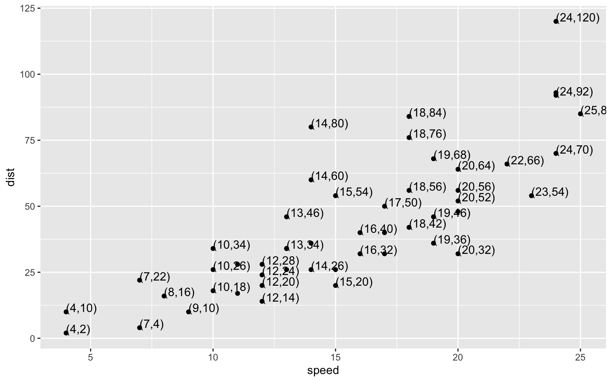
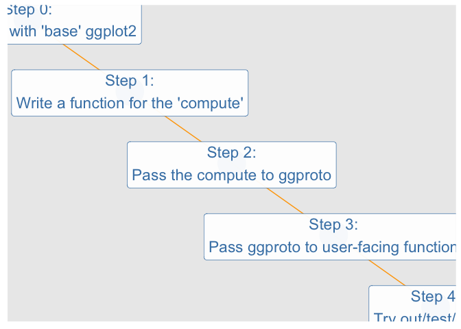
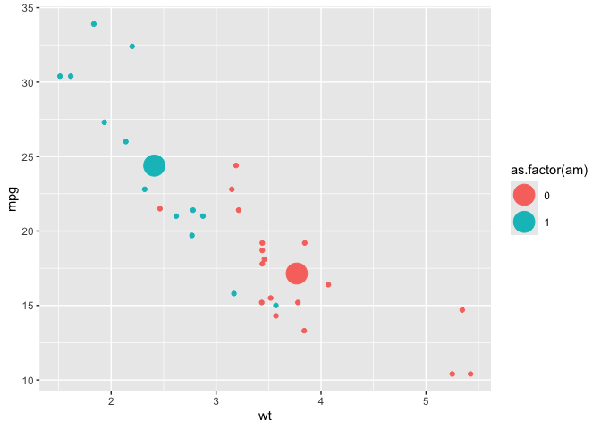
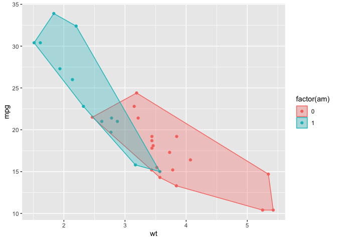
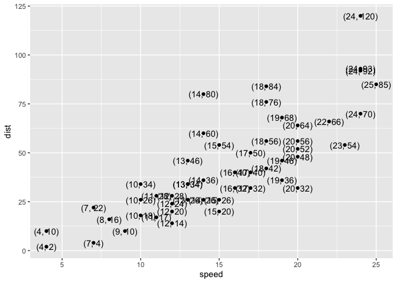
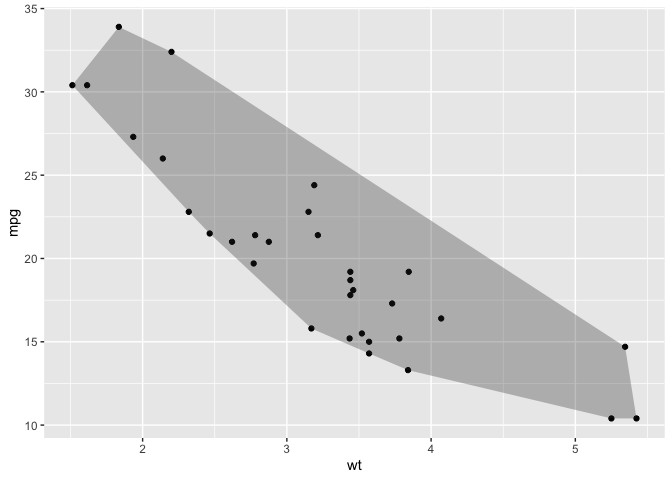
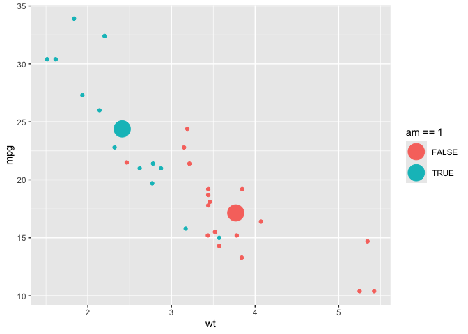
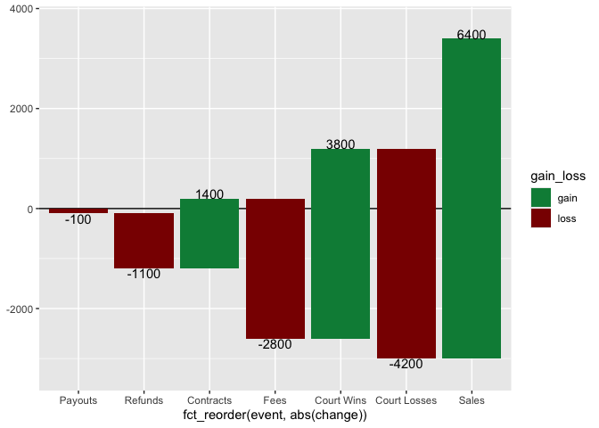
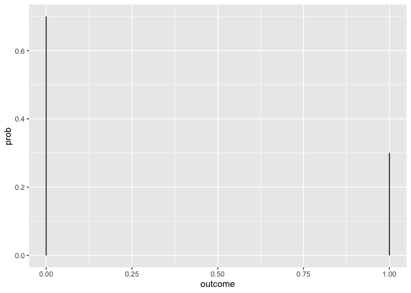
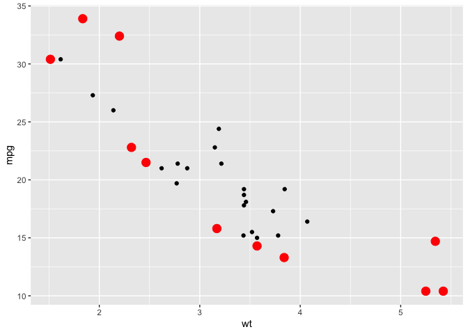

  - [ggplot2-extension-cookbook](#ggplot2-extension-cookbook)
  - [Preface and acknowledgements](#preface-and-acknowledgements)
  - [Getting started](#getting-started)
  - [geom and stat layers](#geom-and-stat-layers)
      - [geom\_text\_coordinate: **1:1:1**](#geom_text_coordinate-111)
      - [geom\_xy\_means: **n:1:1**](#geom_xy_means-n11)
          - [build](#build)
      - [geom\_hull: **n:1:k**](#geom_hull-n1k)
          - [Step 1 and 2](#step-1-and-2)
          - [Compute test…](#compute-test)
          - [Step 3. Write user-facing geom\_/stat\_
            Function(s)](#step-3-write-user-facing-geom_stat_-functions)
          - [Step 4. Try out/test/ enjoy](#step-4-try-outtest-enjoy)
      - [geom\_circle: **1:1:n**](#geom_circle-11n)
      - [geom\_us\_state: **1:1:n**](#geom_us_state-11n)
      - [geom\_ggcirclepack: **1:1:n,
        interdependance**](#geom_ggcirclepack-11n-interdependance)
      - [geom\_ols: **n:k:w;
        interdependence**](#geom_ols-nkw-interdependence)
      - [geom\_county: **1:1:1 via geometry
        sf**](#geom_county-111-via-geometry-sf)
      - [geom\_waterfall: **1:1:1;
        interdependence**](#geom_waterfall-111-interdependence)
          - [Step 0](#step-0)
          - [Steps 1 and 2](#steps-1-and-2)
          - [Step 3](#step-3)
          - [Step 4](#step-4)
  - [geom\_candlestick summarize first, then interdependence
    …](#geom_candlestick-summarize-first-then-interdependence-)
      - [geom\_pie: **n-\>1:1:1**](#geom_pie-n-111)
      - [geom\_wedge: **n-\>1:1:n**](#geom_wedge-n-11n)
  - [repurposing an existing stats](#repurposing-an-existing-stats)
      - [geom\_smoothfit: **n:n:n** ggproto piggybacking on
        compute…](#geom_smoothfit-nnn-ggproto-piggybacking-on-compute)
      - [geom\_barlab: Adding defaults to existing stats via ggproto
        editing](#geom_barlab-adding-defaults-to-existing-stats-via-ggproto-editing)
  - [keeping flexible via stat\_\*
    functions](#keeping-flexible-via-stat_-functions)
  - [modifying ggplot() function (data
    transformation)](#modifying-ggplot-function-data-transformation)
  - [modifying ggraph() function](#modifying-ggraph-function)
  - [defining theme…](#defining-theme)
  - [pseudo extension?](#pseudo-extension)
      - [geom-led funtions.](#geom-led-funtions)
  - [wrapping fiddly functions (annotate and
    theme)](#wrapping-fiddly-functions-annotate-and-theme)
  - [ggtedious *formal testing*](#ggtedious-formal-testing)

<!-- README.md is generated from README.Rmd. Please edit that file -->

# ggplot2-extension-cookbook

<!-- badges: start -->

<!-- badges: end -->

*The ggplot2 Extension Cookbook* aims to provide ggplot2 extension
strategies in a consistent and accessible way.

We group the content by extension type, provide demonstrations of their
use, and then link (for now) to the code that defines them. In that
material, I’ll try to stick to a formula to orient you to the ggplot2
extension:

  - Step 0: get job done with ‘base’ ggplot2
  - Step 1: Write a function for the ‘compute’
  - Step 2: Pass the compute to ggproto
  - Step 3: Pass ggproto to a user-facing function for use in a ggplot()
    pipeline
  - Step 4: Try out/test/enjoy\!

Currently, I’m experimenting with a ratio typology that you’ll see in
the section titles.

Regarding stat\_‘s vs. geom\_’s, I take on geoms first, because they are
more commonly used, perhaps because they are more concrete descriptive
of what the creator envisions, where as stat might be more ’adverbial’,
a more nebulous, harder-to-think about layer description.

Finally, most of the code is at the ‘R for data science level, and not
’Advanced R’ level, which hopefully will afford greater reach.

# Preface and acknowledgements

I attended Thomas Lin Pederson’s January 2020 talk ‘Extending your
ability to extend ggplot2’ seated on the floor of a packed out ballroom.
The talk had the important central message - “you can be a ggplot2
extender”. And since then, I aimed to be an extender. I hope that this
*ggplot2 Extension Cookbook* will help you on your extender journey and,
especially if you are fluent in R and ggplot2, it says to you “you can
be a ggplot2 extender”.

I’ve been using ggplot2 since about 2017, and really enjoyed the user
interface. In general, the syntax does a fantastic job at letting users
compose their plots bit-by-bit, closely resembling to how you might
sketch out a plot on a notepad or blackboard, and describing your
decisions as you go to yourself or a colleague. Or as Thomas Lin
Pederson has also said, ‘ggplot2 lets you *speak your plot into
existence*’. And perhaps a little less eloquently by Hadley Wickham’s,
the ggplot2 author, “This is what I’m thinking; your the computer, now
go and do it\!” (my paraphrase of the author talking about how he
thought data viz should feel as a statistical consultant – well before
ggplot2 existed).

But there were pain points when using ‘base’ ggplot2; for me, this was
mostly when a geom didn’t exist for doing some compute in the
background, but maybe wanted that compute done over and over, and it
would be a slough to do it over and over upstream to the plotting
environment. This pre-computation problem felt manageable in classroom
setting which I was in through early 2020 but when I moved to a
primarily analytic role at West Point — where the volume of analysis was
simply higher and turn around times faster — I felt the problem much
more acutely. (Overnight, I went from weak preference for geom\_col - to
strong preference for geom\_bar\!) Extension seemed to offer the
solution to the problem and I was more motivated in my analyst role.

However, I experienced about a year of failure and frustration when
first entering the extension space. If I weren’t so convinced of the
efficiency gains that it would eventually yield, I’d likely have given
up. Recognizing the substancial hurdles for even long time R and ggplot2
users, I think there is space for more ggplot2 extension reference
materials, such as the recipes in the *ggplot2 Extension Cookbook*.

I’m grateful for several expediences and the efforts of others that have
refined these new materials. First, just after getting my own feet wet
in extension, I had the chance to work on extension with students in the
context of independent studies. Our focus was the same type of extension
that Pederson demonstrated – a geom that used a Stat to do some
computational work, and then inherited the rest of its behavior from a
more primitive geom. Working with first and second year undergrad
students meant that I had to think about and formulate workflow - where
reference material would even be accessibility to very new R users. As
veterans of just one or two stats classes that used R and ggplot2, what
would they find familiar and accessible? What might we be able to
de-emphasize and still succeed? I’m grateful to these This worked with
students and I had a chance to refine it further.

The following steps emerged and persisted into our tutorial formula:

  - Step 0: get job done with ‘base’ ggplot2
  - Step 1: Write a function for the ‘compute’
  - Step 2: Pass the compute to ggproto
  - Step 3: Pass ggproto to stat/geom/facet function
  - Step 4: Try out/test/enjoy\!

Impressed that … Novice -\> extender, in 4 months.

I wondered how the strategy would perform with experienced R and ggplot2
users. Being an academic, further assessment sounded attractive and I
went down the route of devising a tutorial \[with assistance from
independent study student Morgan Brown\] and formally getting feedback
on it via focus groups and a survey, after refining the tutorial.

I did some research on ggplot2 extension among ggplot2 and R ‘super
users’ and have found that the perhaps this community is under-served,
but with the right materials, more folks could get into ggplot2
extension.

I fielded ‘easy geom recipes’ with a group of statistics educators,
conducting a survey on the resource and also getting feedback via a
focus group.

Among my favorite quotation from the focus groups is something that
validated the efforts but also challenged me:

> it was … easy. And I felt empowered as a result of that…. But you
> know, like, my problem isn’t gonna be that easy.

To that participant, I’d say ‘Sometimes it *is* that easy’. But he is
right, that often times I come to an extension problem and am suprised
that the strategy that I think is going to work doesn’t, or at least not
without a little fiddling.

The feedback on the easy-geom-recipes was collected in March 2023.

So, I’m interested in simply developing new, useful extensions.

To try to make those experiences valuable to others, I follow the
‘recipe’ formula as much as possible so that as strategies morph, one
still recognizes where we are at a high-level in the process.

Now to serve the community and for use in this *ggplot2 Extension
Cookbook*, I’m using an in-README documentation strategy for my ggplot2
extension packages so that the development stories are in one place
instead of scattered between package files.

This is made possible via the readme2pkg R package and in turn the knitr
package written by Yihui Xie, whose tools (literate programming,
xaringan and other tools) had already played a huge role in my
relationship with ggplot2. Before arriving at this solution, I felt that
I’d need to divide my energy between moving forward in my own extension
development journey and educator. I’m grateful that with the magic of
knitr::knitr\_code$get() I allow code to sit in the README narrative and
also send it to the required .R directory to serve in the package.

At present, I’ll just show examples of functionality, and then link to
the READMEs for further investigation of the specific recipes/strategies
used.

I’m personally grateful to other ggplot2 extenders and R enthusiasts
that have supported this journey.

I’m also grateful to the ggplot2 development team .

I’m also indebted to my Department of Mathematics and Dean Data Cell
colleagues at West Point, for sitting through some talks (some
extemporaneous and muddled) where I tried to articulate my ggplot2
extension dreams.

Finally, to Winston Chang, who gets top billing in the ggplot2 extension
vignette along with your ggproto, I hope you won’t mind the general
approach here which experiments with making ggproto as ignorable as
possible for OOP noobs. I also hope to meet you someday and hear more
about the early days of ggproto, maybe at ggplot2 extenders meetup as a
special guest, perhaps January 2025.

And finally, finally to Hadley Wickham and Leland Wilkinson having
incredible insights and acting on them.

# Getting started

For best results, I’d recommend *diving* in by actually creating some
geoms as prompted in the ‘easy geom recipes’ tutorial. Having completed
these exercises, you’ll have lived the geom creation from start to
finish, will be well oriented to the consistent steps in the process for
the patterns used in what follows.

# geom and stat layers

<data:n> definding geom:geom

## geom\_text\_coordinate: **1:1:1**

  - for each row in the input dataframe …
  - we’ll perceive a single mark
  - which will be defined by as single row in the internal dataframe

<!-- end list -->

``` r
library(ggplot2)
library(ggxmean)

ggplot(cars) + 
  aes(x = speed, y = dist) + 
  geom_point() + 
  geom_text_coordinate(check_overlap = T,
                       hjust = 0,
                       vjust = 0)
```

<!-- -->

``` r
## Madison put this together

#' A Function to Label Points
#'
#' @param data this is the data set where the points are found
#' @param scales
#'
#' @return this function returns the coordinates of the point as: (x,y)
#' @export
#'
#' @examples
#' library(dplyr)
#' library(magrittr)
#' cars %>%
#'   mutate(x = speed, y = dist) %>%
#'   select(x,y) %>%
#'   compute_group_coordinates()
compute_group_coordinates <- function(data, scales) {

  data.frame(x = data$x,
             y = data$y,
             label = paste0("(", data$x, ",", data$y, ")")

  )
}

StatCoordinate <- ggplot2::ggproto(`_class` = "StatCoordinate",
                 `_inherit` = ggplot2::Stat,
                 required_aes = c("x", "y"),
                 compute_group = compute_group_coordinates)


#' Returns a scatter plot with points that are labeled
#'
#' @inheritParams geom_text
#'
#' @return a scatter plot with points that are labeled
#' @export
#'
#' @examples
#' library(ggplot2)
#' library(magrittr)
#' cars %>%
#' ggplot(aes(x = speed, y = dist)) +
#' geom_point() +
#' geom_text_coordinate(check_overlap = TRUE,
#' nudge_x = .3)
geom_text_coordinate <- function(mapping = NULL, data = NULL,
                                 position = "identity", na.rm = FALSE,
                                 show.legend = NA,
                                 inherit.aes = TRUE, ...) {
  ggplot2::layer(
    stat = StatCoordinate,
    geom = ggplot2::GeomText,
    data = data,
    mapping = mapping,
    position = position,
    show.legend = show.legend,
    inherit.aes = inherit.aes,
    params = list(na.rm = na.rm, ...)
  )
}
```

## geom\_xy\_means: **n:1:1**

*many rows from a dataset: will be summarized and visualized by as
single mark: the mark will be defined by one row of data*

``` r
ggplot(mtcars) + 
  aes(x = wt, y = mpg) + 
  geom_point() + 
  geom_xy_means(size = 8)
```

<!-- -->

``` r

last_plot() + 
  aes(color = as.factor(am))
```

<!-- -->

#### build

``` r
### xymean

StatXymean <- ggplot2::ggproto("StatXymean",
                               ggplot2::Stat,
                               compute_group = function(data, scales) {

                                 data.frame(y = mean(data$y),
                                            x = mean(data$x))

                               },

                               required_aes = c("x", "y")
)


#' Place point at mean of x and mean of y
#'
#' @param mapping
#' @param data
#' @param position
#' @param na.rm
#' @param show.legend
#' @param inherit.aes
#' @param ...
#'
#' @return
#' @export
#'
#' @examples
#' library(ggplot2)
#' ggplot(cars) + aes(x = speed, y = dist) +
#' geom_point() + geom_xy_means(size = 5) + aes(color = speed > 15)
geom_xy_means <- function(mapping = NULL, data = NULL,
                        position = "identity", na.rm = FALSE, show.legend = NA,
                        inherit.aes = TRUE, ...) {

  ggplot2::layer(
    stat = StatXymean, geom = ggplot2::GeomPoint, data = data, mapping = mapping,
    position = position, show.legend = show.legend, inherit.aes = inherit.aes,
    params = list(na.rm = na.rm, ...)
  )

}
```

## geom\_hull: **n:1:k**

rewriting a classic from the ggplot2 vignette…

``` r
library(tidyverse)
#> ── Attaching core tidyverse packages ─────────────────── tidyverse 2.0.0.9000 ──
#> ✔ dplyr     1.1.0     ✔ readr     2.1.4
#> ✔ forcats   1.0.0     ✔ stringr   1.5.0
#> ✔ lubridate 1.9.2     ✔ tibble    3.2.1
#> ✔ purrr     1.0.1     ✔ tidyr     1.3.0
#> ── Conflicts ────────────────────────────────────────── tidyverse_conflicts() ──
#> ✖ dplyr::filter() masks stats::filter()
#> ✖ dplyr::lag()    masks stats::lag()
#> ℹ Use the conflicted package (<http://conflicted.r-lib.org/>) to force all conflicts to become errors
chull_indeces <- chull(mtcars$wt, mtcars$mpg)
chull_indeces
#>  [1] 17 16 15 24  7 29 21  3 28 20 18
mtcars_chull_subset <- mtcars %>% slice(chull_indeces)

ggplot(mtcars) + 
  aes(x = wt, y = mpg) + 
  geom_point() + 
  geom_polygon(data = mtcars_chull_subset, 
               alpha = .3, 
               color = "black")
```

<!-- -->

### Step 1 and 2

``` r
# Step 1
compute_group_c_hull <- function(data, scales){
  
  keep_indeces <- chull(data$x, data$y)
  
  data %>% slice(keep_indeces)
  
}

# Step 2
StatChull <- ggproto(`_class` = "StatChull",
                     `_inherit` = ggplot2::Stat,
                     compute_group = compute_group_c_hull,
                     required_aes = c("x", "y"))
```

### Compute test…

``` r
mtcars %>% 
  rename(x = wt, y = mpg) %>% 
  compute_group_c_hull()
#>                        y cyl  disp  hp drat     x  qsec vs am gear carb
#> Chrysler Imperial   14.7   8 440.0 230 3.23 5.345 17.42  0  0    3    4
#> Lincoln Continental 10.4   8 460.0 215 3.00 5.424 17.82  0  0    3    4
#> Cadillac Fleetwood  10.4   8 472.0 205 2.93 5.250 17.98  0  0    3    4
#> Camaro Z28          13.3   8 350.0 245 3.73 3.840 15.41  0  0    3    4
#> Duster 360          14.3   8 360.0 245 3.21 3.570 15.84  0  0    3    4
#> Ford Pantera L      15.8   8 351.0 264 4.22 3.170 14.50  0  1    5    4
#> Toyota Corona       21.5   4 120.1  97 3.70 2.465 20.01  1  0    3    1
#> Datsun 710          22.8   4 108.0  93 3.85 2.320 18.61  1  1    4    1
#> Lotus Europa        30.4   4  95.1 113 3.77 1.513 16.90  1  1    5    2
#> Toyota Corolla      33.9   4  71.1  65 4.22 1.835 19.90  1  1    4    1
#> Fiat 128            32.4   4  78.7  66 4.08 2.200 19.47  1  1    4    1
```

### Step 3. Write user-facing geom\_/stat\_ Function(s)

``` r
geom_chull <- function(mapping = NULL, 
                        data = NULL,
                        position = "identity", 
                        na.rm = FALSE, 
                        show.legend = NA,
                        inherit.aes = TRUE, ...) {

  ggplot2::layer(
    stat = StatChull, 
    geom = ggplot2::GeomPolygon, 
    data = data, mapping = mapping,
    position = position, 
    show.legend = show.legend, 
    inherit.aes = inherit.aes,
    params = list(na.rm = na.rm, ...)
  )

}
```

### Step 4. Try out/test/ enjoy

``` r
ggplot(data = mtcars) + 
  aes(x = wt, y = mpg) + 
  geom_point() + 
  geom_chull(alpha = .3)
```

<!-- -->

``` r

last_plot() + 
  aes(fill = factor(am), 
      color = factor(am))
```

<!-- -->

## geom\_circle: **1:1:n**

*a single row in a dataframe: will be visualized by a single mark: the
mark will be defined by many-row in an internal dataframe*

for each row in the dataframe, a single geometry is visualized, but each
geom is defined by many rows…

## geom\_us\_state: **1:1:n**

## geom\_ggcirclepack: **1:1:n, interdependance**

*a many-row geom for each row of the input data frame, with
interdependence between input observations.*

## geom\_ols: **n:k:w; interdependence**

*between-group computation*

## geom\_county: **1:1:1 via geometry sf**

*a geom defined by an sf geometry column*

## geom\_waterfall: **1:1:1; interdependence**

The function geom\_waterfall() is exported from the ggwaterfall package,
which is being developed at github.com/EvaMaeRey/ggwaterfall

*One-row geom for each row in input dataset; geom interdependence*

A waterfall plot displays inflows and outflows that occur as a result of
events as well as the balance across multiple events. It is typically
displayed as a series of rectangles. Because the net change is displayed
(cumulative change), there is interdependence between the geometries on
our plot – where one rectangle ends, the next in the series begins.

``` r
library(ggwaterfall)
library(tidyverse)
flow_df <- data.frame(event = c(
                     "Sales", 
                     "Refunds",
                     "Payouts", 
                     "Court Losses", 
                     "Court Wins", 
                     "Contracts", 
                     "Fees"),
           change = c(6400, -1100, 
                      -100, -4200, 3800, 
                      1400, -2800)) |> 
  mutate(event = factor(event))

flow_df
#>          event change
#> 1        Sales   6400
#> 2      Refunds  -1100
#> 3      Payouts   -100
#> 4 Court Losses  -4200
#> 5   Court Wins   3800
#> 6    Contracts   1400
#> 7         Fees  -2800

flow_df |> 
  ggplot() +
  geom_hline(yintercept = 0) +
  aes(change = change, 
      x = event) + # event in order
  geom_waterfall() + 
  geom_waterfall_label() + 
  scale_y_continuous(expand = expansion(.1)) + 
  scale_fill_manual(values = c("springgreen4", "darkred"))
```

<!-- -->

The strategy to create geom waterfall follows the standard four steps.

### Step 0

For ‘step 0’, we base ggplot2 to accomplish this task, and actually
pretty closely follow Hadley Wickham’s short paper that tackles a
waterfall plot with ggplot2.
<https://vita.had.co.nz/papers/ggplot2-wires.pdf>

### Steps 1 and 2

Then, we bundle up this computation into a function (step 1), called
compute\_panel\_waterfall. This function then define the compute\_panel
element in the ggproto object (step 2). We want the computation done
*panel-wise* because of the interdependence between the events, which
run along the x axis. Group-wise computation (the defining
compute\_group element), would fail us, as the cross-event
interdependence would not be preserved.

``` r
#' Title
#'
#' @param data 
#' @param scales 
#' @param width 
#'
#' @return
#' @export
#'
#' @examples
compute_panel_waterfall <- function(data, scales, width = .90){
  
  data %>% 
  mutate(x_scale = x) %>% 
  mutate(x_pos = x %>% as.numeric()) %>% 
  arrange(x_pos) %>% 
  mutate(balance = cumsum(c(0, 
                            change[-nrow(.)]))) %>% 
  mutate(direction = factor(sign(change))) %>% 
  mutate(xmin = x_pos - width/2,
         xmax = x_pos + width/2,
         ymin = balance,
         ymax = balance + change) %>% 
  mutate(x = x_pos) %>% 
  mutate(y = ymax) %>% 
  mutate(gain_loss = ifelse(direction == 1, "gain", "loss"))
  
}


### Step 1.1 Test compute 

# flow_df %>% 
#   rename(x = event) %>% 
#   compute_panel_waterfall() 


## Step 2. Pass compute to ggproto 

StatWaterfall <- ggplot2::ggproto(`_class` = "StatWaterfall", 
                         `_inherit` = ggplot2::Stat,
                         required_aes = c("change", "x"),
                         compute_panel = compute_panel_waterfall,
                         default_aes = ggplot2::aes(label = ggplot2::after_stat(change),
                                           fill = ggplot2::after_stat(gain_loss),
                                           vjust = ggplot2::after_stat((direction == -1) %>%
                                                                as.numeric)))
```

### Step 3

In step 3, we define stat\_waterfall, passing along StatWaterfall to
create a ggplot2 layer function. We include a standard set of arguments,
and we set the geom to ggplot2::GeomRect.

``` r
#' Title
#'
#' @param geom 
#' @param mapping 
#' @param data 
#' @param position 
#' @param na.rm 
#' @param show.legend 
#' @param inherit.aes 
#' @param ... 
#'
#' @return
#' @export
#'
#' @examples
stat_waterfall <- function(geom = ggplot2::GeomRect, 
  mapping = NULL,
  data = NULL,
  position = "identity",
  na.rm = FALSE,
  show.legend = NA,
  inherit.aes = TRUE, ...) {
  ggplot2::layer(
    stat = StatWaterfall,  # proto object from step 2
    geom = geom,  # inherit other behavior
    data = data,
    mapping = mapping,
    position = position,
    show.legend = show.legend,
    inherit.aes = inherit.aes,
    params = list(na.rm = na.rm, ...)
  )
}

#' Title
#'
#' @param geom 
#' @param mapping 
#' @param data 
#' @param position 
#' @param na.rm 
#' @param show.legend 
#' @param inherit.aes 
#' @param ... 
#'
#' @return
#' @export
#'
#' @examples
geom_waterfall <- stat_waterfall


#' Title
#'
#' @param mapping 
#' @param data 
#' @param position 
#' @param na.rm 
#' @param show.legend 
#' @param inherit.aes 
#' @param ... 
#'
#' @return
#' @export
#'
#' @examples
geom_waterfall_label <- function(..., lineheight = .8){
  stat_waterfall(geom = "text", 
                 lineheight = lineheight, ...)}
```

### Step 4

In Step 4, we get to try out the functionality.

``` r
flow_df |> 
  ggplot() +
  geom_hline(yintercept = 0) +
  aes(change = change, 
      x = event) + # event in order
  geom_waterfall() + 
  geom_waterfall_label() + 
  scale_y_continuous(expand = expansion(.1)) + 
  scale_fill_manual(values = c("springgreen4", "darkred"))

last_plot() + 
  aes(x = fct_reorder(event, change))

last_plot() + 
  aes(x = fct_reorder(event, abs(change)))
```



# geom\_candlestick summarize first, then interdependence …

## geom\_pie: **n-\>1:1:1**

## geom\_wedge: **n-\>1:1:n**

# repurposing an existing stats

## geom\_smoothfit: **n:n:n** ggproto piggybacking on compute…

``` r
library(ggsmoothfit)
```

n:1:80 is geom\_smooth default.

## geom\_barlab: Adding defaults to existing stats via ggproto editing

# keeping flexible via stat\_\* functions

Rather than defining geom functions, you might instead ‘stay flexible’
with stat functions. Let’s contrast geom\_chull and stat\_chull below.

``` r
geom_chull <- function(mapping = NULL, 
                        data = NULL,
                        position = "identity", 
                        na.rm = FALSE, 
                        show.legend = NA,
                        inherit.aes = TRUE, ...) {

  ggplot2::layer(
    stat = StatChull, 
    geom = ggplot2::GeomPolygon, 
    data = data, mapping = mapping,
    position = position, 
    show.legend = show.legend, 
    inherit.aes = inherit.aes,
    params = list(na.rm = na.rm, ...)
  )

}


stat_chull <- function(mapping = NULL, 
                       geom = ggplot2::GeomPolygon, 
                        data = NULL,
                        position = "identity", 
                        na.rm = FALSE, 
                        show.legend = NA,
                        inherit.aes = TRUE, ...) {

  ggplot2::layer(
    stat = StatChull, 
    geom = geom, 
    data = data, mapping = mapping,
    position = position, 
    show.legend = show.legend, 
    inherit.aes = inherit.aes,
    params = list(na.rm = na.rm, ...)
  )

}
```

The construction is almost identical. However, in the stat version, the
geom is flexible because it can be user defined, instead of being fixed
in the function. It’s use allows you to go in different visual
directions, but might have a higher cognative load.

``` r
p <- ggplot(data = mtcars) + 
  aes(x = wt, y = mpg) + 
  geom_point() 

p +
  stat_chull(alpha = .3)
```

<!-- -->

``` r

p +
  stat_chull(geom = "point",
             color = "red",
             size = 4)
```

<!-- -->

``` r

p + 
  stat_chull(geom = "text",
             label = "c-hull point",
             hjust = 0)
```

<!-- -->

# modifying ggplot() function (data transformation)

``` r
library(ggverbatim)
```

# modifying ggraph() function

``` r
library(ggedgelist)
```

# defining theme…

``` r
#library(ggchalkboard)
```

# pseudo extension?

## geom-led funtions.

# wrapping fiddly functions (annotate and theme)

``` r
library(ggstamp)
```

``` r
#library(ggcons) # 
```

# ggtedious *formal testing*

``` r
#library(ggtedius)
```
