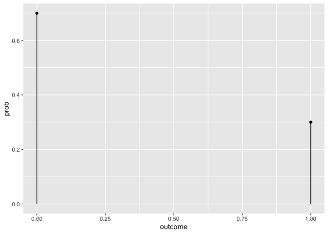
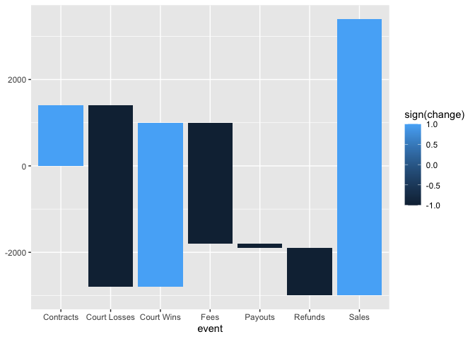
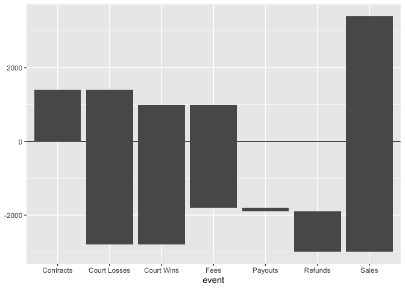
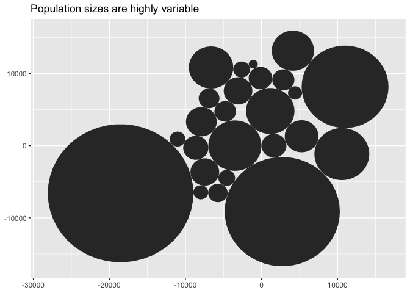
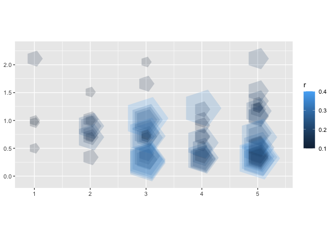
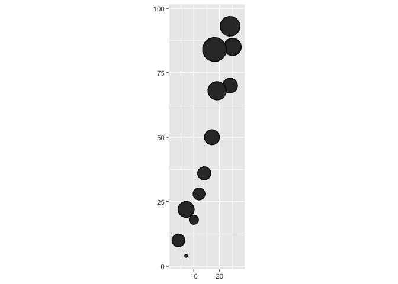
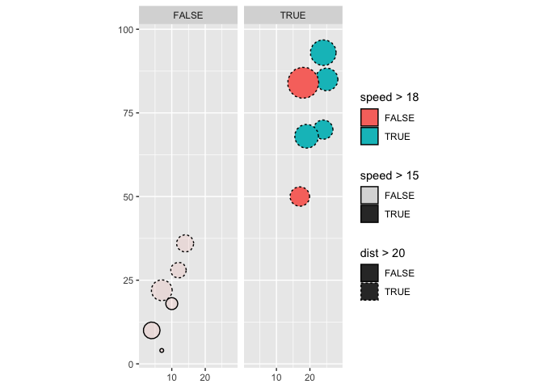

  - [ggplot2-extension-cookbook](#ggplot2-extension-cookbook)
  - [Preface and acknowledgements](#preface-and-acknowledgements)
  - [Getting started](#getting-started)
  - [easy geom\_\* functions: writing new definitions for where and how
    of marks on
    ggplots](#easy-geom_-functions-writing-new-definitions-for-where-and-how-of-marks-on-ggplots)
      - [geom\_text\_coordinate: **1:1:1, compute\_group,
        GeomText**](#geom_text_coordinate-111-compute_group-geomtext)
          - [Step 0: use base ggplot2](#step-0-use-base-ggplot2)
          - [Step 1: Compute](#step-1-compute)
          - [Step 2: pass to ggproto
            object](#step-2-pass-to-ggproto-object)
          - [Step 3. Write user facing
            function.](#step-3-write-user-facing-function)
          - [Step 4: Use/test/enjoy](#step-4-usetestenjoy)
      - [geom\_post: **1:1:1, compute\_group,
        GeomSegment**](#geom_post-111-compute_group-geomsegment)
          - [Step 0. Use base ggplot2](#step-0-use-base-ggplot2-1)
          - [Step 1: Compute](#step-1-compute-1)
          - [Step 2: Pass to ggproto](#step-2-pass-to-ggproto)
          - [Step 3: Pass to user-facing function using
            ggplot2::layer()](#step-3-pass-to-user-facing-function-using-ggplot2layer)
          - [Step 4: use/test/enjoy](#step-4-usetestenjoy-1)
          - [geom\_lollipop: Tangential bonus topic: Combining layers
            into single geom\_\*()
            function](#geom_lollipop-tangential-bonus-topic-combining-layers-into-single-geom_-function)
      - [geom\_xy\_means: **n:1:1, compute\_group,
        GeomPoint**](#geom_xy_means-n11-compute_group-geompoint)
          - [Step 0. Use base ggplot2](#step-0-use-base-ggplot2-2)
          - [Step 1. Write compute
            function](#step-1-write-compute-function)
          - [Step 2. Define Stat, pasing in
            compute](#step-2-define-stat-pasing-in-compute)
          - [Step 3. Write user-facing
            function](#step-3-write-user-facing-function-1)
          - [Step 4. Use/Test/Enjoy](#step-4-usetestenjoy-2)
      - [geom\_chull: **N:1:n, compute\_group,
        GeomPolygon**](#geom_chull-n1n-compute_group-geompolygon)
          - [Step 0. get it done with
            ggplot2](#step-0-get-it-done-with-ggplot2)
          - [Step 1. Compute](#step-1-compute-2)
          - [Step 2. Pass to ggproto](#step-2-pass-to-ggproto-1)
          - [Step 3. Write user-facing geom\_/stat\_
            Function(s)](#step-3-write-user-facing-geom_stat_-functions)
          - [Step 4. Try out/test/ enjoy](#step-4-try-outtest-enjoy)
      - [geom\_waterfall: **1:1:1, compute\_panel,
        GeomRect**](#geom_waterfall-111-compute_panel-geomrect)
          - [Step 0](#step-0)
          - [Steps 1](#steps-1)
          - [Step 2](#step-2)
          - [Step 3](#step-3)
          - [Step 4](#step-4)
          - [Bonus: default `aes` using delayed aesthetic evaluation
            (D.A.E.)](#bonus-default-aes-using-delayed-aesthetic-evaluation-dae)
      - [geom\_circlepack: **1:1:n, compute\_panel,
        GeomPolygon**](#geom_circlepack-11n-compute_panel-geompolygon)
          - [Step 0. How-to w/ base ggplot2 (and
            {packcircles})](#step-0-how-to-w-base-ggplot2-and-packcircles)
          - [Step 1. Compute](#step-1-compute-3)
          - [Step 2. pass to ggproto
            object](#step-2-pass-to-ggproto-object-1)
          - [Step 3. pass to user-facing
            function](#step-3-pass-to-user-facing-function)
          - [Step 4. Use/test/enjoy](#step-4-usetestenjoy-3)
      - [geom\_circle: **1:1:n, compute\_panel,
        GeomPolygon**](#geom_circle-11n-compute_panel-geompolygon)
          - [Step 0. Do it with base
            ggplot2](#step-0-do-it-with-base-ggplot2)
          - [Step 1. Compute](#step-1-compute-4)
          - [Step 2. Pass to ggproto](#step-2-pass-to-ggproto-2)
          - [Step 3. Write geom\_\* or
            stat\_\*](#step-3-write-geom_-or-stat_)
          - [Step 4: Enjoy (test)](#step-4-enjoy-test)
          - [Discussion: Why not
            compute\_group](#discussion-why-not-compute_group)
          - [Exercise: Write the function, geom\_heart() that will take
            the compute below and do it within the geom\_\*
            function](#exercise-write-the-function-geom_heart-that-will-take-the-compute-below-and-do-it-within-the-geom_-function)
      - [geom\_state: **1:1:n, compute\_panel,
        GeomPolygon**](#geom_state-11n-compute_panel-geompolygon)
          - [Step 0: use base ggplot2](#step-0-use-base-ggplot2-3)
          - [Step 1: Write compute function
            🚧](#step-1-write-compute-function-)
          - [Step 2. Pass to ggproto](#step-2-pass-to-ggproto-3)
          - [Step 3. Pass to user-facing
            function](#step-3-pass-to-user-facing-function-1)
          - [Step 4. Use/Test/Enjoy](#step-4-usetestenjoy-4)
      - [geom\_ols: **n:k:w;
        interdependence**](#geom_ols-nkw-interdependence)
      - [geom\_county: **1:1:1, compute\_panel,
        GeomSf**](#geom_county-111-compute_panel-geomsf)
          - [Step 0. get it done in base
            ggplot2](#step-0-get-it-done-in-base-ggplot2)
          - [Step 1. compute](#step-1-compute-5)
          - [Step 2. pass to ggproto
            object](#step-2-pass-to-ggproto-object-2)
          - [Step 3. pass to user-facing function (wrapping
            ggplot::layer\_sf() instead of ggplot2::layer()) 🚧 *more
            check with
            CRSs*](#step-3-pass-to-user-facing-function-wrapping-ggplotlayer_sf-instead-of-ggplot2layer--more-check-with-crss)
          - [Step 4. Use/test/enjoy\!](#step-4-usetestenjoy-5)
      - [geom\_candlestick summarize first, then interdependence
        …](#geom_candlestick-summarize-first-then-interdependence-)
  - [stat\_\* layers: keeping flexible via stat\_\*
    functions](#stat_-layers-keeping-flexible-via-stat_-functions)
      - [stat\_chull: **N:1:n; compute\_group; GeomPolygon, GeomText,
        GeomPoint**](#stat_chull-n1n-compute_group-geompolygon-geomtext-geompoint)
      - [stat\_waterfall: **1:1:1; compute\_panel; GeomRect,
        GeomText**](#stat_waterfall-111-compute_panel-geomrect-geomtext)
      - [Bonus part 2. DAE with GeomText
        target](#bonus-part-2-dae-with-geomtext-target)
  - [Piggyback on compute](#piggyback-on-compute)
      - [Some Delayed Aesthetic
        Evaluation](#some-delayed-aesthetic-evaluation)
      - [Borrowing compute](#borrowing-compute)
      - [geom\_smoothfit: **1:1:1** ggproto piggybacking on
        compute…](#geom_smoothfit-111-ggproto-piggybacking-on-compute)
          - [Step 2](#step-2-1)
          - [Step 3](#step-3-1)
  - [add default aesthetics](#add-default-aesthetics)
      - [geom\_barlab: Adding defaults to existing stats via ggproto
        editing](#geom_barlab-adding-defaults-to-existing-stats-via-ggproto-editing)
  - [facet\_sample](#facet_sample)
  - [theme\_chalkboard()](#theme_chalkboard)
  - [modified start points;
    ggverbatim(),](#modified-start-points-ggverbatim)
      - [ggverbatim()](#ggverbatim)
  - [ggedgelist()](#ggedgelist)
      - [ggscatterplot(), rearrangement](#ggscatterplot-rearrangement)
  - [wrapping fiddly functions (annotate and
    theme)](#wrapping-fiddly-functions-annotate-and-theme)
  - [make it a package: ggtedious *formal
    testing*](#make-it-a-package-ggtedious-formal-testing)

<!-- README.md is generated from README.Rmd. Please edit that file -->

# ggplot2-extension-cookbook

<!-- badges: start -->

<!-- badges: end -->

This *ggplot2 Extension Cookbook* aims to provide ggplot2 some extension
strategies in a consistent and accessible way. The target audience is
fluent ggplot2 and R users who have not yet entered the extension space.
The main tactic is to provide many extensions examples for building
familiarity and confidence, and also which might serve as specific
reference when readers are inspired to build their own extensions.

In that material, I’ll try to stick to an enumerated formula to orient
you to the ggplot2 extension, so even if a few details seem confusing,
you’ll know ‘where’ you are at a higher level:

  - Step 0: get job done with ‘base’ ggplot2
  - Step 1: Write a function for the ‘compute’
  - Step 2: Pass the compute to ggproto object
  - Step 3: Pass ggproto to a user-facing function for use in a ggplot()
    pipeline
  - Step 4: Try out/test/enjoy\!

We group the content by extension type, provide demonstrations of their
use. Right now, there is a lot of focuses on new geom\_\* and stat\_\*
layer functions. I think this is an important area to illuminate because
many of these allow us to pass off routine computational task to the
plotting system. This importance translates to excitement about ggplot2
extension packages: new geom\_\* layers functions really rule the day
when it comes to outside interest. See for example [‘5 powerful ggplot2
extensions’, Rapp
2024](https://albert-rapp.de/posts/ggplot2-tips/20_ggplot_extensions/ggplot_extensions)
in which four of the five focus on new geoms that are made available by
packages and [‘Favorite ggplot2 extensions’, Scherer
2021](https://www.cedricscherer.com/slides/RLadiesTunis-2021-favorite-ggplot-extensions.pdf)
in which almost all of the highlighted extensions are geom\_\* and
stat\_\* user-facing functions.

Regarding focus on stat\_‘s *versus* geom\_’s functions, I take a
geom\_\* -first approach, because these functions are more commonly used
in layman’s ggplot builds. I suspect we find geom\_\* functions to be
more concrete descriptions of what the creator envisions for her plot,
whereas stat\_\* function names may feel a be more ’adverbial’ and
nebulous in their description of rendered output. Consider that
ggplot(mtcars, aes(wt, mpg)) + stat\_identity() and ggplot(mtcars,
aes(wt, mpg)) + geom\_point() create identical plots, but later seems
much more descriptive of the resultant plot. Between these two
particular options, the preference for the geom\_point is evident in the
user data; on Github, there are 788 R language files containing
‘stat\_identity’ whereas a staggering 261-thousand R language files
contain ‘geom\_point’. Of course, stat\_\* constructions are quite
flexible and expressive, and more seasoned ggplot2 users use them with
great fluency, and therefore the topic is covered.

Finally, most of the code is at the ‘R for Data Science’ level, and not
‘Advanced R’ level, which I hope will afford greater reach. While
object oriented programming (OOP) gets top billing in many extension
materials, but many folks that *are* expert users of ggplot2 might *not*
know much about OOP. I see what can be accomplished with little emphasis
on OOP and ggroto.

Reader, I do think it is important for you to recognize that ggplot2
objects (i.e. p in p \<- ggplot(cars, aes(speed, dist)) + geom\_point())
are not, of course the rendered plot, but rather a plot specification
(of global data, aesthetic mapping, etc) that result from the
declarations the user has made. But I think you’ve probably made this
realization very early on in your ggplot2 journey already. You know that
the ggplot plot building syntax allows users to make changes to the
overall plot *specification* incrementally. In other words the `+`
operator allows us to modify the the ggplot2 object. And the ggroto
system allows changes to the ggplot2 specification from outside the
ggplot2 package too — from extension packages.

For those who have dipped your toes into extension, the composition of
the extension elements will look different from what you will see in the
wild. Specifically, I try to define ggproto objects in as concise and
high-level a way as possible — and as close to *ignorable* for those put
off or nervous about OOP methods.

For example defining the object StatCoordinate looks like this:

``` r
StatCoordinate <- ggplot2::ggproto(
  `_class` = "StatCoordinate",
  `_inherit` = ggplot2::Stat,
  required_aes = c("x", "y"),
  compute_group = compute_group_coordinates
  )
```

Currently, with the geom\_\* and stat\_\* layers, I’m experimenting with
a ratio typology that you’ll see in the section titles. The idea is to
think about how the input data relates to the mark we see on the plot
and in turn how the mark’s information is stored in the ggplot2 object.
This is a brand new undertaking, and I’m unsure of how productive or
precise it will be.

Overall, I think the resources in this ggplot2 extension cookbook are
aligned with the findings in [‘10 Things Software Developers Should
Learn about
Learning’](https://cacm.acm.org/magazines/2024/1/278891-10-things-software-developers-should-learn-about-learning/fulltext),
especially the observation that new techniques and ideas are often best
internalized when first applied to concrete examples; general principles
may be more grounded if situated in relevant examples.

# Preface and acknowledgements

In January 2020, I attended Thomas Lin Pederson’s talk ‘Extending your
ability to extend ggplot2’ seated on the floor of a packed out ballroom.
The talk had the important central message - “you can be a ggplot2
extender”. And since then, I wanted to be in that cool-kid extender
club. Four years later, I’m at a point where I can start claiming that
club membership. I hope that this *ggplot2 Extension Cookbook* will help
along you on your extender journey and, especially if you are fluent in
R and ggplot2, it says to you “you can be a ggplot2 extender”.

I became a regular ggplot2 user in 2017. I loved how, in general, the
syntax was just a simple expression of the core Grammar of Graphics
conception of a ‘statistical graphic’ (i.e. data visualization).

> A data visualization displays 1) geometric mark 2) that take on
> aesthetics (color, size, position, etc) that represent variables 3)
> from a dataset.

You can learn so much about data via a simple 3-2-1 — data-mapping-mark
— ggplot2 utterance. And further modifications could be made
bit-by-bit, too, to completely tailor the plot to the creator’s visual
personal preferences.

All of this closely resembles to how you might sketch out a plot on a
notepad or blackboard, or describe your data representation decisions to
yourself or a colleague. As Thomas Lin Pederson has said, ‘ggplot2 lets
you *speak your plot into existence*’. And perhaps a little less
eloquently by Hadley Wickham’s, the ggplot2 author, “This is what I’m
thinking; your the computer, now go and do it\!”, a paraphrase of the
author talking about how he thought data viz *should* feel as a graduate
student statistical consultant – before ggplot2 existed.

But there were admittedly pain points when using ‘base’ ggplot2; for me,
this was mostly when a geom\_\* function didn’t exist for doing some
compute in the background, and I would need such compute done over and
over. It would be a slough to work on the compute for a bunch of subsets
of the data upstream to the plotting environment. This pre-computation
problem felt manageable in an academic and classroom setting that I
found myself in through early in my data career but when I moved to a
primarily analytic role (West Point, Fall 2020) — where the volume of
analysis was simply higher and turn around times faster — I felt the
problem much more acutely. (Overnight, I went from weak preference for
geom\_col - to strong preference for geom\_bar\!) Extension seemed to
offer the solution to the problem, and I was more motivated than ever to
figure extension out in my analyst role.

I experienced about a year of failure and frustration when first
entering the extension space. If I weren’t so convinced of the
efficiency gains that it would eventually yield and the elegance of
extension, I’d likely have given up. Looking back and recognizing the
substantial hurdles for even long time R and ggplot2 users, as I was, I
think there is space for more ggplot2 extension reference materials like
this *ggplot2 Extension Cookbook*.

I’m grateful for several experiences and the efforts of others that have
refined my thinking about what will work for newcomers to extension
First, after just getting my own feet wet in extension, I had the chance
to work on extension with underclassmen, undergraduate students in the
context of their independent studies. Our focus was the same type of
extension that Pederson demonstrated – a geom\_\* function that used a
Stat to do some computational work, and then inherit the rest of its
behavior from a more primitive geom.

Working with new-to-R students gave me a chance to reflect on my
fledgling workflow and reformulate it; how would we build up skills and
ideas in way that would be accessible to *very* new R and ggplot2 users.
What would these students – veterans of just one or two stats classes
that used R and ggplot2, find familiar and accessible? What might we be
able to de-emphasize? ggproto and object oriented programming hadn’t
been touched in coursework. Could we still still succeed with extension?

The following steps emerged:

  - Step 0: get job done with ‘base’ ggplot2
  - Step 1: Write a function for the ‘compute’
  - Step 2: Pass the compute to ggproto
  - Step 3: Pass ggproto to stat/geom/facet function
  - Step 4: Try out/test/enjoy\!

Taking new R users into the extension space was a leap of faith. But I
was very impressed with what the students were able to accomplish during
a single semester.

And I also wondered how the strategy would perform with experienced R
and ggplot2 users. Curious, I created a tutorial \[with assistance from
independent study student Morgan Brown, who continued to work with me
for a second semester\] called ‘Easy-Geom-Recipes’ formally got feedback
on it via focus groups and a survey, after refining the tutorial, with a
small group of stats educator which we might term ggplot and R super
users given their frequency and length of use of these materials.

Among my favorite quotation from the focus groups is something that
validated the efforts but also challenged me:

> it was … easy. And I felt empowered as a result of that…. But you
> know, like, my problem isn’t gonna be that easy.

To that participant, I’d say ‘Sometimes it *is* that easy’. But he is
right, that often times I come to an extension problem and am surprised
that the strategy that I think is going to work doesn’t, or at least not
without a little fiddling.

The [feedback on the
easy-geom-recipes](https://github.com/EvaMaeRey/easy-geom-recipes) was
collected in March 2023. I presented on the outcomes at the ASA Chapter
meeting of COWY, [‘A New Wave of ggplot2
Extenders’](https://evamaerey.github.io/mytidytuesday/2023-09-26-cowy-outline/cowy-slides.html#1).

After presenting on the success of ‘easy geom recipes’, I felt I was at
a crossroads. I could either focus on packaging my material as
educational, or I could actually write extensions in R packages. The
later felt a little more true to my interests, but I felt torn. Happily,
I ended up landing a solution where I could have it *both ways*: writing
packages that preserve the story and create recipes along the way. This
was enabled by a literate programming mindset generally, and
specifically thinly wrapping knitr::knitr\_code$get() in my own helper
package {readme2pkg}; the functions in {readme2pkg} send code chunks to
the appropriate directories for packaging, but live in the README.Rmd as
part of the development narrative. (see to {litr} as an alternative to
{readme2pkg}). I’m returning to to squarely focus on education in
creating this *ggplot2 extension cookbook*. It has been very easy to
pull in material from those packages given their adherence a specific
narrative form. In mocking up this book, I’m using code chunk options
like `child = '../my_gg_experiments/my_extension_ideas.'` and `code =
'../ggwaterfall/R/geom_waterfall'.` It is a great help not to have to
pull up files and copy and paste. I’m very grateful to Yihui Xie for his
insights and efforts at making this possible.

I’m personally grateful to other ggplot2 extenders and R enthusiasts
that have supported this journey.

I’m also grateful to the ggplot2 development team .

I’m also indebted to my Department of Mathematics and Dean Data Cell
colleagues at West Point, for sitting through some talks (some
extemporaneous and muddled) where I tried to articulate my ggplot2
extension dreams.

Finally, to Winston Chang, who gets top billing in the ggplot2 extension
vignette along with your ggproto, I hope you won’t mind the general
approach here which experiments with making ggproto as ignorable as
possible for OOP noobs. I also hope to meet you someday and hear more
about the early days of ggproto, maybe at ggplot2 extenders meetup as a
special guest, perhaps January 2025.

And finally, finally to Hadley Wickham and Leland Wilkinson having
incredible insights and acting on them.

# Getting started

For best results, I’d recommend *diving* in by actually creating some
geoms as prompted in the ‘easy geom recipes’ tutorial using the rendered
[tutorial](https://evamaerey.github.io/easy-geom-recipes/easy_geom_recipes_compute_group.html)
or [text .Rmd
file](https://raw.githubusercontent.com/EvaMaeRey/easy-geom-recipes/main/easy_geom_recipes_compute_group.Rmd).
The ‘easy recipes’ contain 3 fully worked examples, and 3 exercises that
extend the lessons in the examples.

Having completed these exercises, you’ll have lived geom creations from
start to finish, will be well oriented to the consistent patterns I use,
to the extent possible, throughout the cookbook.

<!-- -->

# easy geom\_\* functions: writing new definitions for where and how of marks on ggplots

This section tackles creating new geom\_\* layers. The strategy is to
look at compute that you’d do without extension capabilities (Step 0),
and then create a Stat for that (Step 1 & 2), and then compose a
user-facing function, which inherits other behavior from a more
primitive geom (Step 3), so that ggplot2 can do compute for you in the
background (Step 4).

The section is called *easy* geoms because these geom functions actually
inherit much behavior from more primitive geoms like col, text, point,
segment, rect, etc..

## geom\_text\_coordinate: **1:1:1, compute\_group, GeomText**

The proposed function geom\_text\_coordinate() is one where a label for
an x and y position is automatically computed. The target user interface
will only require x and y to be specified as aesthetics, and will look
something like this. Whereas the geom\_text() function would require a
label aesthetic, geom\_text\_coordinate will compute this label variable
within the function call.

``` r
ggplot(data = cars) + 
  aes(x = speed, y = dist) + 
  geom_point() + 
  geom_text_coordinate() 
```

We’ll be computing a ‘1:1:1’ type layer, which means that for each row
of the input dataframe, a single mark will be drawn, and the internal
data frame that ggplot2 will render with will use a single row per mark.

### Step 0: use base ggplot2

We’ll always start with a ‘step 0’. The groundwork and knowledge that I
assume you have is to build this plot without extending ggplot2. The
computation that you do yourself will serve as useful reference for step
1 of the extension process. Ultimately, we would like a ggplot2 function
to do the compute in the background for us.

``` r
library(tidyverse)
library(ggxmean)

cars |>
  mutate(coords = 
           paste0("(", speed, ",", dist, ")")) |>
  ggplot() + 
  aes(x = speed, y = dist) + 
  geom_point() + 
  geom_text(aes(label = coords), 
            check_overlap = T,
            hjust = 0,
            vjust = 0)
```

<!-- -->

### Step 1: Compute

Next, we turn to writing this compute in a way that ggplot2 layer
functions can use.

Compute functions will capture the compute that our a user-facing
function will ultimately do for us in a plot build. Arguments that are
required for ggplot2 to use the function in its preparation are both
`data` and `scales`. For now, we don’t need worry more about the scales
argument.

The data that serves as input can be assumed to contain columns with
certain variable names — the required aesthetics that we’ll see declared
in the next step. For the function that we’re building, the required
aesthetics will be ‘x’ and ‘y’. In the `compute_group_coordinates()`
function, therefore, the mutate step is possible because the data will
have variables named x and y. In the mutate step, we are creating a
variable that ggplot2 understands internally, `label`.

``` r
compute_group_coordinates <- function(data, scales) {

# data will contain variables 'x' and 'y', because of required aes
data |>                                    
    mutate(label = 
             paste0("(", x, ", ", y, ")"))
}
```

Before we move on, it’s a good idea to check out that our function is
working on its own. To use the function, remember that we need a
dataframe with the expected variables, `x` and `y`. We can test the
function with the cars dataset, but first we modify the data (that has
variable names `speed` and `dist`) with the rename function.

``` r
cars |> 
  rename(x = speed, y = dist) |>  # rename allows us to test function
  compute_group_coordinates() |> 
  head()
#>   x  y   label
#> 1 4  2  (4, 2)
#> 2 4 10 (4, 10)
#> 3 7  4  (7, 4)
#> 4 7 22 (7, 22)
#> 5 8 16 (8, 16)
#> 6 9 10 (9, 10)
```

### Step 2: pass to ggproto object

The next step toward our user-facing function is to create a new Stat,
which is a ggproto object. Fortunately, this is a subclass of the
ggplot2::Stat Class, and we will inherit much behavior from that class.
This means that definition of our class `StatCoordinate`, is quite
straightforward. For our target function, beyond creating the new class
and declaring the inheritance, we’ll need to 1) specify the required
aesthetics and 2) pass our compute function to a compute slot. The slot
we’re using for our coordinates case is compute\_group. Therefore, the
compute will be done by group if any discrete variable (non-numeric) is
mapped from the data. The consequences of using the compute\_group slot
(verse other slots) will become more important in future examples.
Returning to the topic of required\_aes, the coordinates label can
always be created from x and y as an input, and we know that our compute
function uses both variables named ‘x’ and ‘y’ in it’s computation.

``` r
StatCoordinate <- ggplot2::ggproto(
  `_class` = "StatCoordinate",
  `_inherit` = ggplot2::Stat,
  required_aes = c("x", "y"),
  compute_group = compute_group_coordinates
  )
```

### Step 3. Write user facing function.

In Step 3, we’re close to our goal of a user-facing function for
familiar ggplot2 builds.

Under the hood, we’ll pass our new Stat, StatCoordinate, to ggplot2’s
`layer()` function. `ggplot2::layer()` is may not be familiar, but it
can be used directly in ggplot() pipelines. We pass our StatCoordinate
ggproto object to the stat argument, handling the computation (adding a
column of data containing coordinates and called ‘label’). Additionally
the ggplot2::GeomText object to the geom argument. The ‘geometry’ or
‘mark’ on the plot therefore will be of the ‘text’ type.

``` r
# part 3.0 use ggplot2::layer which requires specifying Geom and Stat
ggplot(data = cars) + 
  aes(x = speed, y = dist) + 
  geom_point() + 
  ggplot2::layer(
    stat = StatCoordinate,
    geom = ggplot2::GeomText,
    position = "identity"
    )
```

<!-- -->

You are probably more familiar with `geom_*()` and `stat_*` functions
which wrap the ggplot2::layer() function; these generally have a fixed
geom or stat. In create `geom_text_coordinate()`, because the use-scope
is so narrow, both the stat and geom are ‘hard-coded’ in the layer;
i.e. stat and geom are not arguments in the geom\_\* function. Here’s
how we specify our `geom_text_coordinate()`:

``` r
# part b. create geom_* user-facing function using g
geom_text_coordinate <- function(mapping = NULL, 
                                 data = NULL,
                                 position = "identity",
                                 show.legend = NA,
                                 inherit.aes = TRUE, 
                                 na.rm = FALSE,
                                 ...) {
  ggplot2::layer(
    stat = StatCoordinate,
    geom = ggplot2::GeomText, 
    position = position,
    mapping = mapping,
    data = data,
    inherit.aes = inherit.aes,
    show.legend = show.legend,
    params = list(na.rm = na.rm, ...)
  )
}
```

You will see a few more arguments in play here: `mapping`, `data`,
`position`, `show.legend`, etc.. We do anticipate that the user might
want to have control over the data and aesthetic mapping specific to
layer (rather than deriving them from global declarations), and
therefore make the mapping and data arguments available. Furthermore,
the position, show.legend, inherit.aes, and na.rm arguments are made
available in the geom as shown below. The ellipsis allows you to
leverage even more functionality. In sum, this makes
`geom_text_coordinate()` work very much like `geom_text()` — you can use
all the same arguments you’d use with geom\_text() — except that the
label aesthetic is computed under the hood, and vanilla `geom_text()`
requires you to specify the label aesthetic. For example, you can use
the argument `check_overlap` in `geom_text_coordinate()`, as you might
do in `geom_text()`.

### Step 4: Use/test/enjoy

Good news, we’r at Step 4\! You created a function for use in a ggplot2
pipeline and now you can use it\! Remember, you can basically use
geom\_text\_coordinate in the same was as geom\_text, because the geom
argument in the layer() function is geom = GeomText, so arguments like
check\_overlap that are usable in geom\_text will be meaningful our new
function\! The difference, of course, is that the label aesthetic is
computed for you – so you don’t need that aesthetic which would be
required for the vanilla geom\_text() function.

``` r
ggplot(data = cars) + 
  aes(x = speed, y = dist) + 
  geom_point() + 
  geom_text_coordinate() 
```

<!-- -->

``` r

last_plot() + 
  aes(color = speed > 15)
```

<!-- -->

``` r

last_plot() + 
  geom_text_coordinate(check_overlap = T,
                       color = "black") 
```

<!-- -->

## geom\_post: **1:1:1, compute\_group, GeomSegment**

The next proposed function we’ll take on is geom\_post(). We can use
this function where we are interested in the magnitude of y, not just
relative positions of y. Given that we are interested in the magnitude
of y we’d like a geom that extends from the value of y to y equal to
zero, i.e. a ‘post’ geom. You can use a geom\_segment for this purpose
in base ggplot2 as seen in Step 0. However, you’ll notice that the xend
and yend, which are aesthetics that geom\_segment requires, could
automatically be derived given the requirements of drawing a post.
Therefore, to simplify your future plot compositions, you may want to
define an extension function, geom\_post().

### Step 0. Use base ggplot2

``` r
probs_df = data.frame(outcome = 0:1, 
       prob = c(.7, .3))

probs_df
#>   outcome prob
#> 1       0  0.7
#> 2       1  0.3

ggplot(data = probs_df) + 
  aes(x = outcome, y = prob, yend = 0, xend = outcome) + 
  geom_point() +
  geom_segment()
```

<!-- -->

### Step 1: Compute

``` r
compute_group_post <- function(data, scales){
  
  data |>
    dplyr::mutate(xend = x) |>
    dplyr::mutate(yend = 0)
  
}
```

``` r
probs_df |>
  rename(x = outcome, y = prob) |>
  compute_group_post()
#>   x   y xend yend
#> 1 0 0.7    0    0
#> 2 1 0.3    1    0
```

### Step 2: Pass to ggproto

``` r
StatPost <- ggplot2::ggproto("StatPost",
                               ggplot2::Stat,
                               compute_group = compute_group_post,
                               required_aes = c("x", "y")
)
```

### Step 3: Pass to user-facing function using ggplot2::layer()

``` r
geom_post <- function(mapping = NULL, 
                          data = NULL,
                          position = "identity", 
                          na.rm = FALSE, 
                          show.legend = NA,
                          inherit.aes = TRUE, ...) {

  ggplot2::layer(
    stat = StatPost, 
    geom = ggplot2::GeomSegment, 
    data = data, 
    mapping = mapping,
    position = position, 
    show.legend = show.legend, 
    inherit.aes = inherit.aes,
    params = list(na.rm = na.rm, ...)
  )

}
```

### Step 4: use/test/enjoy

``` r
ggplot(data = probs_df) + 
  aes(x = outcome, y = prob) + 
  geom_post()
```

<!-- -->

### geom\_lollipop: Tangential bonus topic: Combining layers into single geom\_\*() function

``` r
geom_lollipop <- function(...){
  
  list(geom_post(...),
       geom_point(...))
  
}

ggplot(probs_df) + 
  aes(x = outcome, y = prob) +
  geom_lollipop(color = "magenta")
```

<!-- -->

## geom\_xy\_means: **n:1:1, compute\_group, GeomPoint**

*many rows from a dataset: will be summarized and visualized by as
single mark: the mark will be defined by one row of data*

### Step 0. Use base ggplot2

``` r
mtcar_xy_means <- mtcars |>
  summarize(wt_mean = mean(wt),
            mpg_mean = mean(mpg))

ggplot(mtcars) + 
  aes(x = wt, y = mpg) + 
  geom_point() + 
  geom_point(data = mtcar_xy_means,
             aes(x = wt_mean, y = mpg_mean),
             size = 8)
```

<!-- -->

### Step 1. Write compute function

``` r
compute_group_means <- function(data, scales){
  
  data |>
    summarise(x = mean(x),
              y = mean(y))
  
}
```

### Step 2. Define Stat, pasing in compute

``` r
StatXymean <- ggplot2::ggproto("StatXymean",
                               ggplot2::Stat,
                               compute_group = compute_group_means,
                               required_aes = c("x", "y")
)
```

### Step 3. Write user-facing function

``` r
geom_xy_means <- function(mapping = NULL, 
                          data = NULL,
                          position = "identity", 
                          na.rm = FALSE, 
                          show.legend = NA,
                          inherit.aes = TRUE, ...) {

  ggplot2::layer(
    stat = StatXymean, 
    geom = ggplot2::GeomPoint, 
    data = data, 
    mapping = mapping,
    position = position, 
    show.legend = show.legend, 
    inherit.aes = inherit.aes,
    params = list(na.rm = na.rm, ...)
  )

}
```

### Step 4. Use/Test/Enjoy

``` r
ggplot(mtcars) + 
  aes(x = wt, y = mpg) + 
  geom_point() + 
  geom_xy_means(size = 8)
```

<!-- -->

``` r

last_plot() +
  aes(color = am == 1)
```

<!-- -->

## geom\_chull: **N:1:n, compute\_group, GeomPolygon**

This example uses the chull function in R, which ‘computes the subset of
points which lie on the convex hull of the set of points specified.’ In
layman’s terms if you had a bunch of nails hammered into a board and put
a rubber-band around them, the convex hull would be defined by the
subset of nails touching the rubberband.

I’m especially excited to include this example, reworked using the Step
0-4 approach, because ultimately looking at the ggplot2 extension
vignette on stat\_chull and geom\_chull was the beginning of layer
extension unlocking for me.
<https://ggplot2.tidyverse.org/articles/extending-ggplot2.html#creating-a-new-stat>

### Step 0. get it done with ggplot2

``` r
library(tidyverse)
chull_row_ids <- chull(mtcars$wt, mtcars$mpg)
chull_row_ids
#>  [1] 17 16 15 24  7 29 21  3 28 20 18
mtcars_chull_subset <- mtcars |> slice(chull_row_ids)

ggplot(mtcars) + 
  aes(x = wt, y = mpg) + 
  geom_point() + 
  geom_polygon(data = mtcars_chull_subset, 
               alpha = .3, 
               color = "black")
```

<!-- -->

### Step 1. Compute

``` r
# Step 1
compute_group_c_hull <- function(data, scales){
  
  chull_row_ids <- chull(data$x, data$y)
  
  data |> slice(chull_row_ids)
  
}
```

Below, we see that the dataset is reduced to 11 rows which constitute
the convex hull perimeter.

``` r
mtcars |> # 32 rows
  rename(x = wt, y = mpg) |> 
  compute_group_c_hull() # 11 rows
#>                        y cyl  disp  hp drat     x  qsec vs am gear carb
#> Chrysler Imperial   14.7   8 440.0 230 3.23 5.345 17.42  0  0    3    4
#> Lincoln Continental 10.4   8 460.0 215 3.00 5.424 17.82  0  0    3    4
#> Cadillac Fleetwood  10.4   8 472.0 205 2.93 5.250 17.98  0  0    3    4
#> Camaro Z28          13.3   8 350.0 245 3.73 3.840 15.41  0  0    3    4
#> Duster 360          14.3   8 360.0 245 3.21 3.570 15.84  0  0    3    4
#> Ford Pantera L      15.8   8 351.0 264 4.22 3.170 14.50  0  1    5    4
#> Toyota Corona       21.5   4 120.1  97 3.70 2.465 20.01  1  0    3    1
#> Datsun 710          22.8   4 108.0  93 3.85 2.320 18.61  1  1    4    1
#> Lotus Europa        30.4   4  95.1 113 3.77 1.513 16.90  1  1    5    2
#> Toyota Corolla      33.9   4  71.1  65 4.22 1.835 19.90  1  1    4    1
#> Fiat 128            32.4   4  78.7  66 4.08 2.200 19.47  1  1    4    1
```

### Step 2. Pass to ggproto

``` r
# Step 2
StatChull <- ggproto(`_class` = "StatChull",
                     `_inherit` = ggplot2::Stat,
                     compute_group = compute_group_c_hull,
                     required_aes = c("x", "y"))
```

### Step 3. Write user-facing geom\_/stat\_ Function(s)

``` r
geom_chull <- function(mapping = NULL, 
                        data = NULL,
                        position = "identity", 
                        na.rm = FALSE, 
                        show.legend = NA,
                        inherit.aes = TRUE, ...) {

  ggplot2::layer(
    stat = StatChull, 
    geom = ggplot2::GeomPolygon, 
    data = data, mapping = mapping,
    position = position, 
    show.legend = show.legend, 
    inherit.aes = inherit.aes,
    params = list(na.rm = na.rm, ...)
  )

}
```

### Step 4. Try out/test/ enjoy

``` r
ggplot(data = mtcars) + 
  aes(x = wt, y = mpg) + 
  geom_point() + 
  geom_chull(alpha = .3)
```

<!-- -->

``` r

last_plot() + 
  aes(color = factor(am),
      fill = factor(am))
```

<!-- -->

-----

## geom\_waterfall: **1:1:1, compute\_panel, GeomRect**

*One-row geom for each row in input dataset; geom interdependence*

A waterfall plot displays inflows and outflows that occur as a result of
events as well as the balance across multiple events. It is typically
displayed as a series of rectangles. Because the net change is displayed
(cumulative change), there is interdependence between the geometries on
our plot – where one rectangle ends, the next in the series begins.
Therefore we’ll be computing by *panel* and not by group – we do not
want ggplot2 to split the data by discrete variables, which our x axis
is most likely to be.

<!-- In this example we'll see how to alias the stat to a geom user-facing function (stat_waterfall -> geom_waterfall), and also how to change the geom to allow for additional convenient user-facing functions (stat_waterfall -> geom_waterfall_label).  We prep to create geom_waterfall label by using the default_aes slot in in the ggproto step.   -->

### Step 0

For ‘step 0’, we base ggplot2 to accomplish this task, and actually
pretty closely follow Hadley Wickham’s short paper that tackles a
waterfall plot with ggplot2.
<https://vita.had.co.nz/papers/ggplot2-wires.pdf>

``` r
library(tidyverse)
flow_df <- data.frame(event = c("Sales", 
                     "Refunds",
                     "Payouts", 
                     "Court Losses", 
                     "Court Wins", 
                     "Contracts", 
                     "Fees"),
           change = c(6400, -1100, 
                      -100, -4200, 3800, 
                      1400, -2800)) %>% 
  mutate(event = factor(event))

  
balance_df <- flow_df %>%   # maybe add factor in order if factor is not defined...
  mutate(x_pos = event %>% as.numeric()) %>% 
  arrange(x_pos) %>% 
  mutate(balance = cumsum(c(0, 
                            change[-nrow(.)]))) %>% 
  mutate(flow = factor(sign(change)))


ggplot(balance_df) +
          geom_rect(
            aes(x = event,
              xmin = x_pos - 0.45, 
              xmax = x_pos + 0.45, 
              ymin = balance, 
              ymax = balance + change)) +
  aes(fill = sign(change))
#> Warning in geom_rect(aes(x = event, xmin = x_pos - 0.45, xmax = x_pos + :
#> Ignoring unknown aesthetics: x
```

<!-- -->

### Steps 1

Then, we bundle up this computation into a function (step 1), called
compute\_panel\_waterfall. We want the computation done *panel-wise*
because of the interdependence between the events, which run along the x
axis. Group-wise computation (the defining compute\_group element),
would fail us, as the cross-event interdependence would not be
preserved.

``` r
compute_panel_waterfall <- function(data, scales, width = .90){
  
  data %>% 
  arrange(x) %>% 
  mutate(balance = cumsum(c(0, 
                            change[-nrow(.)]))) %>% 
  mutate(direction = factor(sign(change))) %>% 
  mutate(xmin = as.numeric(x) - width/2,
         xmax = as.numeric(x) + width/2,
         ymin = balance,
         ymax = balance + change) %>% 
  # mutate(x = x_pos) %>% 
  mutate(y = ymax) %>% 
  mutate(gain_loss = ifelse(direction == 1, "gain", "loss"))
  
}
```

### Step 2

Now we’ll pass the computation to the compute\_panel…

``` r
StatWaterfall <- ggplot2::ggproto(`_class` = "StatWaterfall", 
                         `_inherit` = ggplot2::Stat,
                         required_aes = c("change", "x"),
                         compute_panel = compute_panel_waterfall)
```

### Step 3

In step 3, we define stat\_waterfall, passing along StatWaterfall to
create a ggplot2 layer function. We include a standard set of arguments,
and we set the geom to ggplot2::GeomRect.

``` r
stat_waterfall <- function(geom = ggplot2::GeomRect, 
  mapping = NULL,
  data = NULL,
  position = "identity",
  na.rm = FALSE,
  show.legend = NA,
  inherit.aes = TRUE, ...) {
  ggplot2::layer(
    stat = StatWaterfall,  # proto object from step 2
    geom = geom,  # inherit other behavior
    data = data,
    mapping = mapping,
    position = position,
    show.legend = show.legend,
    inherit.aes = inherit.aes,
    params = list(na.rm = na.rm, ...)
  )
}

geom_waterfall <- stat_waterfall


geom_waterfall_label <- function(..., lineheight = .8){
  stat_waterfall(geom = "text", 
                 lineheight = lineheight, ...)}
```

### Step 4

In Step 4, we get to try out the functionality.

``` r
flow_df |> 
  ggplot() +
  geom_hline(yintercept = 0) +
  aes(change = change, 
      x = event) + # event in order
  geom_waterfall()
```

<!-- -->

### Bonus: default `aes` using delayed aesthetic evaluation (D.A.E.)

The bonus topic is on defining a default aesthetic. In general, the
direction of the flow is of great import for a waterfall chart, and it
is typically depicted with fill color. However, flow direction mapped to
fill color might not be absolutely fundamental in how we conceive of a
waterfall plot. Therefore, instead of creating a variable ‘fill’ in the
compute\_panel\_waterfall routine, we created gain\_loss which we can
reference with delayed aesthetic evaluation, in this case
ggplot2::after\_stat(). We’ll refer to it in the `default_aes` slot of
the StatWaterfall, using the ggplot2::after\_stat() call on the
internally created variable.

``` r
StatWaterfall <- ggplot2::ggproto(`_class` = "StatWaterfall", 
                         `_inherit` = ggplot2::Stat,
                         required_aes = c("change", "x"),
                         compute_panel = compute_panel_waterfall, 
                         default_aes =                              ### NEW!
                           ggplot2::aes(fill =
                                          ggplot2::after_stat(gain_loss)))
```

Now, since geom\_waterfall calls StatWaterfall and we have added the
default fill aesthetic, when we re-execute the code creating our plot,
now we automatically get the direction of flow mapped to fill color.

``` r
flow_df |> 
  ggplot() +
  geom_hline(yintercept = 0) +
  aes(change = change, 
      x = event) + # event in order
  geom_waterfall()
```

<!-- -->

However, we are not locked in to the gain\_loss being the variable that
defines fill, as seen below:

``` r
last_plot() + 
  aes(fill = event == "Sales")
```

<!-- -->

And we can also turn off mapping to fill color by setting `aes(fill =
NULL)`.

``` r
last_plot() + 
  aes(fill = NULL)
```

<!-- -->

## geom\_circlepack: **1:1:n, compute\_panel, GeomPolygon**

*a many-row geom for each row of the input data frame, with
interdependence between input observations.*

### Step 0. How-to w/ base ggplot2 (and {packcircles})

``` r
df_to_plot <- gapminder::gapminder %>%  
  filter(continent == "Americas") %>%  
  filter(year == 2002) %>%  
  select(country, pop)

packed_centers <- packcircles::circleProgressiveLayout(
  df_to_plot$pop,  sizetype = 'area')  

circle_outlines <- packed_centers %>%  
  packcircles::circleLayoutVertices(npoints = 50)  
  
circle_outlines %>%  
  ggplot() +  
  aes(x = x, y = y) +  
  geom_polygon() +  
  aes(group = id) + 
  coord_equal()
```

<!-- -->

### Step 1. Compute

``` r
# Step 1
compute_panel_circlepack <- function(data, scales){

  data_w_id <- data |>
    mutate(id = row_number())

  if(is.null(data$area)){

    data_w_id <- data_w_id |>
      mutate(area = 1)

  }

  data_w_id |>
    pull(area) |>
    packcircles::circleProgressiveLayout(
      sizetype = 'area') |>
    packcircles::circleLayoutVertices(npoints = 50) |>
    left_join(data_w_id) |>
    mutate(group = id)

}
```

### Step 2. pass to ggproto object

``` r
StatCirclepack <- ggplot2::ggproto(`_class` = "StatCirclepack",
                                  `_inherit` = ggplot2::Stat,
                                  required_aes = c("id"),
                                  compute_panel = compute_panel_circlepack#,
                                  # default_aes = ggplot2::aes(group = after_stat(id))
                                  )
```

### Step 3. pass to user-facing function

``` r
geom_circlepack <- function(mapping = NULL, data = NULL,
                           position = "identity", na.rm = FALSE,
                           show.legend = NA,
                           inherit.aes = TRUE, ...) {
  ggplot2::layer(
    stat = StatCirclepack, # proto object from Step 2
    geom = ggplot2::GeomPolygon, # inherit other behavior
    data = data,
    mapping = mapping,
    position = position,
    show.legend = show.legend,
    inherit.aes = inherit.aes,
    params = list(na.rm = na.rm, ...)
  )
}
```

### Step 4. Use/test/enjoy

``` r
gapminder::gapminder |> 
  filter(year == 2002) |> 
  ggplot() + 
  aes(id = country, area = pop/1000000) + 
  geom_circlepack()
#> Joining with `by = join_by(id)`
```

<!-- -->

``` r

last_plot() + 
  aes(fill = continent) 
#> Joining with `by = join_by(id)`
```

<!-- -->

``` r

last_plot() + 
  aes(fill = pop/1000000) + 
  facet_wrap(facets = vars(continent))
#> Joining with `by = join_by(id)`
#> Joining with `by = join_by(id)`
#> Joining with `by = join_by(id)`
#> Joining with `by = join_by(id)`
#> Joining with `by = join_by(id)`
```

<!-- -->

## geom\_circle: **1:1:n, compute\_panel, GeomPolygon**

This next example is the case that TLP took on in his talk, but takes a
bit different approach to be more consistent with other approaches in
this cookbook. Essentially, for each row in our data set with defined
centers x0 and y0 and radius r, we are joining up 15 rows which then
help us build a circle around the x0y0 circle center.

*a single row in a dataframe: will be visualized by a single mark : the
mark will be defined by many-row in an internal dataframe*

*for each row in the dataframe, a single geometry is visualized, but
each geometric mark is defined by many rows…*

“../mytidytuesday/2023-12-27-geom\_circle\_via\_join/geom\_circle\_via\_join.Rmd”

### Step 0. Do it with base ggplot2

``` r
library(tidyverse)

n_vertices <- 15

data.frame(x0 = 0:1, y0 = 0:1, r = 1:2/3) |> 
  mutate(input_data_row_id = row_number()) |> 
  crossing(tibble(vertex_id = 0:n_vertices)) |> 
  mutate(angle = 2*pi*vertex_id/max(vertex_id)) |> 
  mutate(x = x0 + cos(angle)*r,
         y = y0 + sin(angle)*r) |> 
  ggplot() + 
  aes(x, y) +
  geom_path(aes(group = input_data_row_id)) +
  geom_text(aes( label = vertex_id))
```

<!-- -->

### Step 1. Compute

``` r
compute_panel_circle <- function(data, scales, n_vertices = 15){
  
  data |> 
    mutate(group = row_number()) |> 
    crossing(tibble(vertex_id = 0:n_vertices)) |>
    mutate(angle_in_circle = 2*pi*vertex_id/max(vertex_id)) |> 
    mutate(x = x0 + cos(angle_in_circle)*r,
           y = y0 + sin(angle_in_circle)*r) 
  
}

tibble(x0 = 1:2, y0 = 1:2, r = 1 ) |> 
  compute_panel_circle()
#> # A tibble: 32 × 8
#>       x0    y0     r group vertex_id angle_in_circle      x     y
#>    <int> <int> <dbl> <int>     <int>           <dbl>  <dbl> <dbl>
#>  1     1     1     1     1         0           0     2      1    
#>  2     1     1     1     1         1           0.419 1.91   1.41 
#>  3     1     1     1     1         2           0.838 1.67   1.74 
#>  4     1     1     1     1         3           1.26  1.31   1.95 
#>  5     1     1     1     1         4           1.68  0.895  1.99 
#>  6     1     1     1     1         5           2.09  0.5    1.87 
#>  7     1     1     1     1         6           2.51  0.191  1.59 
#>  8     1     1     1     1         7           2.93  0.0219 1.21 
#>  9     1     1     1     1         8           3.35  0.0219 0.792
#> 10     1     1     1     1         9           3.77  0.191  0.412
#> # ℹ 22 more rows
```

### Step 2. Pass to ggproto

``` r
StatCircle <- ggproto(
  `_class` = "StatCircle", 
  `_inherit` = ggplot2::Stat,
  compute_panel = compute_panel_circle,
                      required_aes = c("x0", "y0", "r")
                      )
```

### Step 3. Write geom\_\* or stat\_\*

``` r
geom_circle <- function(
  mapping = NULL,
  data = NULL,
  position = "identity",
  na.rm = FALSE,
  show.legend = NA,
  inherit.aes = TRUE, ...) {
  ggplot2::layer(
    stat = StatCircle,  # proto object from Step 2
    geom = ggplot2::GeomPolygon,  # inherit other behavior
    data = data,
    mapping = mapping,
    position = position,
    show.legend = show.legend,
    inherit.aes = inherit.aes,
    params = list(na.rm = na.rm, ...)
  )
}
```

### Step 4: Enjoy (test)

``` r
data.frame(x0 = 0:1, 
           y0 = 0:1, 
           r = 1:2/3) |> 
  ggplot() + 
  aes(x0 = x0, y0 = y0, r = r) + 
  geom_circle(color = "red",
              linetype = "dashed") + 
  aes(fill = r)
```

<!-- -->

``` r

diamonds |> 
  slice_sample(n = 80) |> 
  ggplot() + 
  aes(x0 = as.numeric(cut), 
      y0 = carat, 
      r = as.numeric(clarity)/20) + 
  geom_circle(alpha = .2, n_vertices = 5) + 
  aes(fill = after_stat(r)) +
  coord_equal()
```

<!-- -->

``` r

cars |> 
  sample_n(12) |>  
  ggplot() + 
  aes(x0 = speed, y0 = dist, r = dist/speed) + 
  geom_circle(color = "black") +
  coord_equal()
```

<!-- -->

``` r

last_plot() + 
  aes(alpha = speed > 15) +
  aes(linetype = dist > 20) +
  aes(fill = speed > 18) +
  facet_wrap(~ dist > 40)
#> Warning: Using alpha for a discrete variable is not advised.
```

<!-- -->

### Discussion: Why not compute\_group

``` r
StatCircle2 <- ggproto(
  `_class` = "StatCircle2",
  `_inherit` = ggplot2::Stat,
  compute_group = compute_panel_circle,
  required_aes = c("x0", "y0", "r"))

geom_circle_CG <- function(
  mapping = NULL,
  data = NULL,
  position = "identity",
  na.rm = FALSE,
  show.legend = NA,
  inherit.aes = TRUE, ...) {
  ggplot2::layer(
    stat = StatCircle2,  # proto object from Step 2
    geom = ggplot2::GeomPolygon,  # inherit other behavior
    data = data,
    mapping = mapping,
    position = position,
    show.legend = show.legend,
    inherit.aes = inherit.aes,
    params = list(na.rm = na.rm, ...)
  )
}

cars |> 
  sample_n(12) |>  
  ggplot() + 
  aes(x0 = speed, y0 = dist, r = dist/speed) + 
  geom_circle_CG(color = "black") +
  coord_equal() + 
  aes(alpha = speed > 15) +
  aes(linetype = dist > 20) +
  aes(fill = speed > 18) +
  facet_wrap(~ dist > 40)
#> Warning: Using alpha for a discrete variable is not advised.
```

<!-- -->

### Exercise: Write the function, geom\_heart() that will take the compute below and do it within the geom\_\* function

``` r

data.frame(x0 = 0:1, y0 = 0:1, r = 1:2/3, rotation = 0) %>% 
  mutate(group = row_number()) %>% 
  tidyr::crossing(around = 0:15/15) %>%
    dplyr::mutate(
      y = y0 + r * (
        .85 * cos(2*pi*around)
        - .35 * cos(2 * 2*pi*around)
        - .25 * cos(3 * 2*pi*around)
        - .05 * cos(4 * 2*pi*around)
      ) - rotation * pi,
      x = x0 + r * (sin(2*pi*around)^3) - rotation * pi) %>% 
  ggplot() +
   aes(x = x, y = y, group = group) + 
  geom_polygon(alpha = .5, fill = "darkred") + 
  coord_equal()
```

<!-- -->

## geom\_state: **1:1:n, compute\_panel, GeomPolygon**

### Step 0: use base ggplot2

``` r
states_characteristics <- tibble(state.name) |> 
  mutate(ind_vowel_states = 
           str_detect(state.name, "A|E|I|O|U"))

head(states_characteristics)
#> # A tibble: 6 × 2
#>   state.name ind_vowel_states
#>   <chr>      <lgl>           
#> 1 Alabama    TRUE            
#> 2 Alaska     TRUE            
#> 3 Arizona    TRUE            
#> 4 Arkansas   TRUE            
#> 5 California FALSE           
#> 6 Colorado   FALSE

us_states_geo <- ggplot2::map_data("state")

head(us_states_geo)
#>        long      lat group order  region subregion
#> 1 -87.46201 30.38968     1     1 alabama      <NA>
#> 2 -87.48493 30.37249     1     2 alabama      <NA>
#> 3 -87.52503 30.37249     1     3 alabama      <NA>
#> 4 -87.53076 30.33239     1     4 alabama      <NA>
#> 5 -87.57087 30.32665     1     5 alabama      <NA>
#> 6 -87.58806 30.32665     1     6 alabama      <NA>

states_characteristics |> 
  left_join(us_states_geo |> mutate(state.name = stringr::str_to_title(region))) |> 
  ggplot() + 
  aes(x = long, y = lat, group = group) +
  geom_polygon() +
  aes(fill = ind_vowel_states) +
  coord_map()
#> Joining with `by = join_by(state.name)`
#> Warning in left_join(states_characteristics, mutate(us_states_geo, state.name = stringr::str_to_title(region))): Each row in `x` is expected to match at most 1 row in `y`.
#> ℹ Row 1 of `x` matches multiple rows.
#> ℹ If multiple matches are expected, set `multiple = "all"` to silence this
#>   warning.
```

<!-- -->

### Step 1: Write compute function 🚧

#### Prestep. Prepare reference dataset with state perimeters

``` r
ggplot2::map_data("state") |> 
  rename(state_name = region) |> 
  mutate(state_name = stringr::str_to_title(state_name)) |> 
  rename(x = long, y = lat) |> 
  select(-subregion) |> 
  rename(geometry_group = group) ->
continental_states_geo_reference
```

#### Compute step. Join reference data onto input data

``` r
compute_panel_state <- function(data, scales){
  
  data |> 
    dplyr::left_join(continental_states_geo_reference) |>
    dplyr::mutate(group = geometry_group)
  
}
```

And let’s test out this compute…

``` r
states_characteristics |> 
  rename(state_name = state.name) |> 
  compute_panel_state()
#> Joining with `by = join_by(state_name)`
#> Warning in dplyr::left_join(data, continental_states_geo_reference): Each row in `x` is expected to match at most 1 row in `y`.
#> ℹ Row 1 of `x` matches multiple rows.
#> ℹ If multiple matches are expected, set `multiple = "all"` to silence this
#>   warning.
#> # A tibble: 15,529 × 7
#>    state_name ind_vowel_states     x     y geometry_group order group
#>    <chr>      <lgl>            <dbl> <dbl>          <dbl> <int> <dbl>
#>  1 Alabama    TRUE             -87.5  30.4              1     1     1
#>  2 Alabama    TRUE             -87.5  30.4              1     2     1
#>  3 Alabama    TRUE             -87.5  30.4              1     3     1
#>  4 Alabama    TRUE             -87.5  30.3              1     4     1
#>  5 Alabama    TRUE             -87.6  30.3              1     5     1
#>  6 Alabama    TRUE             -87.6  30.3              1     6     1
#>  7 Alabama    TRUE             -87.6  30.3              1     7     1
#>  8 Alabama    TRUE             -87.6  30.3              1     8     1
#>  9 Alabama    TRUE             -87.7  30.3              1     9     1
#> 10 Alabama    TRUE             -87.8  30.3              1    10     1
#> # ℹ 15,519 more rows
```

### Step 2. Pass to ggproto

``` r
StatUsstate <- ggplot2::ggproto(`_class` = "StatUsstate",
                                `_inherit` = ggplot2::Stat,
                                required_aes = c("state_name"),
                                compute_panel = compute_panel_state#,
                                #default_aes = aes(group =
                                                    # after_stat(geometry_group))
)
```

### Step 3. Pass to user-facing function

``` r
geom_state <- function(mapping = NULL, data = NULL,
                           position = "identity", na.rm = FALSE,
                           show.legend = NA,
                           inherit.aes = TRUE, ...) {
  ggplot2::layer(
    stat = StatUsstate, # proto object from Step 2
    geom = ggplot2::GeomPolygon, # inherit other behavior
    data = data,
    mapping = mapping,
    position = position,
    show.legend = show.legend,
    inherit.aes = inherit.aes,
    params = list(na.rm = na.rm, ...)
  )
}
```

### Step 4. Use/Test/Enjoy

``` r
ggplot(data = states_characteristics) + 
  aes(state_name = state.name) +
  geom_state() + 
  coord_map()
#> Joining with `by = join_by(state_name)`
#> Warning in dplyr::left_join(data, continental_states_geo_reference): Each row in `x` is expected to match at most 1 row in `y`.
#> ℹ Row 1 of `x` matches multiple rows.
#> ℹ If multiple matches are expected, set `multiple = "all"` to silence this
#>   warning.
```

<!-- -->

``` r

last_plot() + 
  aes(fill = ind_vowel_states)
#> Joining with `by = join_by(state_name)`
#> Warning in dplyr::left_join(data, continental_states_geo_reference): Each row in `x` is expected to match at most 1 row in `y`.
#> ℹ Row 1 of `x` matches multiple rows.
#> ℹ If multiple matches are expected, set `multiple = "all"` to silence this
#>   warning.
```

<!-- -->

``` r

last_plot() + 
  aes(fill = state.name == "Iowa")
#> Joining with `by = join_by(state_name)`
#> Warning in dplyr::left_join(data, continental_states_geo_reference): Each row in `x` is expected to match at most 1 row in `y`.
#> ℹ Row 1 of `x` matches multiple rows.
#> ℹ If multiple matches are expected, set `multiple = "all"` to silence this
#>   warning.
```

<!-- -->

## geom\_ols: **n:k:w; interdependence**

*between-group computation*

## geom\_county: **1:1:1, compute\_panel, GeomSf**

*a geom defined by an sf geometry column*

### Step 0. get it done in base ggplot2

Similar to our U.S. states example, where the state name is the

``` r
# data to visualize
nc_county_info |> head()
#>    fips county_name BIR79
#> 1 37009        Ashe  1364
#> 2 37005   Alleghany   542
#> 3 37171       Surry  3616
#> 4 37053   Currituck   830
#> 5 37131 Northampton  1606
#> 6 37091    Hertford  1838

# find a dataset with geographic info
nc_geo_reference <- sf::st_read(system.file("shape/nc.shp", package="sf")) |> 
  select(NAME, FIPS, FIPSNO, geometry)
#> Reading layer `nc' from data source 
#>   `/Library/Frameworks/R.framework/Versions/4.2/Resources/library/sf/shape/nc.shp' 
#>   using driver `ESRI Shapefile'
#> Simple feature collection with 100 features and 14 fields
#> Geometry type: MULTIPOLYGON
#> Dimension:     XY
#> Bounding box:  xmin: -84.32385 ymin: 33.88199 xmax: -75.45698 ymax: 36.58965
#> Geodetic CRS:  NAD27

nc_geo_reference |> 
  rename(fips = FIPS) |> 
  full_join(ggnorthcarolina::northcarolina_county_flat) |> 
  ggplot() + 
  geom_sf() + 
  aes(fill = BIR79)
#> Joining with `by = join_by(fips, FIPSNO)`
```

<!-- -->

### Step 1. compute

#### Prestep. Prepare reference sf dataframe

Our objective is similar to the geom\_state() construction that uses a
reference dataframe that contains the latitudes and longitudes of the
state perimeters in the compute step; the reference data is joined up
via the state\_name required aesthetic. Then we inherit geom behavior
from GeomPolygon.

The sf layer approach is similar. Instead of adding many rows of data
for each locality with longitude and latitude coordinates, however, the
geometry list-column will be added in the compute step.

If we inspect the layer data for the choropleth created with base
ggplot2, we see the geometry column and fill which will be familiar to
you if you’ve done any work with geom\_sf(). However, you’ll also note
the xmin, xmax, ymin, and ymax columns. These are also needed for our
reference data.

So… This is my question to the ggplot2 and spatial folks. Below, I have
a routine for adding these xmin ymin etc columns. Do you have a better
one? Perhaps something that uses a ggplot2 sf internal function?

``` r
last_plot() |> layer_data() |> head()
#>      fill                       geometry PANEL group      xmin      xmax
#> 1 #152F48 MULTIPOLYGON (((-81.47276 3...     1    -1 -84.32385 -75.45698
#> 2 #132C44 MULTIPOLYGON (((-81.23989 3...     1    -1 -84.32385 -75.45698
#> 3 #1A3854 MULTIPOLYGON (((-80.45634 3...     1    -1 -84.32385 -75.45698
#> 4 #142D46 MULTIPOLYGON (((-76.00897 3...     1    -1 -84.32385 -75.45698
#> 5 #16304A MULTIPOLYGON (((-77.21767 3...     1    -1 -84.32385 -75.45698
#> 6 #16314B MULTIPOLYGON (((-76.74506 3...     1    -1 -84.32385 -75.45698
#>       ymin     ymax linetype alpha stroke
#> 1 33.88199 36.58965        1    NA    0.5
#> 2 33.88199 36.58965        1    NA    0.5
#> 3 33.88199 36.58965        1    NA    0.5
#> 4 33.88199 36.58965        1    NA    0.5
#> 5 33.88199 36.58965        1    NA    0.5
#> 6 33.88199 36.58965        1    NA    0.5
```

``` r

### 1, create sf reference dataframe w xmin, ymin, xmax and ymax using return_st_bbox_df function
return_st_bbox_df <- function(sf_df){
  
  bb <- sf::st_bbox(sf_df)

  data.frame(xmin = bb[1], ymin = bb[2],
             xmax = bb[3], ymax = bb[4])

}

northcarolina_county_reference <-
  sf::st_read(system.file("shape/nc.shp", package="sf")) |>
  dplyr::rename(county_name = NAME,
                fips = FIPS) |>
  dplyr::select(county_name, fips, geometry) |>
  dplyr::mutate(bb =
                  purrr::map(geometry,
                             return_st_bbox_df)) |>
  tidyr::unnest(bb) |>
  data.frame()
#> Reading layer `nc' from data source 
#>   `/Library/Frameworks/R.framework/Versions/4.2/Resources/library/sf/shape/nc.shp' 
#>   using driver `ESRI Shapefile'
#> Simple feature collection with 100 features and 14 fields
#> Geometry type: MULTIPOLYGON
#> Dimension:     XY
#> Bounding box:  xmin: -84.32385 ymin: 33.88199 xmax: -75.45698 ymax: 36.58965
#> Geodetic CRS:  NAD27
```

#### Compute Step using reference data

``` r
compute_panel_county <- function(data, scales){
  
  data |> 
    dplyr::inner_join(northcarolina_county_reference)
  
}
```

### Step 2. pass to ggproto object

``` r
StatNcfips <- ggplot2::ggproto(`_class` = "StatNcfips",
                                `_inherit` = ggplot2::Stat,
                                required_aes = "fips|county_name",
                                compute_panel = compute_panel_county)
```

### Step 3. pass to user-facing function (wrapping ggplot::layer\_sf() instead of ggplot2::layer()) 🚧 *more check with CRSs*

``` r
geom_county <- function(
      mapping = NULL,
      data = NULL,
      position = "identity",
      na.rm = FALSE,
      show.legend = NA,
      inherit.aes = TRUE,
      crs = "NAD27", # "NAD27", 5070, "WGS84", "NAD83", 4326 , 3857
      ...) {

  c(ggplot2::layer_sf(
              stat = StatNcfips,  # proto object from step 2
              geom = ggplot2::GeomSf,  # inherit other behavior
              data = data,
              mapping = mapping,
              position = position,
              show.legend = show.legend,
              inherit.aes = inherit.aes,
              params = rlang::list2(na.rm = na.rm, ...)
              ),
              
              coord_sf(crs = crs,
                       default_crs = sf::st_crs(crs),
                       datum = crs,
                       default = TRUE)
     )
  }
```

### Step 4. Use/test/enjoy\!

``` r
ggnorthcarolina::northcarolina_county_flat |> 
  ggplot() + 
  aes(fips = fips) + 
  geom_county(crs = "NAD83") 
#> Joining with `by = join_by(fips)`
```

<!-- -->

``` r

p <- last_plot()
p$coordinates$crs
#> [1] "NAD83"

last_plot() + 
  aes(fill = SID74/BIR74)
#> Joining with `by = join_by(fips)`
```

<!-- -->

## geom\_candlestick summarize first, then interdependence …

<!-- ## geom_pie: **n -> 1:1:1** -->

<!-- ```{r} -->

<!-- code = readlines_wo_roxygen("../ggwedge/R/compute_panel_pie.R") -->

<!-- ``` -->

<!-- ## geom_wedge: **n -> 1:1:n** -->

# stat\_\* layers: keeping flexible via stat\_\* functions

## stat\_chull: **N:1:n; compute\_group; GeomPolygon, GeomText, GeomPoint**

Rather than defining geom functions, you might instead write stat\_\*
functions which can be used with a variety of geoms. Let’s contrast
geom\_chull and stat\_chull below.

``` r
geom_chull <- function(mapping = NULL, 
                        data = NULL,
                        position = "identity", 
                        na.rm = FALSE, 
                        show.legend = NA,
                        inherit.aes = TRUE, ...) {

  ggplot2::layer(
    stat = StatChull, 
    geom = ggplot2::GeomPolygon, 
    data = data, mapping = mapping,
    position = position, 
    show.legend = show.legend, 
    inherit.aes = inherit.aes,
    params = list(na.rm = na.rm, ...)
  )

}


stat_chull <- function(mapping = NULL, 
                       geom = ggplot2::GeomPolygon, 
                       data = NULL,
                       position = "identity", 
                       na.rm = FALSE, 
                       show.legend = NA,
                       inherit.aes = TRUE, ...) {

  ggplot2::layer(
    stat = StatChull, 
    geom = geom, 
    data = data, 
    mapping = mapping,
    position = position, 
    show.legend = show.legend, 
    inherit.aes = inherit.aes,
    params = list(na.rm = na.rm, ...)
  )

}
```

The construction is almost identical. However, in the stat version, the
geom is flexible because it can be user defined, instead of being
hard-coded in the function. Its use allows you to go in different visual
directions, but might have a higher cognitive load.

``` r
p <- ggplot(data = mtcars) + 
  aes(x = wt, y = mpg) + 
  geom_point() 

p +
  stat_chull(alpha = .3)
```

<!-- -->

``` r

p +
  stat_chull(geom = "point",
             color = "red",
             size = 4)
```

<!-- -->

``` r

p + 
  stat_chull(geom = "text",
             label = "c-hull point",
             hjust = 0)
```

<!-- -->

``` r

# shows stat does not well-serve "path" geom
p + 
  stat_chull(geom = "path",
             label = "c-hull point",
             hjust = 0)
#> Warning in stat_chull(geom = "path", label = "c-hull point", hjust = 0):
#> Ignoring unknown parameters: `label` and `hjust`
```

<!-- -->

## stat\_waterfall: **1:1:1; compute\_panel; GeomRect, GeomText**

Now, we also return to the waterfall question. Let’s see how we can
prepare the same stat to serve both with GeomRect and GeomText to write
user-facing functions. In brief, we’ll create a stat\_\* user-facing
function which doesn’t hard-code our geom, but has the default GeomRect.
We’ll alias stat\_waterfall to geom\_\* waterfall, and also create
geom\_waterfall\_text for labeling the rectangle-based layer.

``` r
StatWaterfall <- ggplot2::ggproto(`_class` = "StatWaterfall", 
                         `_inherit` = ggplot2::Stat,
                         required_aes = c("change", "x"),
                         compute_panel = compute_panel_waterfall,
                         default_aes = ggplot2::aes(label = ggplot2::after_stat(change),
                                           fill = ggplot2::after_stat(gain_loss),
                                           vjust = ggplot2::after_stat((direction == -1) %>%
                                                                as.numeric)))

stat_waterfall <- function(geom = ggplot2::GeomRect, 
  mapping = NULL,
  data = NULL,
  position = "identity",
  na.rm = FALSE,
  show.legend = NA,
  inherit.aes = TRUE, ...) {
  ggplot2::layer(
    stat = StatWaterfall,  # proto object from step 2
    geom = geom,  # inherit other behavior
    data = data,
    mapping = mapping,
    position = position,
    show.legend = show.legend,
    inherit.aes = inherit.aes,
    params = list(na.rm = na.rm, ...)
  )
}

geom_waterfall <- stat_waterfall

geom_waterfall_label <- function(..., lineheight = .8){
  stat_waterfall(geom = "text", 
                 lineheight = lineheight, ...)}

flow_df |> 
  ggplot() +
  geom_hline(yintercept = 0) +
  aes(change = change, 
      x = event) + # event in order
  geom_waterfall() + 
  geom_waterfall_label()
```

<!-- -->

``` r

last_plot() + 
  aes(x = fct_reorder(event, change))
```

<!-- -->

``` r

last_plot() + 
  aes(x = fct_reorder(event, abs(change)))
```

<!-- -->

## Bonus part 2. DAE with GeomText target

If you’ve still got some stamina, let’s talk about another great usage
of DEA in Stat definitions: for default label definitions. Below, we
overwrite the StatWaterfall default\_aes yet again, with the default
fill aes defined, but also the label and vjust aes, which are relevant
to labeling.

Then we define a separate user-facing function geom\_waterfall\_label,
based on the same stat.

``` r
StatWaterfall$default_aes <- ggplot2::aes(fill = ggplot2::after_stat(gain_loss),
                                          label = ggplot2::after_stat(change),
                                          vjust = ggplot2::after_stat((direction == -1) %>%
                                                                        as.numeric))

geom_waterfall_label <- function(
  mapping = NULL,
  data = NULL,
  position = "identity",
  na.rm = FALSE,
  show.legend = NA,
  inherit.aes = TRUE, ...) {
  ggplot2::layer(
    stat = StatWaterfall,  # proto object from step 2
    geom = ggplot2::GeomText, 
    data = data,
    mapping = mapping,
    position = position,
    show.legend = show.legend,
    inherit.aes = inherit.aes,
    params = list(na.rm = na.rm, ...)
  )
}

flow_df |> 
  ggplot() +
  geom_hline(yintercept = 0) +
  aes(change = change, 
      x = event) + # event in order
  geom_waterfall() + 
  geom_waterfall_label()
```

<!-- -->

The final plot shows that while there are some convenience defaults for
label and fill, these can be over-ridden.

``` r
last_plot() + 
  aes(label = ifelse(change > 0, "gain", "loss")) + 
  aes(fill = NULL)
```

<!-- -->

# Piggyback on compute

## Some Delayed Aesthetic Evaluation

## Borrowing compute

## geom\_smoothfit: **1:1:1** ggproto piggybacking on compute…

n:1:80 is geom\_smooth default.

``` r
ggplot(data = mtcars) +
  aes(x = wt, y = mpg) +
  geom_point() +
  geom_smooth() +
  stat_smooth(xseq = mtcars$wt,
              geom = "point",
              color = "blue")
#> `geom_smooth()` using method = 'loess' and formula = 'y ~ x'
#> `geom_smooth()` using method = 'loess' and formula = 'y ~ x'
```

<!-- --> \#\#\# Step 1. compute

``` r
compute_group_smooth_fit <- function(data, scales, method = NULL, formula = NULL,
                           se = TRUE, n = 80, span = 0.75, fullrange = FALSE,
                           level = 0.95, method.args = list(),
                           na.rm = FALSE, flipped_aes = NA){
  
  
  out <- ggplot2::StatSmooth$compute_group(data = data, scales = scales, 
                       method = method, formula = formula, 
                       se = FALSE, n= n, span = span, fullrange = fullrange,
                       xseq = data$x, 
                       level = .95, method.args = method.args, 
                       na.rm = na.rm, flipped_aes = flipped_aes) 
  

  out$x_obs <-  data$x
  out$y_obs <- data$y
  
  out$xend <- out$x_obs
  out$yend <- out$y_obs
  
  out
  
}
```

### Step 2

### Step 3

``` r
geom_smooth_predict <- function(xseq,  mapping = NULL, data = NULL, ..., method = NULL, formula = NULL, se = TRUE, method.args = list(), na.rm = FALSE, orientation = NA, show.legend = NA, inherit.aes = TRUE, color = "blue"){
  
  stat_smooth( mapping = mapping, data = data, geom = "point", position = "identity", xseq = xseq,  ..., method = method, formula = formula, se = se, method.args = list(), na.rm = na.rm, orientation = orientation, show.legend = show.legend, inherit.aes = inherit.aes, color = color
)
  
}
```

# add default aesthetics

## geom\_barlab: Adding defaults to existing stats via ggproto editing

# facet\_sample

# theme\_chalkboard()

``` r

theme_chalkboard <- function(board_color = "darkseagreen4", chalk_color = "lightyellow"){

  list(
    ggplot2::theme(rect = ggplot2::element_rect(fill =
                                                  board_color)),
    ggplot2::theme(text = ggplot2::element_text(color = chalk_color,
                                                face = "italic",
                                                size = 15)),
    ggplot2::theme(panel.background =
                     ggplot2::element_rect(fill = board_color)),
    ggplot2::theme(legend.key = ggplot2::element_blank()),
    ggplot2::theme(legend.title = ggplot2::element_blank()),
    ggplot2::theme(axis.text =
                     ggplot2::element_text(color = chalk_color)),
    ggplot2::theme(axis.ticks =
                     ggplot2::element_line(color = chalk_color)),
    ggplot2::theme(panel.grid = ggplot2::element_blank())
  )

}

theme_chalkboard_slate <- function(){

  theme_chalkboard("lightskyblue4", "honeydew")

}
```

``` r
ggplot(data = cars) +
  aes(x = speed, dist) +
  geom_point() +
  theme_chalkboard()
```

<!-- -->

``` r

last_plot() +
  theme_chalkboard_slate()
```

<!-- -->

``` r
geoms_chalk_on <- function(color = "lightyellow", fill = color){

  # https://stackoverflow.com/questions/21174625/ggplot-how-to-set-default-color-for-all-geoms

  ggplot2::update_geom_defaults("point",   list(colour = color, size = 2.5, alpha = .75))
  ggplot2::update_geom_defaults("segment",   list(colour = color, size = 1.25, alpha = .75))
  ggplot2::update_geom_defaults("rug",   list(colour = color, size = 1, alpha = .75))
  ggplot2::update_geom_defaults("rect",   list(colour = color, size = 1, alpha = .75))
  ggplot2::update_geom_defaults("label",   list(fill = fill, color = "grey35", size = 5))

  # params <- ls(pattern = '^geom_', env = as.environment('package:ggxmean'))
  # geoms <- gsub("geom_", "", params)
  #
  # lapply(geoms, update_geom_defaults, list(colour = "oldlace"))
  # lapply(geoms, update_geom_defaults, list(colour = "oldlace"))

}
```

``` r
geoms_chalk_on()

last_plot()
```

<!-- -->

# modified start points; ggverbatim(),

## ggverbatim()

``` r
ggverbatim <- function(data, cat_cols = 1,  row_var_name = NULL, cols_var_name = "x", value_var_name = NULL){

  message("Variables that represented visually are ; e.g.  aesthetic mappying are 'x', and " |> paste(row_var_name))

  row_var_name <- names(data)[1]
  names(data)[1] <- "row_var"

  col_headers <- names(data)
  col_headers <- col_headers[2:length(col_headers)]

  data %>%
    mutate(row_var = fct_inorder(row_var)) %>%
    pivot_longer(cols = -cat_cols) %>%
    mutate(name = factor(name, levels = col_headers)) %>%
    rename(x = name) ->
  pivoted

  pivoted %>%
    ggplot() +
    aes(x = x) +
    labs(x = cols_var_name) +
    aes(y = row_var) +
    labs(y = row_var_name) +
    aes(label = value) +
    aes(fill = value) +
    scale_x_discrete(position = "top") +
    scale_y_discrete(limits=rev)

}
```

# ggedgelist()

``` r
# get into ggplot2 plot space from edge list data frame 
ggedgelist <- function(edgelist, nodelist = NULL, ...)(
  
  # message("'name' a variable created in the 'nodes' dataframe")
  
    if(is.null(nodelist)){
    edgelist %>% 
    tidygraph::as_tbl_graph() %>% 
    ggraph::ggraph(...) 
    
  }else{ # join on nodes attributes if they are available
    
    names(nodelist)[1] <- "name"
    
    edgelist %>% 
    tidygraph::as_tbl_graph() %>%
    dplyr::full_join(nodelist) %>% 
    ggraph::ggraph(...) 
    
  }
  
)

# get a fill viz w edgelist dataframe only
ggedgelist_quick <- function(edgelist, nodelist = NULL, include_names = F,  ...){
  

  p <- ggedgelist(edgelist = edgelist,
                  nodelist = nodelist, ...) +
  ggraph::geom_edge_link(color = "orange") +
  ggraph::geom_node_point(size = 9,
                  color = "steelblue",
                  alpha = .8) 
  
  if(include_names){p + ggraph::geom_node_label(aes(label = name))}else{p}
  
}

geom_node_label_auto <- function(...){ 
  
  ggraph::geom_node_label(aes(label = name), ...)
  
}

geom_node_text_auto <- function(...){ 
  
  ggraph::geom_node_text(aes(label = name), ...)
  
}
```

## ggscatterplot(), rearrangement

# wrapping fiddly functions (annotate and theme)

<https://github.com/EvaMaeRey/ggstamp>

<https://github.com/EvaMaeRey/more_theme_easing_ideas>

# make it a package: ggtedious *formal testing*

This is a placeholder for the ggtedious workshop, yet to be completed.

<https://github.com/EvaMaeRey/ggtedious>

``` r
#library(ggtedius)
```
