- [ggplot2 extension cookbook 🫖](#ggplot2-extension-cookbook-)
- [Preface and acknowledgements](#preface-and-acknowledgements)
- [Getting started](#getting-started)
- [easy geom\_\* functions: writing new definitions for where and how of
  marks on
  ggplots](#easy-geom_-functions-writing-new-definitions-for-where-and-how-of-marks-on-ggplots)
  - [geom_text_coordinate: **1:1:1, compute_group,
    GeomText**](#geom_text_coordinate-111-compute_group-geomtext)
    - [Step 0: use base ggplot2](#step-0-use-base-ggplot2)
    - [Step 1: Compute](#step-1-compute)
    - [Step 2: Define Stat object](#step-2-define-stat-object)
    - [Step 3. Write user facing
      function.](#step-3-write-user-facing-function)
  - [geom_post: **1:1:1, compute_group,
    GeomSegment**](#geom_post-111-compute_group-geomsegment)
    - [Step 0. Use base ggplot2](#step-0-use-base-ggplot2-1)
    - [Step 1: Compute](#step-1-compute-1)
    - [Step 2: Define Stat](#step-2-define-stat)
    - [Step 3: Pass to user-facing function using
      ggplot2::layer()](#step-3-pass-to-user-facing-function-using-ggplot2layer)
    - [geom_lollipop: Tangential bonus topic: Combining layers into via
      `list()`](#geom_lollipop-tangential-bonus-topic-combining-layers-into-via-list)
  - [geom_xy_means: **n:1:1, compute_group,
    GeomPoint**](#geom_xy_means-n11-compute_group-geompoint)
    - [Step 0. Use base ggplot2](#step-0-use-base-ggplot2-2)
    - [Step 1. Write compute function](#step-1-write-compute-function)
    - [Step 2. Define Stat, pasing in
      compute](#step-2-define-stat-pasing-in-compute)
    - [Step 3. Write user-facing
      function](#step-3-write-user-facing-function-1)
  - [geom_chull: **N:1:n, compute_group,
    GeomPolygon**](#geom_chull-n1n-compute_group-geompolygon)
    - [Step 0. get it done with
      ggplot2](#step-0-get-it-done-with-ggplot2)
    - [Step 1. Compute](#step-1-compute-2)
    - [Step 2. Define Stat](#step-2-define-stat-1)
    - [Step 3. Write user-facing geom\_/stat\_
      Function(s)](#step-3-write-user-facing-geom_stat_-functions)
  - [geom_waterfall: **1:1:1, compute_panel,
    GeomRect**](#geom_waterfall-111-compute_panel-geomrect)
    - [Step 0. Use base ggplot2](#step-0-use-base-ggplot2-3)
    - [Steps 1. compute](#steps-1-compute)
    - [Step 2. Define Stat, passing to
      ggproto](#step-2-define-stat-passing-to-ggproto)
    - [Step 3. Pass to user-facing
      function](#step-3-pass-to-user-facing-function)
    - [Bonus: default `aes` using delayed aesthetic evaluation
      (D.A.E.)](#bonus-default-aes-using-delayed-aesthetic-evaluation-dae)
  - [geom_circlepack: **1:1:n, compute_panel,
    GeomPolygon**](#geom_circlepack-11n-compute_panel-geompolygon)
    - [Step 0. How-to w/ base ggplot2 (and
      {packcircles})](#step-0-how-to-w-base-ggplot2-and-packcircles)
    - [Step 1. Compute](#step-1-compute-3)
    - [Step 2. Define Stat object](#step-2-define-stat-object-1)
    - [Step 3. pass to user-facing
      function](#step-3-pass-to-user-facing-function-1)
  - [geom_circle: **1:1:n, compute_panel,
    GeomPolygon**](#geom_circle-11n-compute_panel-geompolygon)
    - [Step 0. Do it with base ggplot2](#step-0-do-it-with-base-ggplot2)
    - [Step 1. Compute](#step-1-compute-4)
    - [Step 2. Define Stat](#step-2-define-stat-2)
    - [Step 3. Write geom\_\* or stat\_\*](#step-3-write-geom_-or-stat_)
    - [Exercise: Write the function, geom_heart() that will take the
      compute below and do it within the geom\_\*
      function](#exercise-write-the-function-geom_heart-that-will-take-the-compute-below-and-do-it-within-the-geom_-function)
  - [geom_state: **1:1:n, compute_panel,
    GeomPolygon**](#geom_state-11n-compute_panel-geompolygon)
    - [Step 0: use base ggplot2](#step-0-use-base-ggplot2-4)
    - [Step 1: Write compute function
      🚧](#step-1-write-compute-function-)
    - [Step 2. Pass to Stat](#step-2-pass-to-stat)
    - [Step 3. Pass to user-facing
      function](#step-3-pass-to-user-facing-function-2)
  - [geom_ols_linear_parallel: **n:k:w;
    interdependence**](#geom_ols_linear_parallel-nkw-interdependence)
    - [Step 1. Get the job done with
      ggplot2](#step-1-get-the-job-done-with-ggplot2)
    - [Step 2. Define Stat](#step-2-define-stat-3)
    - [Step 3. Pass to user-facing
      function](#step-3-pass-to-user-facing-function-3)
  - [geom_county: \*\*1:1:1\*, compute_panel,
    GeomSf\*\*](#geom_county-111-compute_panel-geomsf)
    - [Step 0. get it done in base
      ggplot2](#step-0-get-it-done-in-base-ggplot2)
    - [Step 1. compute](#step-1-compute-5)
    - [Step 2. Define Stat](#step-2-define-stat-4)
    - [Step 3. pass to user-facing function (wrapping ggplot::layer_sf()
      instead of ggplot2::layer()) 🚧 *more check with
      CRSs*](#step-3-pass-to-user-facing-function-wrapping-ggplotlayer_sf-instead-of-ggplot2layer--more-check-with-crss)
    - [Exercise](#exercise)
    - [Exercise](#exercise-1)
  - [geom_candlestick summarize first, then interdependence
    …](#geom_candlestick-summarize-first-then-interdependence-)
- [stat\_\* layers: keeping flexible via stat\_\*
  functions](#stat_-layers-keeping-flexible-via-stat_-functions)
  - [stat_chull: **N:1:n; compute_group; GeomPolygon, GeomText,
    GeomPoint**](#stat_chull-n1n-compute_group-geompolygon-geomtext-geompoint)
  - [stat packing. stat_waterfall: **1:1:1; compute_panel; GeomRect,
    GeomText**](#stat-packing-stat_waterfall-111-compute_panel-geomrect-geomtext)
  - [Bonus part 2. DAE with GeomText
    target](#bonus-part-2-dae-with-geomtext-target)
- [Piggyback on compute](#piggyback-on-compute)
  - [Some Delayed Aesthetic
    Evaluation](#some-delayed-aesthetic-evaluation)
  - [Borrowing compute](#borrowing-compute)
  - [geom_smoothfit: **1:1:1** ggproto piggybacking on
    compute…](#geom_smoothfit-111-ggproto-piggybacking-on-compute)
    - [Step 2](#step-2)
    - [Step 3](#step-3)
  - [add default aesthetics](#add-default-aesthetics)
  - [geom_barlab: Adding defaults to existing stats via ggproto
    editing](#geom_barlab-adding-defaults-to-existing-stats-via-ggproto-editing)
- [facet_sample](#facet_sample)
- [theme_chalkboard()](#theme_chalkboard)
- [Coords](#coords)
  - [coord_page()](#coord_page)
- [coord_poster()](#coord_poster)
- [modified start points;
  ggverbatim(),](#modified-start-points-ggverbatim)
  - [ggverbatim()](#ggverbatim)
- [ggedgelist()](#ggedgelist)
  - [ggscatterplot(), rearrangement](#ggscatterplot-rearrangement)
- [wrapping fiddly functions (annotate and
  theme)](#wrapping-fiddly-functions-annotate-and-theme)
- [make it a package: ggtedious *formal
  testing*](#make-it-a-package-ggtedious-formal-testing)

<!-- README.md is generated from README.Rmd. Please edit that file -->

# ggplot2 extension cookbook 🫖

<!-- badges: start -->
<!-- badges: end -->

This *ggplot2 Extension Cookbook* aims to provide ggplot2 some extension
strategies in a consistent and accessible way. The target audience is
fluent ggplot2 and R users who have not yet entered the extension space.
The main tactic is to provide many extensions examples for building
familiarity and confidence, and also which might serve as specific
reference when readers are inspired to build their own extensions.

In that material, I’ll try to stick to an enumerated formula to orient
you to the ggplot2 extension, so even if a few details seem confusing,
you’ll know ‘where’ you are at a higher level:

- Step 0: get job done with ‘base’ ggplot2
- Step 1: Write a function for the ‘compute’. Test.
- Step 2: Pass the compute to ggproto object. Test.
- Step 3: Pass ggproto to a user-facing function. Try out/test/enjoy!

We group the content by extension type, provide demonstrations of their
use. Right now, there is a lot of focuses on new geom\_\* and stat\_\*
layer functions. I think this is an important area to illuminate because
many of these allow us to pass off routine computational task to the
plotting system. This importance translates to excitement about ggplot2
extension packages: new geom\_\* layers functions really rule the day
when it comes to outside interest. See for example [‘5 powerful ggplot2
extensions’, Rapp
2024](https://albert-rapp.de/posts/ggplot2-tips/20_ggplot_extensions/ggplot_extensions)
in which four of the five focus on new geoms that are made available by
packages and [‘Favorite ggplot2 extensions’, Scherer
2021](https://www.cedricscherer.com/slides/RLadiesTunis-2021-favorite-ggplot-extensions.pdf)
in which almost all of the highlighted extensions are geom\_\* and
stat\_\* user-facing functions.

Regarding focus on stat\_‘s *versus* geom\_’s functions, I take a
geom\_\* -first approach, because these functions are more commonly used
in layman’s ggplot builds. I suspect we find geom\_\* functions to be
more concrete descriptions of what the creator envisions for her plot,
whereas stat\_\* function names may feel a be more ’adverbial’ and
nebulous in their description of rendered output. Consider that
ggplot(mtcars, aes(wt, mpg)) + stat_identity() and ggplot(mtcars,
aes(wt, mpg)) + geom_point() create identical plots, but later seems
much more descriptive of the resultant plot. Between these two
particular options, the preference for the geom_point is evident in the
user data; on Github, there are 788 R language files containing
‘stat_identity’ whereas a staggering 261-thousand R language files
contain ‘geom_point’. Of course, stat\_\* constructions are quite
flexible and expressive, and more seasoned ggplot2 users use them with
great fluency, and therefore the topic is covered.

Finally, most of the code is at the ‘R for Data Science’ level, and not
‘Advanced R’ level, which I hope will afford greater reach. While object
oriented programming (OOP) gets top billing in many extension materials,
but many folks that *are* expert users of ggplot2 might *not* know much
about OOP. I see what can be accomplished with little emphasis on OOP
and ggroto.

Reader, I do think it is important for you to recognize that ggplot2
objects (i.e. p in p \<- ggplot(cars, aes(speed, dist)) + geom_point())
are not, of course the rendered plot, but rather a plot specification
(of global data, aesthetic mapping, etc) that result from the
declarations the user has made. But I think you’ve probably made this
realization very early on in your ggplot2 journey already. You know that
the ggplot plot building syntax allows users to make changes to the
overall plot *specification* incrementally. In other words the `+`
operator allows us to modify the the ggplot2 object. And the ggroto
system allows changes to the ggplot2 specification from outside the
ggplot2 package too — from extension packages.

For those who have dipped your toes into extension, the composition of
the extension elements will look different from what you will see in the
wild. Specifically, I try to define ggproto objects in as concise and
high-level a way as possible — and as close to *ignorable* for those put
off or nervous about OOP methods.

For example defining the object StatCoordinate looks like this:

``` r
StatCoordinate <- ggplot2::ggproto(
  `_class` = "StatCoordinate",
  `_inherit` = ggplot2::Stat,
  required_aes = c("x", "y"),
  compute_group = compute_group_coordinates
  )
```

Currently, with the geom\_\* and stat\_\* layers, I’m experimenting with
a ratio typology that you’ll see in the section titles. The idea is to
think about how the input data relates to the mark we see on the plot
and in turn how the mark’s information is stored in the ggplot2 object.
This is a brand new undertaking, and I’m unsure of how productive or
precise it will be.

Overall, I think the resources in this ggplot2 extension cookbook are
aligned with the findings in [‘10 Things Software Developers Should
Learn about
Learning’](https://cacm.acm.org/magazines/2024/1/278891-10-things-software-developers-should-learn-about-learning/fulltext),
especially the observation that new techniques and ideas are often best
internalized when first applied to concrete examples; general principles
may be more grounded if situated in relevant examples.

# Preface and acknowledgements

In January 2020, I attended Thomas Lin Pederson’s talk ‘Extending your
ability to extend ggplot2’ seated on the floor of a packed out ballroom.
The talk had the important central message - “you can be a ggplot2
extenderâ€. And since then, I wanted to be in that cool-kid extender
club. Four years later, I’m at a point where I can start claiming that
club membership. I hope that this *ggplot2 Extension Cookbook* will help
along you on your extender journey and, especially if you are fluent in
R and ggplot2, it says to you “you can be a ggplot2 extenderâ€.

I became a regular ggplot2 user in 2017. I loved how, in general, the
syntax was just a simple expression of the core Grammar of Graphics
conception of a ‘statistical graphic’ (i.e. data visualization).

> A data visualization displays 1) geometric mark 2) that take on
> aesthetics (color, size, position, etc) that represent variables 3)
> from a dataset.

You can learn so much about data via a simple 3-2-1 — data-mapping-mark
— ggplot2 utterance. And further modifications could be made bit-by-bit,
too, to completely tailor the plot to the creator’s visual personal
preferences.

All of this closely resembles to how you might sketch out a plot on a
notepad or blackboard, or describe your data representation decisions to
yourself or a colleague. As Thomas Lin Pederson has said, ‘ggplot2 lets
you *speak your plot into existence*’. And perhaps a little less
eloquently by Hadley Wickham’s, the ggplot2 author, “This is what I’m
thinking; your the computer, now go and do it!â€, a paraphrase of the
author talking about how he thought data viz *should* feel as a graduate
student statistical consultant – before ggplot2 existed.

But there were admittedly pain points when using ‘base’ ggplot2; for me,
this was mostly when a geom\_\* function didn’t exist for doing some
compute in the background, and I would need such compute done over and
over. It would be a slough to work on the compute for a bunch of subsets
of the data upstream to the plotting environment. This pre-computation
problem felt manageable in an academic and classroom setting that I
found myself in through early in my data career but when I moved to a
primarily analytic role (West Point, Fall 2020) — where the volume of
analysis was simply higher and turn around times faster — I felt the
problem much more acutely. (Overnight, I went from weak preference for
geom_col - to strong preference for geom_bar!) Extension seemed to offer
the solution to the problem, and I was more motivated than ever to
figure extension out in my analyst role.

I experienced about a year of failure and frustration when first
entering the extension space. If I weren’t so convinced of the
efficiency gains that it would eventually yield and the elegance of
extension, I’d likely have given up. Looking back and recognizing the
substantial hurdles for even long time R and ggplot2 users, as I was, I
think there is space for more ggplot2 extension reference materials like
this *ggplot2 Extension Cookbook*.

I’m grateful for several experiences and the efforts of others that have
refined my thinking about what will work for newcomers to extension
First, after just getting my own feet wet in extension, I had the chance
to work on extension with underclassmen, undergraduate students in the
context of their independent studies. Our focus was the same type of
extension that Pederson demonstrated – a geom\_\* function that used a
Stat to do some computational work, and then inherit the rest of its
behavior from a more primitive geom.

Working with new-to-R students gave me a chance to reflect on my
fledgling workflow and reformulate it; how would we build up skills and
ideas in way that would be accessible to *very* new R and ggplot2 users.
What would these students – veterans of just one or two stats classes
that used R and ggplot2, find familiar and accessible? What might we be
able to de-emphasize? ggproto and object oriented programming hadn’t
been touched in coursework. Could we still still succeed with extension?

The following steps emerged:

- Step 0: get job done with ‘base’ ggplot2
- Step 1: Write a function for the ‘compute’
- Step 2: Pass the compute to ggproto
- Step 3: Pass ggproto to stat/geom/facet function
- Step 4: Try out/test/enjoy!

Taking new R users into the extension space was a leap of faith. But I
was very impressed with what the students were able to accomplish during
a single semester.

And I also wondered how the strategy would perform with experienced R
and ggplot2 users. Curious, I created a tutorial \[with assistance from
independent study student Morgan Brown, who continued to work with me
for a second semester\] called ‘Easy-Geom-Recipes’ formally got feedback
on it via focus groups and a survey, after refining the tutorial, with a
small group of stats educator which we might term ggplot and R super
users given their frequency and length of use of these materials.

Among my favorite quotation from the focus groups is something that
validated the efforts but also challenged me:

> it was … easy. And I felt empowered as a result of that…. But you
> know, like, my problem isn’t gonna be that easy.

To that participant, I’d say ‘Sometimes it *is* that easy’. But he is
right, that often times I come to an extension problem and am surprised
that the strategy that I think is going to work doesn’t, or at least not
without a little fiddling.

The [feedback on the
easy-geom-recipes](https://github.com/EvaMaeRey/easy-geom-recipes) was
collected in March 2023. I presented on the outcomes at the ASA Chapter
meeting of COWY, [‘A New Wave of ggplot2
Extenders’](https://evamaerey.github.io/mytidytuesday/2023-09-26-cowy-outline/cowy-slides.html#1).

After presenting on the success of ‘easy geom recipes’, I felt I was at
a crossroads. I could either focus on packaging my material as
educational, or I could actually write extensions in R packages. The
later felt a little more true to my interests, but I felt torn. Happily,
I ended up landing a solution where I could have it *both ways*: writing
packages that preserve the story and create recipes along the way. This
was enabled by a literate programming mindset generally, and
specifically thinly wrapping knitr::knitr_code\$get() in my own helper
package {readme2pkg}; the functions in {readme2pkg} send code chunks to
the appropriate directories for packaging, but live in the README.Rmd as
part of the development narrative. (see to {litr} as an alternative to
{readme2pkg}). I’m returning to to squarely focus on education in
creating this *ggplot2 extension cookbook*. It has been very easy to
pull in material from those packages given their adherence a specific
narrative form. In mocking up this book, I’m using code chunk options
like `child = '../my_gg_experiments/my_extension_ideas.'` and
`code = '../ggwaterfall/R/geom_waterfall'.` It is a great help not to
have to pull up files and copy and paste. I’m very grateful to Yihui Xie
for his insights and efforts at making this possible.

I’m personally grateful to other ggplot2 extenders and R enthusiasts
that have supported this journey.

I’m also grateful to the ggplot2 development team .

I’m also indebted to my Department of Mathematics and Dean Data Cell
colleagues at West Point, for sitting through some talks (some
extemporaneous and muddled) where I tried to articulate my ggplot2
extension dreams.

Finally, to Winston Chang, who gets top billing in the ggplot2 extension
vignette along with your ggproto, I hope you won’t mind the general
approach here which experiments with making ggproto as ignorable as
possible for OOP noobs. I also hope to meet you someday and hear more
about the early days of ggproto, maybe at ggplot2 extenders meetup as a
special guest, perhaps January 2025.

And finally, finally to Hadley Wickham and Leland Wilkinson having
incredible insights and acting on them.

# Getting started

For best results, I’d recommend *diving* in by actually creating some
geoms as prompted in the ‘easy geom recipes’ tutorial using the web
[tutorial](https://evamaerey.github.io/easy-geom-recipes/tutorial-preview.html).

Having completed these exercises, you’ll have lived geom creations from
start to finish, will be well oriented to the consistent patterns I use,
to the extent possible, throughout the cookbook.

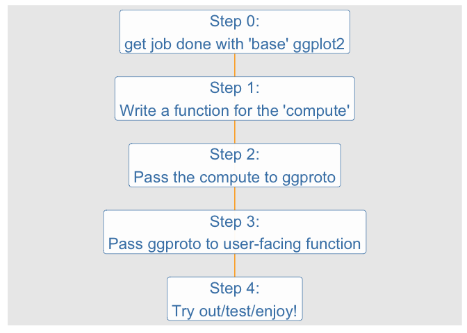<!-- -->

# easy geom\_\* functions: writing new definitions for where and how of marks on ggplots

This section tackles creating new geom\_\* layers. The strategy is to
look at compute that you’d do without extension capabilities (Step 0),
and then create a Stat for that (Step 1 & 2), and then compose a
user-facing function, which inherits other behavior from a more
primitive geom (Step 3), so that ggplot2 can do compute for you in the
background (Step 4).

The section is called *easy* geoms because these geom functions actually
inherit much behavior from more primitive geoms like col, text, point,
segment, rect, etc..

## geom_text_coordinate: **1:1:1, compute_group, GeomText**

The proposed function geom_text_coordinate() is one where a label for an
x and y position is automatically computed. The target user interface
will only require x and y to be specified as aesthetics, and will look
something like this. Whereas the geom_text() function would require a
label aesthetic, geom_text_coordinate will compute this label variable
within the function call.

``` r
ggplot(data = cars) + 
  aes(x = speed, y = dist) + 
  geom_point() + 
  geom_text_coordinate() 
```

We’ll be computing a ‘1:1:1’ type layer, which means that for each row
of the input dataframe, a single mark will be drawn, and the internal
data frame that ggplot2 will render with will use a single row per mark.

### Step 0: use base ggplot2

We’ll always start with a ‘step 0’. The groundwork and knowledge that I
assume you have is to build this plot without extending ggplot2. The
computation that you do yourself will serve as useful reference for step
1 of the extension process. Ultimately, we would like a ggplot2 function
to do the compute in the background for us.

``` r
library(tidyverse)
library(ggxmean)

cars |>
  mutate(coords = 
           paste0("(", speed, ",", dist, ")")) |>
  ggplot() + 
  aes(x = speed, y = dist) + 
  geom_point() + 
  geom_text(aes(label = coords), 
            check_overlap = T,
            hjust = 0,
            vjust = 0)
```

<!-- -->

### Step 1: Compute

Next, we turn to writing this compute in a way that ggplot2 layer
functions can use.

Compute functions will capture the compute that our a user-facing
function will ultimately do for us in a plot build. Arguments that are
required for ggplot2 to use the function in its preparation are both
`data` and `scales`. For now, we don’t need worry more about the scales
argument.

The data that serves as input can be assumed to contain columns with
certain variable names — the required aesthetics that we’ll see declared
in the next step. For the function that we’re building, the required
aesthetics will be ‘x’ and ‘y’. In the `compute_group_coordinates()`
function, therefore, the mutate step is possible because the data will
have variables named x and y. In the mutate step, we are creating a
variable that ggplot2 understands internally, `label`.

``` r
compute_group_coordinates <- function(data, scales) {

# data will contain variables 'x' and 'y', because of required aes
data |>                                    
    mutate(label = 
             paste0("(", x, ", ", y, ")"))
}
```

#### Test Compute

Before we move on, it’s a good idea to check out that our function is
working on its own. To use the function, remember that we need a
dataframe with the expected variables, `x` and `y`. We can test the
function with the cars dataset, but first we modify the data (that has
variable names `speed` and `dist`) with the rename function.

``` r
cars |> 
  rename(x = speed, y = dist) |>  # rename allows us to test function
  compute_group_coordinates() |> 
  head()
#>   x  y   label
#> 1 4  2  (4, 2)
#> 2 4 10 (4, 10)
#> 3 7  4  (7, 4)
#> 4 7 22 (7, 22)
#> 5 8 16 (8, 16)
#> 6 9 10 (9, 10)
```

### Step 2: Define Stat object

The next step toward our user-facing function is to create a new Stat,
which is a ggproto object. Fortunately, this is a subclass of the
ggplot2::Stat Class, and we will inherit much behavior from that class.
This means that definition of our class `StatCoordinate`, is quite
straightforward. For our target function, beyond creating the new class
and declaring the inheritance, we’ll need to 1) specify the required
aesthetics and 2) pass our compute function to a compute slot. The slot
we’re using for our coordinates case is compute_group. Therefore, the
compute will be done by group if any discrete variable (non-numeric) is
mapped from the data. The consequences of using the compute_group slot
(verse other slots) will become more important in future examples.
Returning to the topic of required_aes, the coordinates label can always
be created from x and y as an input, and we know that our compute
function uses both variables named ‘x’ and ‘y’ in it’s computation.

``` r
StatCoordinate <- ggplot2::ggproto(
  `_class` = "StatCoordinate",
  `_inherit` = ggplot2::Stat,
  required_aes = c("x", "y"),
  compute_group = compute_group_coordinates
  )
```

#### Test.

Here we can use geom_text on it’s own to test out our new stat.

``` r
cars |>
  ggplot() + 
  aes(x = speed, y = dist) + 
  geom_point() + 
  geom_text(stat = StatCoordinate, 
            check_overlap = T,
            hjust = 0,
            vjust = 0)
```

<!-- -->

Alternatively, we could test out our Stat with the `layer()` function
and specify both the Stat and the Geom. An input is also required for
the position argument. This gets us closer to defining our user-facing
function.

``` r
ggplot(data = cars) + 
  aes(x = speed, y = dist) + 
  geom_point() + 
  ggplot2::layer(
    stat = StatCoordinate,
    geom = ggplot2::GeomText,
    position = "identity"
    )
```

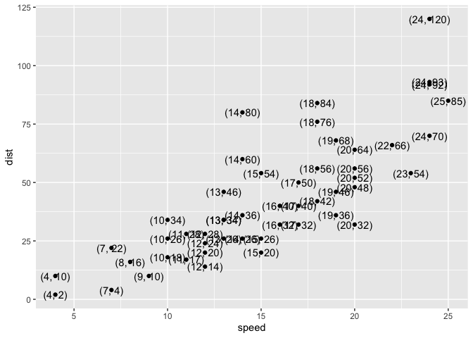<!-- -->

### Step 3. Write user facing function.

In Step 3, we’re close to our goal of a user-facing function for
familiar ggplot2 builds.

Under the hood, we’ll pass our new Stat, StatCoordinate, to ggplot2’s
`layer()` function. `ggplot2::layer()` is may not be familiar, but it
can be used directly in ggplot() pipelines.

Here’s how we specify our `stat_text_coordinate()`. For users that
prefer functions with the geom\_\* prefix, we alias to
`geom_text_coordinate()` as well.

``` r
# part b. create geom_* user-facing function using g
stat_text_coordinate <- function(mapping = NULL, 
                                 data = NULL,
                                 geom = ggplot2::GeomText,
                                 position = "identity",
                                 show.legend = NA,
                                 inherit.aes = TRUE, 
                                 na.rm = FALSE,
                                 ...) {
  ggplot2::layer(
    geom = geom, 
    stat = StatCoordinate,
    position = position,
    mapping = mapping,
    data = data,
    inherit.aes = inherit.aes,
    show.legend = show.legend,
    params = list(na.rm = na.rm, ...)
  )
}

# alias
geom_text_coordinate <- stat_text_coordinate
```

You will see a few more arguments in play here: `mapping`, `data`,
`position`, `show.legend`, etc.. We do anticipate that the user might
want to have control over the data and aesthetic mapping specific to
layer (rather than deriving them from global declarations), and
therefore make the mapping and data arguments available. Furthermore,
the position, show.legend, inherit.aes, and na.rm arguments are made
available in the geom as shown below. The ellipsis allows you to
leverage even more functionality. In sum, this makes
`geom_text_coordinate()` work very much like `geom_text()` — you can use
all the same arguments you’d use with geom_text() — except that the
label aesthetic is computed under the hood, and vanilla `geom_text()`
requires you to specify the label aesthetic. For example, you can use
the argument `check_overlap` in `geom_text_coordinate()`, as you might
do in `geom_text()`.

#### Test

Good news, we’re at Step 4! You created a function for use in a ggplot2
pipeline and now you can use it! Remember, you can basically use
geom_text_coordinate in the same was as geom_text, because the geom
argument in the layer() function is geom = GeomText, so arguments like
check_overlap that are usable in geom_text will be meaningful our new
function! The difference, of course, is that the label aesthetic is
computed for you – so you don’t need that aesthetic which would be
required for the vanilla geom_text() function.

``` r
ggplot(data = cars) + 
  aes(x = speed, y = dist) + 
  geom_point() + 
  geom_text_coordinate() 
```

<!-- -->

``` r

last_plot() + 
  aes(color = speed > 15)
```

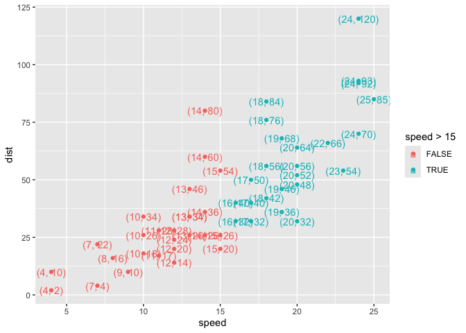<!-- -->

``` r

last_plot() + 
  geom_text_coordinate(check_overlap = T,
                       color = "black") 
```

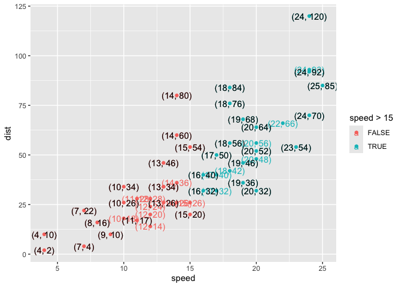<!-- -->

## geom_post: **1:1:1, compute_group, GeomSegment**

The next proposed function we’ll take on is geom_post(). We can use this
function where we are interested in the magnitude of y, not just
relative positions of y. Given that we are interested in the magnitude
of y we’d like a geom that extends from the value of y to y equal to
zero, i.e. a ‘post’ geom. You can use a geom_segment for this purpose in
base ggplot2 as seen in Step 0. However, you’ll notice that the xend and
yend, which are aesthetics that geom_segment requires, could
automatically be derived given the requirements of drawing a post.
Therefore, to simplify your future plot compositions, you may want to
define an extension function, geom_post().

### Step 0. Use base ggplot2

``` r
probs_df = data.frame(outcome = 0:1, 
       prob = c(.7, .3))

probs_df
#>   outcome prob
#> 1       0  0.7
#> 2       1  0.3
```

``` r

ggplot(data = probs_df) + 
  aes(x = outcome, y = prob, yend = 0, xend = outcome) + 
  geom_point() +
  geom_segment()
```

<!-- -->

### Step 1: Compute

``` r
compute_group_post <- function(data, scales){
  
  data |>
    dplyr::mutate(xend = x) |>
    dplyr::mutate(yend = 0)
  
}
```

#### Test

``` r
probs_df |>
  rename(x = outcome, y = prob) |>
  compute_group_post()
#>   x   y xend yend
#> 1 0 0.7    0    0
#> 2 1 0.3    1    0
```

### Step 2: Define Stat

``` r
StatPost <- ggplot2::ggproto("StatPost",
                               ggplot2::Stat,
                               compute_group = compute_group_post,
                               required_aes = c("x", "y")
)
```

#### Testing with layer() or geom\_\*()

``` r
ggplot(data = probs_df) + 
  aes(x = outcome, y = prob) + 
  geom_point() +
  geom_segment(stat = StatPost)
```

<!-- -->

### Step 3: Pass to user-facing function using ggplot2::layer()

``` r
stat_post <- function(mapping = NULL, 
                      data = NULL,
                      geom = GeomSegment,
                      position = "identity", 
                      na.rm = FALSE, 
                      show.legend = NA,
                      inherit.aes = TRUE, ...) {

  ggplot2::layer(
    stat = StatPost, 
    geom = geom, 
    data = data, 
    mapping = mapping,
    position = position, 
    show.legend = show.legend, 
    inherit.aes = inherit.aes,
    params = list(na.rm = na.rm, ...)
  )

}


# aliasing
geom_post <- stat_post
```

##### use/test/enjoy

``` r
ggplot(data = probs_df) + 
  aes(x = outcome, y = prob) + 
  geom_post()
```

<!-- -->

### geom_lollipop: Tangential bonus topic: Combining layers into via `list()`

One way to combine layers is via the `list()` function. However, if you
want your point and post to be more closely tied together, another
mechanism exists… link to…

``` r
geom_lollipop <- function(...){

  list(geom_post(...),
       geom_point(...))

}

ggplot(probs_df) +
  aes(x = outcome, y = prob) +
  geom_lollipop(color = "magenta")
```

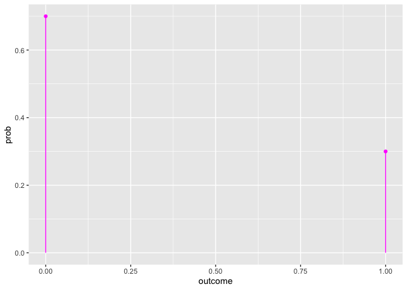<!-- -->

## geom_xy_means: **n:1:1, compute_group, GeomPoint**

*many rows from a dataset: will be summarized and visualized by as
single mark: the mark will be defined by one row of data*

### Step 0. Use base ggplot2

``` r
mtcar_xy_means <- mtcars |>
  summarize(wt_mean = mean(wt),
            mpg_mean = mean(mpg))

ggplot(mtcars) + 
  aes(x = wt, y = mpg) + 
  geom_point() + 
  geom_point(data = mtcar_xy_means,
             aes(x = wt_mean, y = mpg_mean),
             size = 8)
```

<!-- -->

### Step 1. Write compute function

``` r
compute_group_means <- function(data, scales){
  
  data |>
    summarise(x = mean(x),
              y = mean(y))
  
}
```

#### Testing…

``` r
mtcars |> 
  select(x = wt, y = mpg) |> 
  compute_group_means()
#>         x        y
#> 1 3.21725 20.09062
```

### Step 2. Define Stat, pasing in compute

``` r
StatXymean <- ggplot2::ggproto("StatXymean",
                               ggplot2::Stat,
                               compute_group = compute_group_means,
                               required_aes = c("x", "y")
)
```

#### Testing with layer() or geom\_\*()

``` r
ggplot(mtcars) + 
  aes(x = wt, y = mpg) + 
  geom_point() + 
  geom_point(stat = StatXymean,
             size = 8)
```

<!-- -->

### Step 3. Write user-facing function

``` r
stat_xy_means <- function(mapping = NULL, 
                          data = NULL,
                          geom = ggplot2::GeomPoint,
                          position = "identity", 
                          na.rm = FALSE, 
                          show.legend = NA,
                          inherit.aes = TRUE, ...) {

  ggplot2::layer(
    stat = StatXymean, 
    geom = geom, 
    data = data, 
    mapping = mapping,
    position = position, 
    show.legend = show.legend, 
    inherit.aes = inherit.aes,
    params = list(na.rm = na.rm, ...)
  )

}

# aliasing
geom_xy_means <- stat_xy_means
```

#### Use/Test/Enjoy

``` r
ggplot(mtcars) + 
  aes(x = wt, y = mpg) + 
  geom_point() + 
  geom_xy_means(size = 8)
```

<!-- -->

``` r

last_plot() +
  aes(color = am == 1)
```

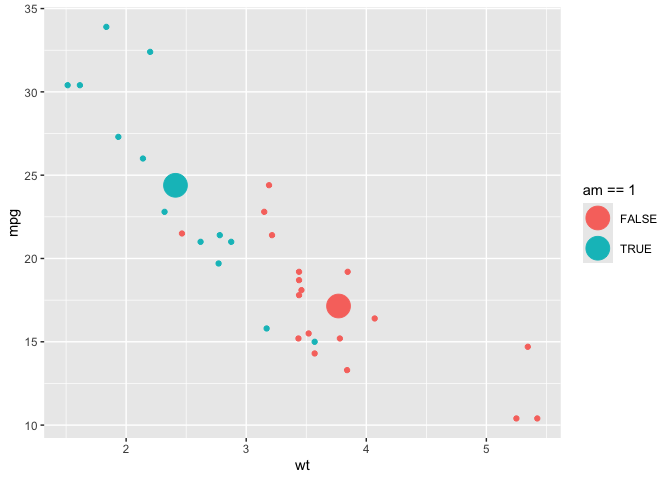<!-- -->

## geom_chull: **N:1:n, compute_group, GeomPolygon**

This example uses the chull function in R, which ‘computes the subset of
points which lie on the convex hull of the set of points specified.’ In
layman’s terms if you had a bunch of nails hammered into a board and put
a rubber-band around them, the convex hull would be defined by the
subset of nails touching the rubberband.

I’m especially excited to include this example, reworked using the Step
0-4 approach, because ultimately looking at the ggplot2 extension
vignette on stat_chull and geom_chull was the beginning of layer
extension unlocking for me.
<https://ggplot2.tidyverse.org/articles/extending-ggplot2.html#creating-a-new-stat>

### Step 0. get it done with ggplot2

``` r
library(tidyverse)
chull_row_ids <- chull(mtcars$wt, mtcars$mpg)
chull_row_ids
#>  [1] 17 16 15 24  7 29 21  3 28 20 18
```

``` r
mtcars_chull_subset <- mtcars |> slice(chull_row_ids)

ggplot(mtcars) + 
  aes(x = wt, y = mpg) + 
  geom_point() + 
  geom_polygon(data = mtcars_chull_subset, 
               alpha = .3, 
               color = "black")
```

<!-- -->

### Step 1. Compute

``` r
# Step 1
compute_group_c_hull <- function(data, scales){
  
  chull_row_ids <- chull(data$x, data$y)
  
  data |> slice(chull_row_ids)
  
}
```

Below, we see that the dataset is reduced to 11 rows which constitute
the convex hull perimeter.

#### Test

``` r
mtcars |> # 32 rows
  rename(x = wt, y = mpg) |> 
  compute_group_c_hull() # 11 rows
#>                        y cyl  disp  hp drat     x  qsec vs am gear carb
#> Chrysler Imperial   14.7   8 440.0 230 3.23 5.345 17.42  0  0    3    4
#> Lincoln Continental 10.4   8 460.0 215 3.00 5.424 17.82  0  0    3    4
#> Cadillac Fleetwood  10.4   8 472.0 205 2.93 5.250 17.98  0  0    3    4
#> Camaro Z28          13.3   8 350.0 245 3.73 3.840 15.41  0  0    3    4
#> Duster 360          14.3   8 360.0 245 3.21 3.570 15.84  0  0    3    4
#> Ford Pantera L      15.8   8 351.0 264 4.22 3.170 14.50  0  1    5    4
#> Toyota Corona       21.5   4 120.1  97 3.70 2.465 20.01  1  0    3    1
#> Datsun 710          22.8   4 108.0  93 3.85 2.320 18.61  1  1    4    1
#> Lotus Europa        30.4   4  95.1 113 3.77 1.513 16.90  1  1    5    2
#> Toyota Corolla      33.9   4  71.1  65 4.22 1.835 19.90  1  1    4    1
#> Fiat 128            32.4   4  78.7  66 4.08 2.200 19.47  1  1    4    1
```

### Step 2. Define Stat

``` r
# Step 2
StatChull <- ggproto(`_class` = "StatChull",
                     `_inherit` = ggplot2::Stat,
                     compute_group = compute_group_c_hull,
                     required_aes = c("x", "y"))
```

#### Test

``` r
ggplot(mtcars) + 
  aes(x = wt, y = mpg) + 
  geom_point() + 
  geom_polygon(stat = StatChull, 
               alpha = .3, 
               color = "black")
```

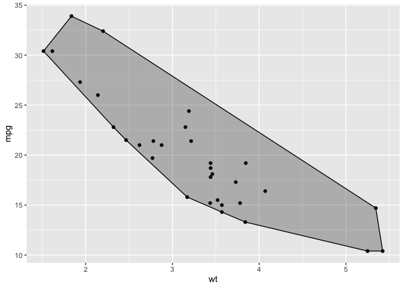<!-- -->

### Step 3. Write user-facing geom\_/stat\_ Function(s)

``` r
stat_chull <- function(mapping = NULL, 
                      data = NULL,
                       geom = GeomPolygon,
                        position = "identity", 
                        na.rm = FALSE, 
                        show.legend = NA,
                        inherit.aes = TRUE, ...) {

  ggplot2::layer(
    stat = StatChull, 
    geom = geom, 
    data = data, mapping = mapping,
    position = position, 
    show.legend = show.legend, 
    inherit.aes = inherit.aes,
    params = list(na.rm = na.rm, ...)
  )

}

# aliasing
geom_chull <- stat_chull
```

#### Try out/test/ enjoy

``` r
ggplot(data = mtcars) + 
  aes(x = wt, y = mpg) + 
  geom_point() + 
  geom_chull(alpha = .3)
```

<!-- -->

``` r

last_plot() + 
  aes(color = factor(am),
      fill = factor(am))
```

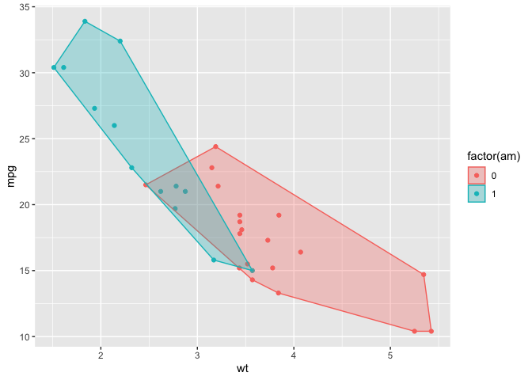<!-- -->

------------------------------------------------------------------------

## geom_waterfall: **1:1:1, compute_panel, GeomRect**

*One-row geom for each row in input dataset; geom interdependence*

A waterfall plot displays inflows and outflows that occur as a result of
events as well as the balance across multiple events. It is typically
displayed as a series of rectangles. Because the net change is displayed
(cumulative change), there is interdependence between the geometries on
our plot – where one rectangle ends, the next in the series begins.
Therefore we’ll be computing by *panel* and not by group – we do not
want ggplot2 to split the data by discrete variables, which our x axis
is most likely to be.

<!-- In this example we'll see how to alias the stat to a geom user-facing function (stat_waterfall -> geom_waterfall), and also how to change the geom to allow for additional convenient user-facing functions (stat_waterfall -> geom_waterfall_label).  We prep to create geom_waterfall label by using the default_aes slot in in the ggproto step.   -->

### Step 0. Use base ggplot2

For ‘step 0’, we base ggplot2 to accomplish this task, and actually
pretty closely follow Hadley Wickham’s short paper that tackles a
waterfall plot with ggplot2.
<https://vita.had.co.nz/papers/ggplot2-wires.pdf>

``` r
library(tidyverse)
flow_df <- data.frame(event = c("Sales", 
                     "Refunds",
                     "Payouts", 
                     "Court Losses", 
                     "Court Wins", 
                     "Contracts", 
                     "Fees"),
           change = c(6400, -1100, 
                      -100, -4200, 3800, 
                      1400, -2800)) %>% 
  mutate(event = factor(event))

  
balance_df <- flow_df %>%   # maybe add factor in order if factor is not defined...
  mutate(x_pos = event %>% as.numeric()) %>% 
  arrange(x_pos) %>% 
  mutate(balance = cumsum(c(0, 
                            change[-nrow(.)]))) %>% 
  mutate(flow = factor(sign(change)))


ggplot(balance_df) +
          geom_rect(
            aes(x = event,
              xmin = x_pos - 0.45, 
              xmax = x_pos + 0.45, 
              ymin = balance, 
              ymax = balance + change)) +
  aes(fill = sign(change))
#> Warning in geom_rect(aes(x = event, xmin = x_pos - 0.45, xmax = x_pos + :
#> Ignoring unknown aesthetics: x
```

<!-- -->

### Steps 1. compute

Then, we bundle up this computation into a function (step 1), called
compute_panel_waterfall. We want the computation done *panel-wise*
because of the interdependence between the events, which run along the x
axis. Group-wise computation (the defining compute_group element), would
fail us, as the cross-event interdependence would not be preserved.

``` r
compute_panel_waterfall <- function(data, scales, width = .90){
  
  data %>% 
  arrange(x) %>% 
  mutate(balance = cumsum(c(0, 
                            change[-nrow(.)]))) %>% 
  mutate(direction = factor(sign(change))) %>% 
  mutate(xmin = as.numeric(x) - width/2,
         xmax = as.numeric(x) + width/2,
         ymin = balance,
         ymax = balance + change) %>% 
  # mutate(x = x_pos) %>% 
  mutate(y = ymax) %>% 
  mutate(gain_loss = ifelse(direction == 1, "gain", "loss"))
  
}
```

### Step 2. Define Stat, passing to ggproto

Now we’ll pass the computation to the compute_panel…

``` r
StatWaterfall <- ggplot2::ggproto(`_class` = "StatWaterfall", 
                         `_inherit` = ggplot2::Stat,
                         required_aes = c("change", "x"),
                         compute_panel = compute_panel_waterfall)
```

#### Test Stat with layer() or geom\_\*()

``` r
flow_df %>% 
  ggplot() +
  aes(x = event, change = change) + 
  geom_rect(stat = StatWaterfall)
```

<!-- -->

### Step 3. Pass to user-facing function

In step 3, we define stat_waterfall, passing along StatWaterfall to
create a ggplot2 layer function. We include a standard set of arguments,
and we set the geom to ggplot2::GeomRect.

``` r
stat_waterfall <- function(geom = ggplot2::GeomRect, 
  mapping = NULL,
  data = NULL,
  position = "identity",
  na.rm = FALSE,
  show.legend = NA,
  inherit.aes = TRUE, ...) {
  ggplot2::layer(
    stat = StatWaterfall,  # proto object from step 2
    geom = geom,  # inherit other behavior
    data = data,
    mapping = mapping,
    position = position,
    show.legend = show.legend,
    inherit.aes = inherit.aes,
    params = list(na.rm = na.rm, ...)
  )
}

geom_waterfall <- stat_waterfall


geom_waterfall_label <- function(..., lineheight = .8){
  stat_waterfall(geom = "text", 
                 lineheight = lineheight, ...)}
```

#### Use/test/enjoy

In Step 4, we get to try out the functionality.

``` r
flow_df |> 
  ggplot() +
  geom_hline(yintercept = 0) +
  aes(change = change, 
      x = event) + # event in order
  geom_waterfall()
```

<!-- -->

### Bonus: default `aes` using delayed aesthetic evaluation (D.A.E.)

The bonus topic is on defining a default aesthetic. In general, the
direction of the flow is of great import for a waterfall chart, and it
is typically depicted with fill color. However, flow direction mapped to
fill color might not be absolutely fundamental in how we conceive of a
waterfall plot. Therefore, instead of creating a variable ‘fill’ in the
compute_panel_waterfall routine, we created gain_loss which we can
reference with delayed aesthetic evaluation, in this case
ggplot2::after_stat(). We’ll refer to it in the `default_aes` slot of
the StatWaterfall, using the ggplot2::after_stat() call on the
internally created variable.

``` r
StatWaterfall <- ggplot2::ggproto(`_class` = "StatWaterfall", 
                         `_inherit` = ggplot2::Stat,
                         required_aes = c("change", "x"),
                         compute_panel = compute_panel_waterfall, 
                         default_aes =                              ### NEW!
                           ggplot2::aes(fill =
                                          ggplot2::after_stat(gain_loss)))
```

Now, we’ll just check to see how StatWaterfall works quickly with the
geom_rect() function.

``` r
flow_df |> 
  ggplot() +
  geom_hline(yintercept = 0) +
  aes(change = change, 
      x = event) + # event in order
  geom_rect(stat = StatWaterfall)
```

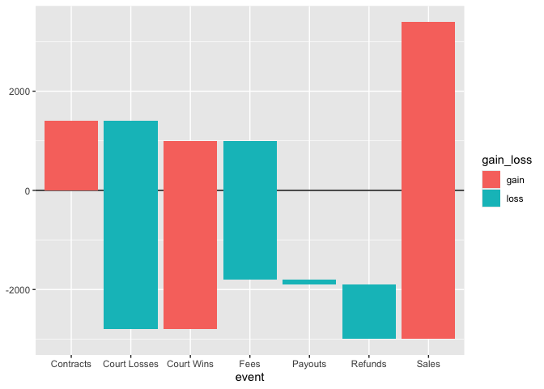<!-- -->

We also see that we are not locked into the gain_loss being the variable
that defines fill by defining a default aes, as seen below:

``` r
last_plot() + 
  aes(fill = event == "Sales")
```

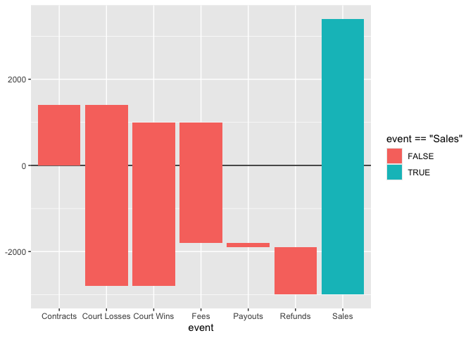<!-- -->

And we can also turn off mapping to fill altogether by setting
`aes(fill = NULL)`.

``` r
last_plot() + 
  aes(fill = NULL)
```

<!-- -->

## geom_circlepack: **1:1:n, compute_panel, GeomPolygon**

*a many-row geom for each row of the input data frame, with
interdependence between input observations.*

### Step 0. How-to w/ base ggplot2 (and {packcircles})

``` r
df_to_plot <- gapminder::gapminder %>%  
  filter(continent == "Americas") %>%  
  filter(year == 2002) %>%  
  select(country, pop)

packed_centers <- packcircles::circleProgressiveLayout(
  df_to_plot$pop,  sizetype = 'area')  

circle_outlines <- packed_centers %>%  
  packcircles::circleLayoutVertices(npoints = 50)  
  
circle_outlines %>%  
  ggplot() +  
  aes(x = x, y = y) +  
  geom_polygon() +  
  aes(group = id) + 
  coord_equal()
```

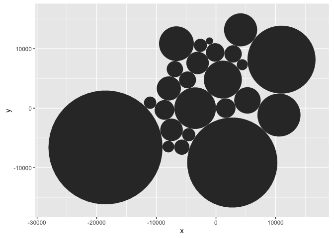<!-- -->

### Step 1. Compute

``` r
# Step 1
compute_panel_circlepack <- function(data, scales){

  data_w_id <- data |>
    mutate(id = row_number())

  data_w_id |>
    pull(area) |>
    packcircles::circleProgressiveLayout(
      sizetype = 'area') |>
    packcircles::circleLayoutVertices(npoints = 50) |>
    left_join(data_w_id) |>
    mutate(group = id)

}
```

#### Test compute

``` r
gapminder::gapminder %>%  
  filter(continent == "Americas") %>%  
  filter(year == 2002) %>%  
  select(area = pop) %>%  
  compute_panel_circlepack() %>% 
  head()
#> Joining with `by = join_by(id)`
#>            x         y id     area group
#> 1    0.00000    0.0000  1 38331121     1
#> 2  -27.54349  437.7912  1 38331121     1
#> 3 -109.73958  868.6783  1 38331121     1
#> 4 -245.29200 1285.8657  1 38331121     1
#> 5 -432.06299 1682.7743  1 38331121     1
#> 6 -667.10708 2053.1445  1 38331121     1
```

### Step 2. Define Stat object

``` r
StatCirclepack <- ggplot2::ggproto(`_class` = "StatCirclepack",
                                  `_inherit` = ggplot2::Stat,
                                  required_aes = c("area"),
                                  compute_panel = compute_panel_circlepack
                                  )
```

#### Test

``` r
gapminder::gapminder %>%  
  filter(continent == "Americas") %>%  
  filter(year == 2002) %>%  
  select(country, pop) %>% 
  ggplot() + 
  aes(area = pop) + 
  geom_polygon(stat = StatCirclepack) + 
  labs(title = "Population sizes are highly variable in the Americas in 2002")
#> Joining with `by = join_by(id)`
```

<!-- -->

### Step 3. pass to user-facing function

``` r
stat_circlepack <- function(mapping = NULL, data = NULL,
                            geom = GeomPolygon,
                           position = "identity", na.rm = FALSE,
                           show.legend = NA,
                           inherit.aes = TRUE, ...) {
  ggplot2::layer(
    stat = StatCirclepack, # proto object from Step 2
    geom = geom, # inherit other behavior
    data = data,
    mapping = mapping,
    position = position,
    show.legend = show.legend,
    inherit.aes = inherit.aes,
    params = list(na.rm = na.rm, ...)
  )
}

# aliasing
geom_circlepack <- stat_circlepack
```

#### Use/test/enjoy

``` r
gapminder::gapminder |> 
  filter(year == 2002) |> 
  ggplot() + 
  aes(id = country, area = pop/1000000) + 
  geom_circlepack() + 
  coord_equal()
#> Joining with `by = join_by(id)`
```

<!-- -->

``` r

last_plot() + 
  aes(fill = continent) 
#> Joining with `by = join_by(id)`
```

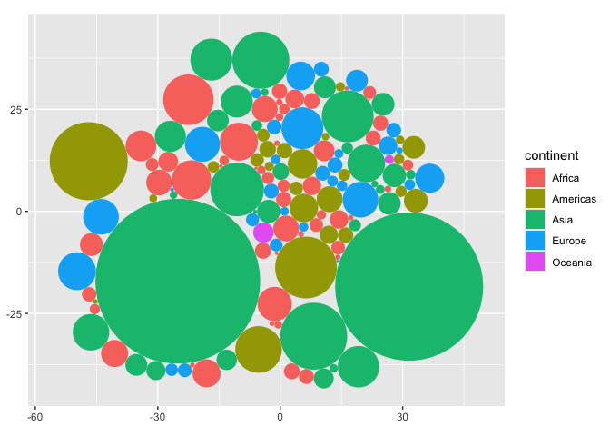<!-- -->

``` r

last_plot() + 
  aes(fill = pop/1000000) + 
  facet_wrap(facets = vars(continent))
#> Joining with `by = join_by(id)`
#> Joining with `by = join_by(id)`
#> Joining with `by = join_by(id)`
#> Joining with `by = join_by(id)`
#> Joining with `by = join_by(id)`
```

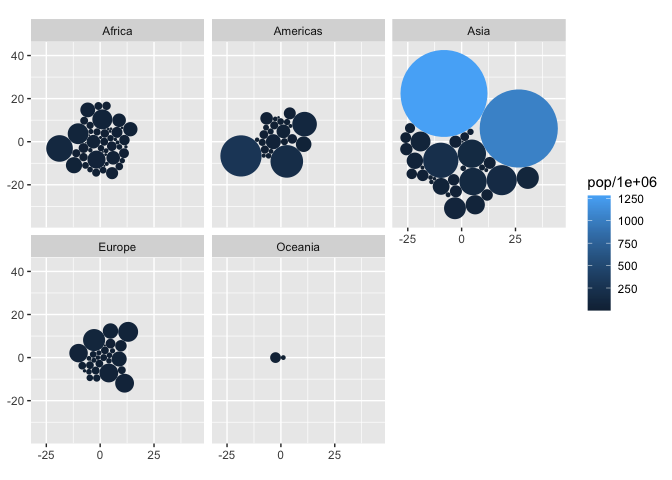<!-- -->

## geom_circle: **1:1:n, compute_panel, GeomPolygon**

This next example is the case that Thomas Lin Pederson took on in his
talk, but takes a bit different approach to be more consistent with
other approaches in this cookbook. Essentially, for each row in our data
set with defined centers x0 and y0 and radius r, we are joining up 15
rows which then help us build a circle around the x0y0 circle center.

I use the internal variable name ‘around’ instead of ‘angle’ since angle
meaningful to gglot2 for defining the angle of text, which is not our
meaning here.

*a single row in a dataframe: will be visualized by a single mark : the
mark will be defined by many-row in an internal dataframe*

*for each row in the dataframe, a single geometry is visualized, but
each geometric mark is defined by many rows…*

“../mytidytuesday/2023-12-27-geom_circle_via_join/geom_circle_via_join.Rmdâ€

### Step 0. Do it with base ggplot2

``` r
library(tidyverse)

n_vertices <- 15

data.frame(x0 = 0:1, y0 = 0:1, r = 1:2/3) |> 
  mutate(input_data_row_id = row_number()) |> 
  crossing(tibble(vertex_id = 0:n_vertices)) |> 
  mutate(around = 2*pi*vertex_id/max(vertex_id)) |> 
  mutate(x = x0 + cos(around)*r,
         y = y0 + sin(around)*r) |> 
  ggplot() + 
  aes(x, y) +
  geom_path(aes(group = input_data_row_id)) +
  geom_text(aes( label = vertex_id))
```

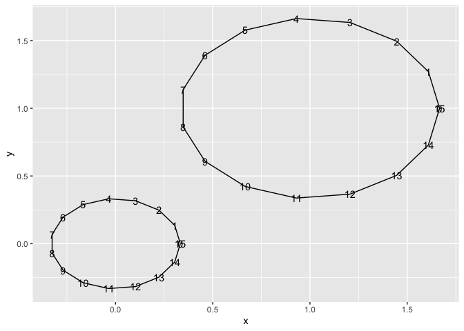<!-- -->

### Step 1. Compute

``` r
compute_panel_circle <- function(data, scales, n_vertices = 15){
  
  data |> 
    mutate(group = row_number()) |> 
    crossing(tibble(around = 0:n_vertices/n_vertices)) |>
    mutate(x = x + cos(2*pi*around)*r,
           y = y + sin(2*pi*around)*r) 
  
}

tibble(x = 1:2, y = 1:2, r = 1 ) |> 
  compute_panel_circle()
#> # A tibble: 32 × 5
#>         x     y     r group around
#>     <dbl> <dbl> <dbl> <int>  <dbl>
#>  1 2      1         1     1 0     
#>  2 1.91   1.41      1     1 0.0667
#>  3 1.67   1.74      1     1 0.133 
#>  4 1.31   1.95      1     1 0.2   
#>  5 0.895  1.99      1     1 0.267 
#>  6 0.5    1.87      1     1 0.333 
#>  7 0.191  1.59      1     1 0.4   
#>  8 0.0219 1.21      1     1 0.467 
#>  9 0.0219 0.792     1     1 0.533 
#> 10 0.191  0.412     1     1 0.6   
#> # ℹ 22 more rows
```

### Step 2. Define Stat

``` r
StatCircle <- ggproto(
  `_class` = "StatCircle", 
  `_inherit` = ggplot2::Stat,
  compute_panel = compute_panel_circle,
                      required_aes = c("x", "y", "r")
                      )
```

#### Test with geom\_\*() or layer

``` r
mpg %>% 
  ggplot() + 
  aes(x = cty, y = hwy) + 
  geom_point() + 
  geom_path(stat = StatCircle, aes(r = .5))
```

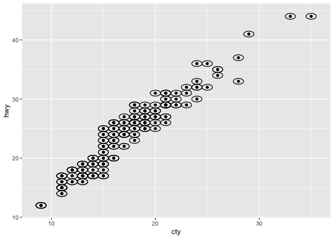<!-- -->

### Step 3. Write geom\_\* or stat\_\*

``` r
stat_circle <- function(
  mapping = NULL,
  data = NULL,
  geom = GeomPolygon,
  position = "identity",
  na.rm = FALSE,
  show.legend = NA,
  inherit.aes = TRUE, ...) {
  ggplot2::layer(
    stat = StatCircle,  # proto object from Step 2
    geom = geom,  # inherit other behavior
    data = data,
    mapping = mapping,
    position = position,
    show.legend = show.legend,
    inherit.aes = inherit.aes,
    params = list(na.rm = na.rm, ...)
  )
}

geom_circle <- stat_circle
```

#### Test enjoy

``` r
data.frame(x = 0:1, 
           y = 0:1, 
           r = 1:2/3) |> 
  ggplot() + 
  aes(x = x, y = y, r = r) + 
  geom_circle(color = "red",
              linetype = "dashed") + 
  aes(fill = r)
```

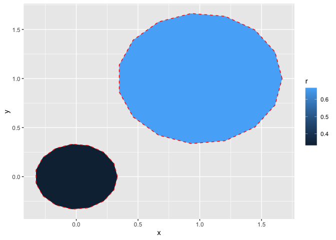<!-- -->

``` r

diamonds |> 
  slice_sample(n = 80) |> 
  ggplot() + 
  aes(x = as.numeric(cut), 
      y = carat, 
      r = as.numeric(clarity)/20) + 
  geom_circle(alpha = .2, n_vertices = 5) + 
  aes(fill = after_stat(r)) +
  coord_equal()
```

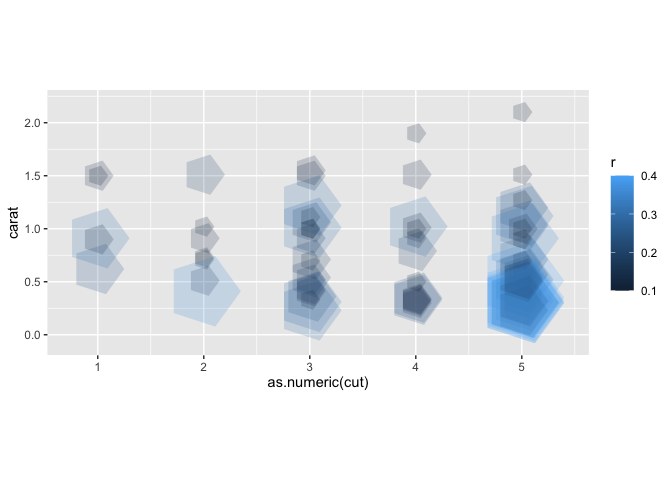<!-- -->

``` r

cars |> 
  sample_n(12) |>  
  ggplot() + 
  aes(x = speed, y = dist, r = dist/speed) + 
  geom_circle(color = "black") +
  coord_equal()
```

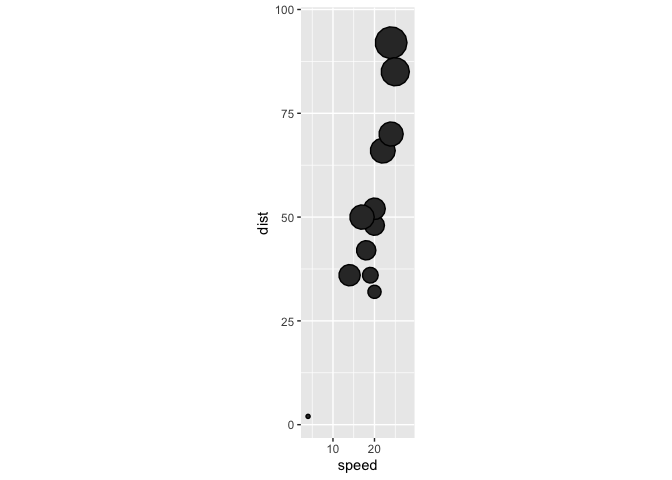<!-- -->

``` r

last_plot() + 
  aes(alpha = speed > 15) +
  aes(linetype = dist > 20) +
  aes(fill = speed > 18) +
  facet_wrap(~ dist > 40)
#> Warning: Using alpha for a discrete variable is not advised.
```

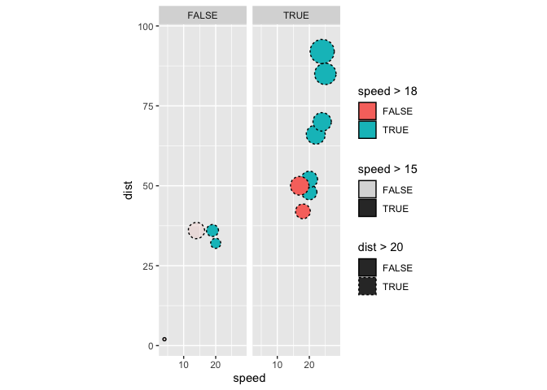<!-- -->

<!-- ### Discussion: Why not compute_group -->
<!-- ```{r} -->
<!-- StatCircle2 <- ggproto( -->
<!--   `_class` = "StatCircle2", -->
<!--   `_inherit` = ggplot2::Stat, -->
<!--   compute_group = compute_panel_circle, -->
<!--   required_aes = c("x0", "y0", "r")) -->
<!-- geom_circle_CG <- function( -->
<!--   mapping = NULL, -->
<!--   data = NULL, -->
<!--   position = "identity", -->
<!--   na.rm = FALSE, -->
<!--   show.legend = NA, -->
<!--   inherit.aes = TRUE, ...) { -->
<!--   ggplot2::layer( -->
<!--     stat = StatCircle2,  # proto object from Step 2 -->
<!--     geom = ggplot2::GeomPolygon,  # inherit other behavior -->
<!--     data = data, -->
<!--     mapping = mapping, -->
<!--     position = position, -->
<!--     show.legend = show.legend, -->
<!--     inherit.aes = inherit.aes, -->
<!--     params = list(na.rm = na.rm, ...) -->
<!--   ) -->
<!-- } -->
<!-- cars |>  -->
<!--   sample_n(12) |>   -->
<!--   ggplot() +  -->
<!--   aes(x0 = speed, y0 = dist, r = dist/speed) +  -->
<!--   geom_circle_CG(color = "black") + -->
<!--   coord_equal() +  -->
<!--   aes(alpha = speed > 15) + -->
<!--   aes(linetype = dist > 20) + -->
<!--   aes(fill = speed > 18) + -->
<!--   facet_wrap(~ dist > 40) -->
<!-- ``` -->

### Exercise: Write the function, geom_heart() that will take the compute below and do it within the geom\_\* function

``` r
data.frame(x0 = 0:1, y0 = 0:1, r = 1:2/3) %>% 
  mutate(group = row_number()) %>% 
  tidyr::crossing(vertex_index = 0:15/15) %>%
    dplyr::mutate(
      y = y0 + r * (
        .85 * cos(2*pi*vertex_index)
        - .35 * cos(2 * 2*pi*vertex_index)
        - .25 * cos(3 * 2*pi*vertex_index)
        - .05 * cos(4 * 2*pi*vertex_index)
      ),
      x = x0 + r * (sin(2*pi*vertex_index)^3)) %>% 
  ggplot() +
   aes(x = x, y = y, group = group) + 
  geom_polygon(alpha = .5, fill = "darkred") + 
  coord_equal()
```

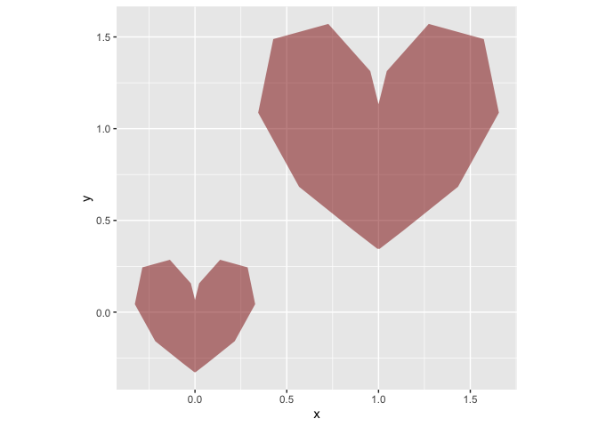<!-- -->

## geom_state: **1:1:n, compute_panel, GeomPolygon**

### Step 0: use base ggplot2

``` r
states_characteristics <- tibble(state.name) |> 
  mutate(ind_vowel_states = 
           str_detect(state.name, "A|E|I|O|U"))

head(states_characteristics)
#> # A tibble: 6 × 2
#>   state.name ind_vowel_states
#>   <chr>      <lgl>           
#> 1 Alabama    TRUE            
#> 2 Alaska     TRUE            
#> 3 Arizona    TRUE            
#> 4 Arkansas   TRUE            
#> 5 California FALSE           
#> 6 Colorado   FALSE
```

``` r

us_states_geo <- ggplot2::map_data("state")

head(us_states_geo)
#>        long      lat group order  region subregion
#> 1 -87.46201 30.38968     1     1 alabama      <NA>
#> 2 -87.48493 30.37249     1     2 alabama      <NA>
#> 3 -87.52503 30.37249     1     3 alabama      <NA>
#> 4 -87.53076 30.33239     1     4 alabama      <NA>
#> 5 -87.57087 30.32665     1     5 alabama      <NA>
#> 6 -87.58806 30.32665     1     6 alabama      <NA>
```

``` r

states_characteristics |> 
  left_join(us_states_geo |> 
              mutate(state.name = stringr::str_to_title(region))) |> 
  ggplot() + 
  aes(x = long, y = lat, group = group) +
  geom_polygon() +
  aes(fill = ind_vowel_states) +
  coord_map()
#> Joining with `by = join_by(state.name)`
```

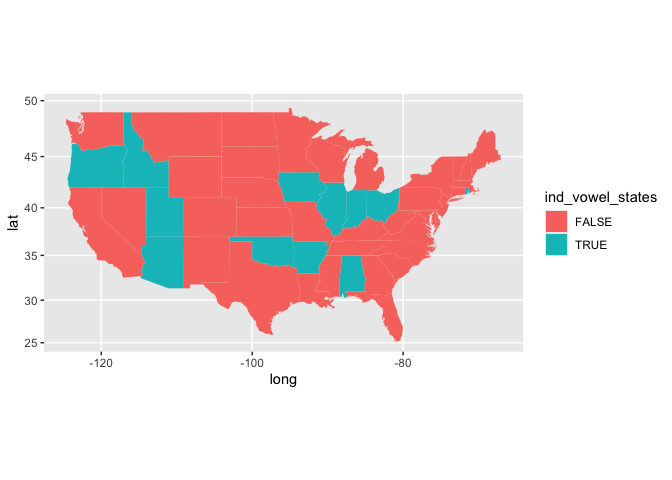<!-- -->

### Step 1: Write compute function 🚧

#### Prestep. Prepare reference dataset with state perimeters

``` r
ggplot2::map_data("state") |> 
  rename(state_name = region) |> 
  mutate(state_name = stringr::str_to_title(state_name)) |> 
  rename(x = long, y = lat) |> 
  select(-subregion) |> 
  rename(state_id_number = group) ->
continental_states_geo_reference
```

#### Compute step. Join reference data onto input data

``` r
compute_panel_state <- function(data, scales){
  
  data |> 
    dplyr::left_join(continental_states_geo_reference) |>
    dplyr::mutate(group = state_id_number)
  
}
```

#### Test

``` r
states_characteristics |> 
  rename(state_name = state.name) |> 
  compute_panel_state()
#> Joining with `by = join_by(state_name)`
#> # A tibble: 15,529 × 7
#>    state_name ind_vowel_states     x     y state_id_number order group
#>    <chr>      <lgl>            <dbl> <dbl>           <dbl> <int> <dbl>
#>  1 Alabama    TRUE             -87.5  30.4               1     1     1
#>  2 Alabama    TRUE             -87.5  30.4               1     2     1
#>  3 Alabama    TRUE             -87.5  30.4               1     3     1
#>  4 Alabama    TRUE             -87.5  30.3               1     4     1
#>  5 Alabama    TRUE             -87.6  30.3               1     5     1
#>  6 Alabama    TRUE             -87.6  30.3               1     6     1
#>  7 Alabama    TRUE             -87.6  30.3               1     7     1
#>  8 Alabama    TRUE             -87.6  30.3               1     8     1
#>  9 Alabama    TRUE             -87.7  30.3               1     9     1
#> 10 Alabama    TRUE             -87.8  30.3               1    10     1
#> # ℹ 15,519 more rows
```

### Step 2. Pass to Stat

``` r
StatUsstate <- ggplot2::ggproto(`_class` = "StatUsstate",
                                `_inherit` = ggplot2::Stat,
                                required_aes = c("state_name"),
                                compute_panel = compute_panel_state)
```

``` r
states_characteristics %>% 
  ggplot() + 
  aes(state_name = state.name) + 
  geom_polygon(stat = StatUsstate) + 
  coord_map()
#> Joining with `by = join_by(state_name)`
```

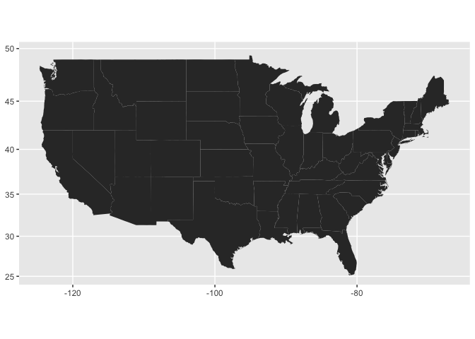<!-- -->

``` r

last_plot() + 
  aes(fill = ind_vowel_states)
#> Joining with `by = join_by(state_name)`
```

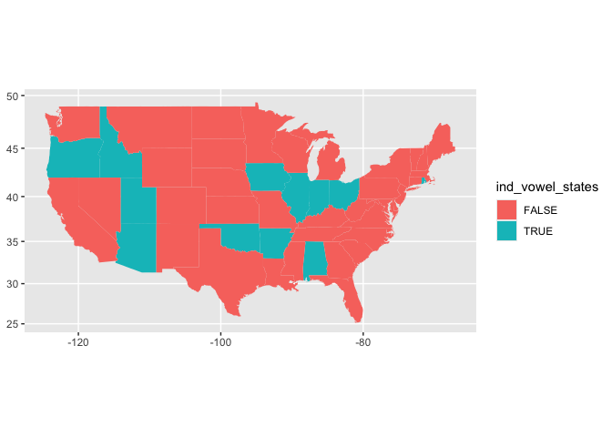<!-- -->

### Step 3. Pass to user-facing function

``` r
geom_state <- function(mapping = NULL, data = NULL,
                           position = "identity", na.rm = FALSE,
                           show.legend = NA,
                           inherit.aes = TRUE, ...) {
  ggplot2::layer(
    stat = StatUsstate, # proto object from Step 2
    geom = ggplot2::GeomPolygon, # inherit other behavior
    data = data,
    mapping = mapping,
    position = position,
    show.legend = show.legend,
    inherit.aes = inherit.aes,
    params = list(na.rm = na.rm, ...)
  )
}
```

#### Use/Test/Enjoy

``` r
ggplot(data = states_characteristics) + 
  aes(state_name = state.name) +
  geom_state() + 
  coord_map()
#> Joining with `by = join_by(state_name)`
```

<!-- -->

``` r

last_plot() + 
  aes(fill = ind_vowel_states)
#> Joining with `by = join_by(state_name)`
```

<!-- -->

``` r

last_plot() + 
  aes(fill = state.name == "Iowa")
#> Joining with `by = join_by(state_name)`
```

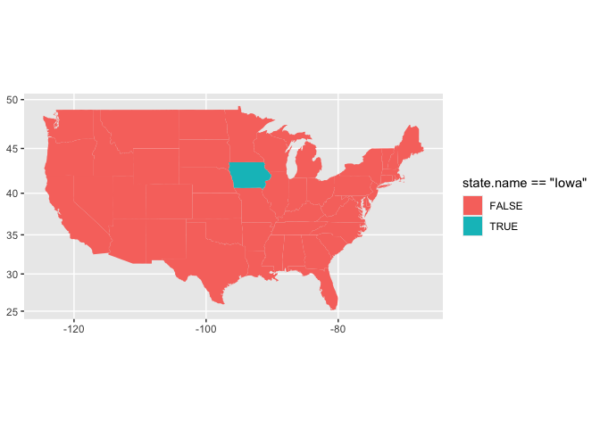<!-- -->

## geom_ols_linear_parallel: **n:k:w; interdependence**

If you’re a long time user of ggplot2, you’ll probably have used
geom_smooth. However, because geom_smooth estimates group-wise, that is,
the modeling is done in the compute_group step of the Stat’s
specification, when a categorical variable is mapped (to color or group
for example), multiple models are computed and visualized. When you want
to visualize a single model that contain a categorical (discrete)
variable, then, geom_smooth won’t be well suited to your problem.

To start to think about extension in this space, we create
geom_ols_linear_parallel, the simple case of an OLS model with a
continuous and categorical independent variables, with no interaction
and no higher order terms. This simple extension could be widely useful
in in teaching and industry. Yet, this is a very specific use case; in
the bonus material we’ll discuss in how the extension strategy could be
made usable for more modeling cases.

### Step 1. Get the job done with ggplot2

``` r
penguins_df <- palmerpenguins::penguins |>
  ggplot2::remove_missing()
#> Warning: Removed 11 rows containing missing values or values outside the scale
#> range.
```

``` r

model_bill_length <- lm(bill_length_mm ~ 
                        bill_depth_mm + species, 
                        data = penguins_df)

penguins_df |>
  mutate(bill_length_fit =
           model_bill_length$fitted.values) |>
  ggplot() +
  aes(x = bill_depth_mm,
      y = bill_length_mm) +
  geom_point() + 
  aes(color = species) + 
  geom_line(aes(y = bill_length_fit))
```

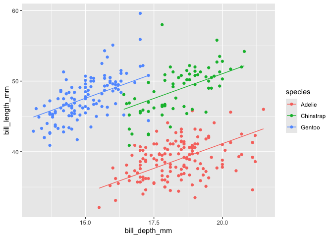<!-- -->

``` r
compute_panel_lm_parallel <- function(data, scales){
  
  model <- lm(y ~ x + category, data = data)
  
  data |>
    mutate(y = model$fitted)
  
}
```

### Step 2. Define Stat

``` r
StatParallel <- ggplot2::ggproto(`_class` = "StatParallel",
                           `_inherit` = ggplot2::Stat,
                           required_aes = c("x", "y", "category"),
                           compute_panel = compute_panel_lm_parallel,
                           default_aes = aes(color = after_stat(category)))
```

#### Use layer() or geom\_\*() function to test stat

``` r
penguins_df |>
  ggplot() +
  aes(x = bill_depth_mm,
      y = bill_length_mm, 
      color = species) +
  geom_point() + 
  geom_line(stat = StatParallel, aes(category = species))
```

<!-- -->

### Step 3. Pass to user-facing function

``` r
stat_ols_linear_parallel <- function(mapping = NULL, data = NULL,
                                     geom = GeomLine,
                           position = "identity", na.rm = FALSE,
                           
                           show.legend = NA,
                           inherit.aes = TRUE, ...) {
  ggplot2::layer(
    stat = StatParallel, # proto object from Step 2
    geom = geom, # inherit other behavior
    data = data,
    mapping = mapping,
    position = position,
    show.legend = show.legend,
    inherit.aes = inherit.aes,
    params = list(na.rm = na.rm, ...)
  )
}

# alias
geom_ols_linear_parallel <- stat_ols_linear_parallel
```

#### Use/test/enjoy

``` r
ggplot(palmerpenguins::penguins) +
  aes(x = bill_depth_mm, 
      y = bill_length_mm,
      color = species, 
      category = species) +
  geom_point() + 
  geom_ols_linear_parallel()
#> Warning: Removed 2 rows containing non-finite outside the scale range
#> (`stat_parallel()`).
#> Warning: Removed 2 rows containing missing values or values outside the scale range
#> (`geom_point()`).
```

<!-- -->

## geom_county: \*\*1:1:1\*, compute_panel, GeomSf\*\*

*a geom defined by an sf geometry column*

### Step 0. get it done in base ggplot2

Similar to our U.S. states example, where the state name is the
positional aesthetic…

``` r
nc_id_geometry |> 
  left_join(nc_counties_flat) %>% 
  ggplot() + 
  geom_sf() + 
  aes(fill = BIR79)
#> Joining with `by = join_by(FIPS, NAME)`
```

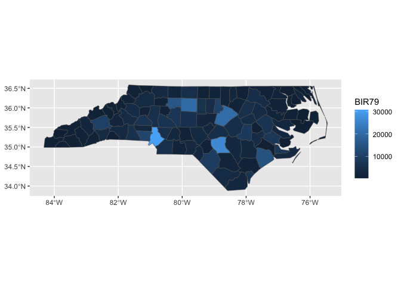<!-- -->

``` r
last_plot() %>% layer_data() %>% head()
#>      fill                       geometry PANEL group      xmin      xmax
#> 1 #152F48 MULTIPOLYGON (((-81.47276 3...     1    -1 -84.32385 -75.45698
#> 2 #132C44 MULTIPOLYGON (((-81.23989 3...     1    -1 -84.32385 -75.45698
#> 3 #1A3854 MULTIPOLYGON (((-80.45634 3...     1    -1 -84.32385 -75.45698
#> 4 #142D46 MULTIPOLYGON (((-76.00897 3...     1    -1 -84.32385 -75.45698
#> 5 #16304A MULTIPOLYGON (((-77.21767 3...     1    -1 -84.32385 -75.45698
#> 6 #16314B MULTIPOLYGON (((-76.74506 3...     1    -1 -84.32385 -75.45698
#>       ymin     ymax linetype alpha stroke
#> 1 33.88199 36.58965        1    NA    0.5
#> 2 33.88199 36.58965        1    NA    0.5
#> 3 33.88199 36.58965        1    NA    0.5
#> 4 33.88199 36.58965        1    NA    0.5
#> 5 33.88199 36.58965        1    NA    0.5
#> 6 33.88199 36.58965        1    NA    0.5
```

### Step 1. compute

#### Prestep. Prepare reference sf dataframe

Our objective is similar to the geom_state() construction that uses a
reference dataframe that contains the latitudes and longitudes of the
state perimeters in the compute step; the reference data is joined up
via the state_name required aesthetic. Then we inherit geom behavior
from GeomPolygon.

The sf layer approach is similar. Instead of adding many rows of data
for each locality with longitude and latitude coordinates, however, the
geometry list-column will be added in the compute step.

If we inspect the layer data for the choropleth created with base
ggplot2, we see the geometry column and fill which will be familiar to
you if you’ve done any work with geom_sf(). However, you’ll also note
the xmin, xmax, ymin, and ymax columns. We’ll also pull out individual
coordinates for each area for labeling purposes.

<!-- So... This is my question to the ggplot2 and spatial folks.  Below, I have a routine for adding these xmin ymin etc columns.  Do you have a better one?  Perhaps something that uses a ggplot2 sf internal function?  -->

``` r
northcarolina_county_reference <- 
   sf::st_read(system.file("shape/nc.shp", package="sf")) %>% 
  dplyr::select(county_name = NAME,
                fips = FIPS,
                geometry) |>
  # add individual bounding boxes, xmin, ymin etc
  StatSf$compute_panel(coord = CoordSf) %>%  
  # adds xy coordinates
  StatSfCoordinates$compute_group(coord = CoordSf) %>% 
  # remove sf info
  tibble()
#> Reading layer `nc' from data source 
#>   `/Library/Frameworks/R.framework/Versions/4.4-x86_64/Resources/library/sf/shape/nc.shp' 
#>   using driver `ESRI Shapefile'
#> Simple feature collection with 100 features and 14 fields
#> Geometry type: MULTIPOLYGON
#> Dimension:     XY
#> Bounding box:  xmin: -84.32385 ymin: 33.88199 xmax: -75.45698 ymax: 36.58965
#> Geodetic CRS:  NAD27
#> Warning in st_point_on_surface.sfc(sf::st_zm(x)): st_point_on_surface may not
#> give correct results for longitude/latitude data
```

#### Define Compute using reference data

``` r
compute_panel_county <- function(data, scales){
  
  data |> 
    dplyr::inner_join(northcarolina_county_reference)
  
}
```

### Step 2. Define Stat

``` r
StatNcfips <- ggplot2::ggproto(`_class` = "StatNcfips",
                                `_inherit` = ggplot2::Stat,
                                required_aes = "fips|county_name",
                                compute_panel = compute_panel_county,
                                default_aes = aes(label = after_stat(county_name)))
```

test with layer() or geom\_\*()

``` r
nc_counties_flat %>% 
  ggplot() + 
  aes(fips = FIPS) + 
  geom_sf(stat = StatNcfips) + 
  coord_sf(crs = "NAD27") 
#> Joining with `by = join_by(fips)`
```

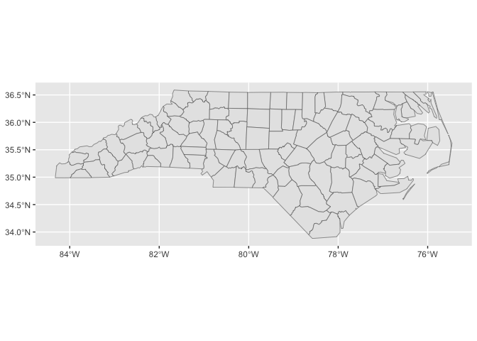<!-- -->

``` r

last_plot() + 
  geom_sf_text(stat = StatNcfips, size = 2, check_overlap = T)
#> Warning in layer_sf(data = data, mapping = mapping, stat = stat, geom =
#> GeomText, : Ignoring unknown parameters: `fun.geometry`
#> Joining with `by = join_by(fips)`
#> Joining with `by = join_by(fips)`
```

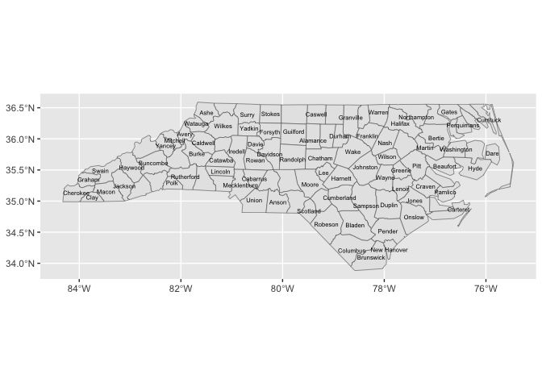<!-- -->

``` r

last_plot() + 
  aes(label = SID74) + 
  aes(fill = SID74)
#> Joining with `by = join_by(fips)`
#> Joining with `by = join_by(fips)`
```

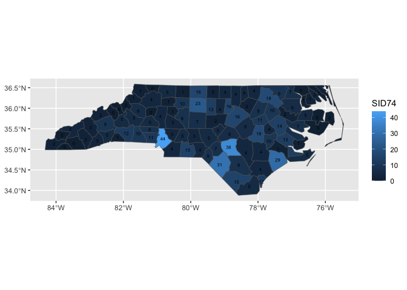<!-- -->

``` r

last_plot() + 
  aes(fill = 1000*SID74/BIR74)
#> Joining with `by = join_by(fips)`
#> Joining with `by = join_by(fips)`
```

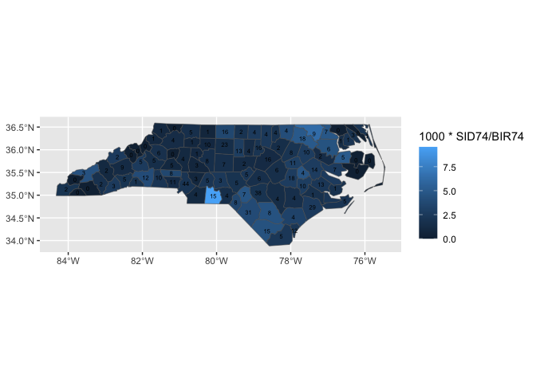<!-- -->

### Step 3. pass to user-facing function (wrapping ggplot::layer_sf() instead of ggplot2::layer()) 🚧 *more check with CRSs*

``` r
geom_county <- function(
      mapping = NULL,
      data = NULL,
      position = "identity",
      na.rm = FALSE,
      show.legend = NA,
      inherit.aes = TRUE,
      crs = "NAD27", # "NAD27", 5070, "WGS84", "NAD83", 4326 , 3857
      ...) {

  c(ggplot2::layer_sf(
              stat = StatNcfips,  # proto object from step 2
              geom = ggplot2::GeomSf,  # inherit other behavior
              data = data,
              mapping = mapping,
              position = position,
              show.legend = show.legend,
              inherit.aes = inherit.aes,
              params = rlang::list2(na.rm = na.rm, ...)
              ),
              
              coord_sf(crs = crs,
                       default_crs = sf::st_crs(crs),
                       datum = crs,
                       default = TRUE)
     )
  }
```

``` r

geom_county_text <- function(
      mapping = NULL,
      data = NULL,
      position = "identity",
      na.rm = FALSE,
      show.legend = NA,
      inherit.aes = TRUE,
      crs = "NAD27", # "NAD27", 5070, "WGS84", "NAD83", 4326 , 3857
      ...) {

  c(ggplot2::layer_sf(
              stat = StatNcfips,  # proto object from step 2
              geom = ggplot2::GeomText,  # inherit other behavior
              data = data,
              mapping = mapping,
              position = position,
              show.legend = show.legend,
              inherit.aes = inherit.aes,
              params = rlang::list2(na.rm = na.rm, ...)
              ),
              
              coord_sf(crs = crs,
                       default_crs = sf::st_crs(crs),
                       datum = crs,
                       default = TRUE)
     )
  }
```

#### Use/test/enjoy!

``` r
nc_counties_flat |> 
  ggplot() + 
  aes(fips = FIPS) + 
  geom_county() +
  geom_county_text(check_overlap = T) 
#> Joining with `by = join_by(fips)`
#> Joining with `by = join_by(fips)`
```

<!-- -->

``` r

last_plot() + 
  aes(fill = SID74/BIR74)
#> Joining with `by = join_by(fips)`
#> Joining with `by = join_by(fips)`
```

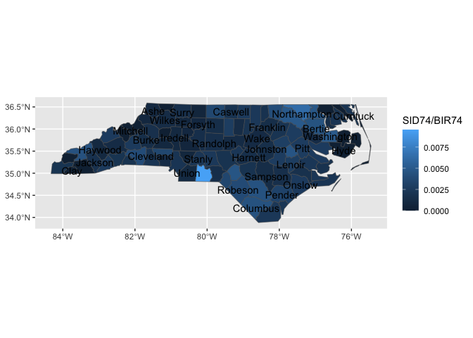<!-- -->

### Exercise

Use a STAT to create geom_estado and geom_estado_text

``` r
geo_ref_data_raw <- rnaturalearth::ne_countries(  
  scale = "medium", returnclass = "sf") %>%  
  select(name, continent, geometry) %>% 
  rename(country_name = name)
```

### Exercise

Use sf data to create another set of useful layers for making
choropleths

## geom_candlestick summarize first, then interdependence …

<!-- ## geom_pie: **n -> 1:1:1** -->
<!-- ```{r} -->
<!-- code = readlines_wo_roxygen("../ggwedge/R/compute_panel_pie.R") -->
<!-- ``` -->
<!-- ## geom_wedge: **n -> 1:1:n** -->

# stat\_\* layers: keeping flexible via stat\_\* functions

## stat_chull: **N:1:n; compute_group; GeomPolygon, GeomText, GeomPoint**

Rather than using your layer in a predetermined way geom, recall that
you are in fact writing stat\_\* functions, which could be used with a
variety of geoms. Let’s look at stat_chull’s flexible usage below.

``` r
p <- ggplot(data = mtcars) + 
  aes(x = wt, y = mpg) + 
  geom_point() 

p +
  stat_chull(alpha = .3)
```

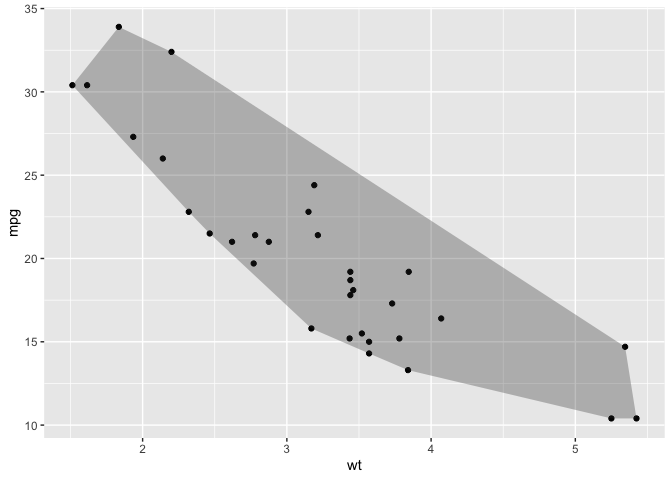<!-- -->

``` r

p +
  stat_chull(geom = "point",
             color = "red",
             size = 4)
```

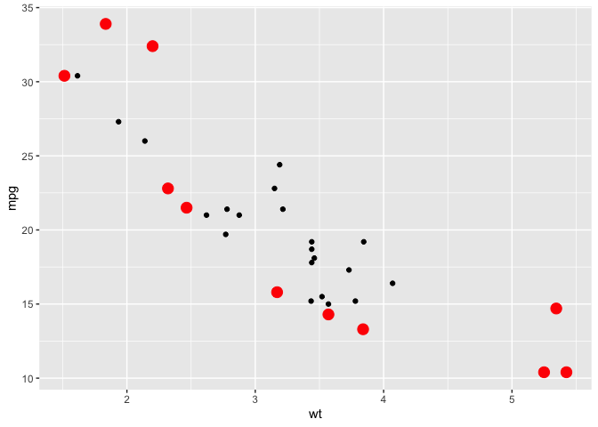<!-- -->

``` r

p + 
  stat_chull(geom = "text",
             label = "c-hull point",
             hjust = 0)
```

<!-- -->

``` r

# shows stat does not well-serve "path" geom
p + 
  stat_chull(geom = "path",
             label = "c-hull point",
             hjust = 0)
#> Warning in stat_chull(geom = "path", label = "c-hull point", hjust = 0):
#> Ignoring unknown parameters: `label` and `hjust`
```

<!-- -->

For ease of use, you may consider offering convenience functions for
variants of your default `stat_*()` function.

``` r
geom_chull_point <- function(){stat_chull(geom = GeomPoint)}
geom_chull_text <- function(){stat_chull(geom = GeomText)}
```

## stat packing. stat_waterfall: **1:1:1; compute_panel; GeomRect, GeomText**

Now, we also return to the waterfall. Let’s see how we can prepare the
same stat to serve both with GeomRect and GeomText to write user-facing
functions. In brief, we’ll create a stat\_\* user-facing function which
doesn’t hard-code our geom, but has the default GeomRect. We’ll alias
stat_waterfall to geom\_\* waterfall, and also create
geom_waterfall_text for labeling the rectangle-based layer.

``` r
StatWaterfall <- ggplot2::ggproto(`_class` = "StatWaterfall", 
                         `_inherit` = ggplot2::Stat,
                         required_aes = c("change", "x"),
                         compute_panel = compute_panel_waterfall,
                         default_aes = 
                           ggplot2::aes(label = ggplot2::after_stat(change),
                                        fill = ggplot2::after_stat(gain_loss),
                                        vjust = ggplot2::after_stat((
                                          direction == -1) %>%
                                                                as.numeric)))

stat_waterfall <- function(geom = ggplot2::GeomRect, 
  mapping = NULL,
  data = NULL,
  position = "identity",
  na.rm = FALSE,
  show.legend = NA,
  inherit.aes = TRUE, ...) {
  ggplot2::layer(
    stat = StatWaterfall,  # proto object from step 2
    geom = geom,  # inherit other behavior
    data = data,
    mapping = mapping,
    position = position,
    show.legend = show.legend,
    inherit.aes = inherit.aes,
    params = list(na.rm = na.rm, ...)
  )
}

geom_waterfall <- stat_waterfall

geom_waterfall_label <- function(...){
  stat_waterfall(geom = "text", ...)}

flow_df |> 
  ggplot() +
  geom_hline(yintercept = 0) +
  aes(change = change, 
      x = event) + # event in order
  geom_waterfall() + 
  geom_waterfall_label()
```

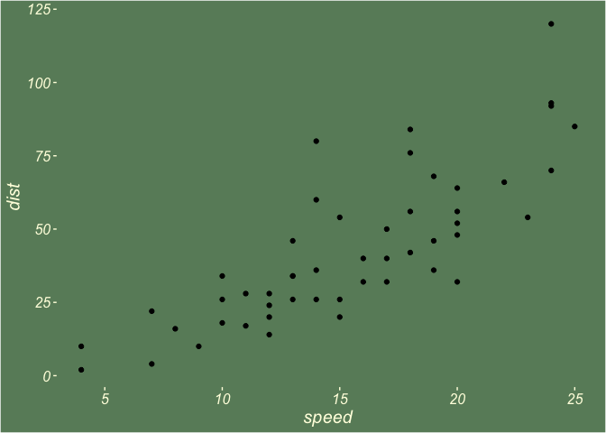<!-- -->

``` r

last_plot() + 
  aes(x = fct_reorder(event, change))
```

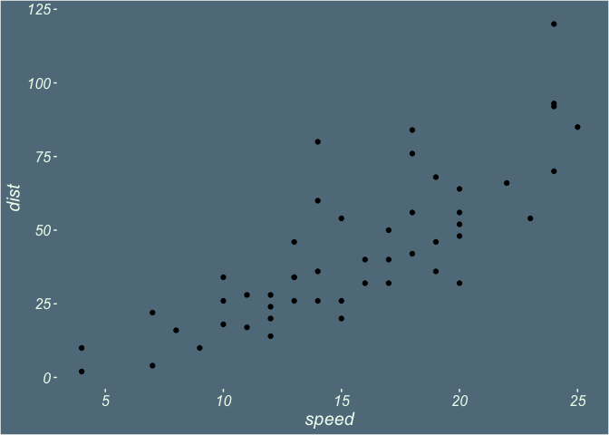<!-- -->

``` r

last_plot() + 
  aes(x = fct_reorder(event, abs(change)))
```

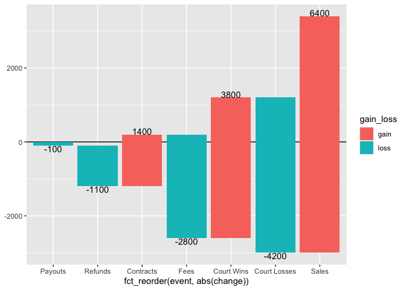<!-- -->

## Bonus part 2. DAE with GeomText target

If you’ve still got some stamina, let’s talk about another great usage
of DEA in Stat definitions: for default label definitions. Below, we
overwrite the StatWaterfall default_aes yet again, with the default fill
aes defined, but also the label and vjust aes, which are relevant to
labeling.

Then we define a separate user-facing function geom_waterfall_label,
based on the same stat.

``` r
StatWaterfall$default_aes <- ggplot2::aes(fill = ggplot2::after_stat(gain_loss),
                                          label = ggplot2::after_stat(change),
                                          vjust = ggplot2::after_stat((direction == -1) %>%
                                                                        as.numeric))

geom_waterfall_label <- function(
  mapping = NULL,
  data = NULL,
  position = "identity",
  na.rm = FALSE,
  show.legend = NA,
  inherit.aes = TRUE, ...) {
  ggplot2::layer(
    stat = StatWaterfall,  # proto object from step 2
    geom = ggplot2::GeomText, 
    data = data,
    mapping = mapping,
    position = position,
    show.legend = show.legend,
    inherit.aes = inherit.aes,
    params = list(na.rm = na.rm, ...)
  )
}

flow_df |> 
  ggplot() +
  geom_hline(yintercept = 0) +
  aes(change = change, 
      x = event) + # event in order
  geom_waterfall() + 
  geom_waterfall_label()
```

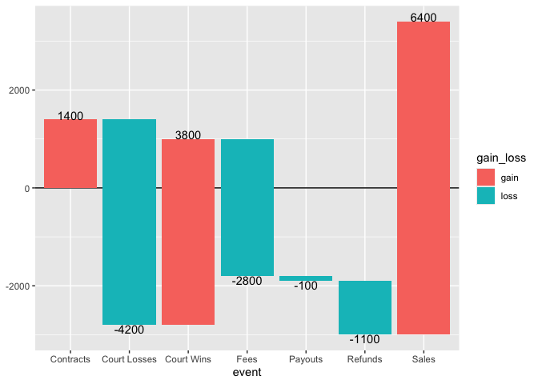<!-- -->

The final plot shows that while there are some convenience defaults for
label and fill, these can be over-ridden.

``` r
last_plot() + 
  aes(label = ifelse(change > 0, "gain", "loss")) + 
  aes(fill = NULL)
```

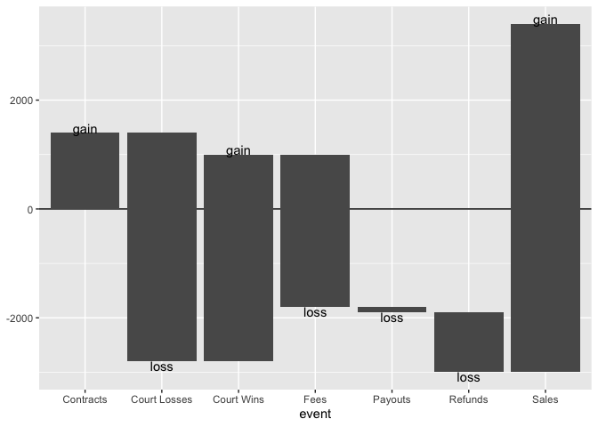<!-- -->

# Piggyback on compute

## Some Delayed Aesthetic Evaluation

## Borrowing compute

## geom_smoothfit: **1:1:1** ggproto piggybacking on compute…

n:1:80 is geom_smooth default.

``` r
ggplot(data = mtcars) +
  aes(x = wt, y = mpg) +
  geom_point() +
  geom_smooth() +
  stat_smooth(xseq = mtcars$wt,
              geom = "point",
              color = "blue")
#> `geom_smooth()` using method = 'loess' and formula = 'y ~ x'
#> `geom_smooth()` using method = 'loess' and formula = 'y ~ x'
```

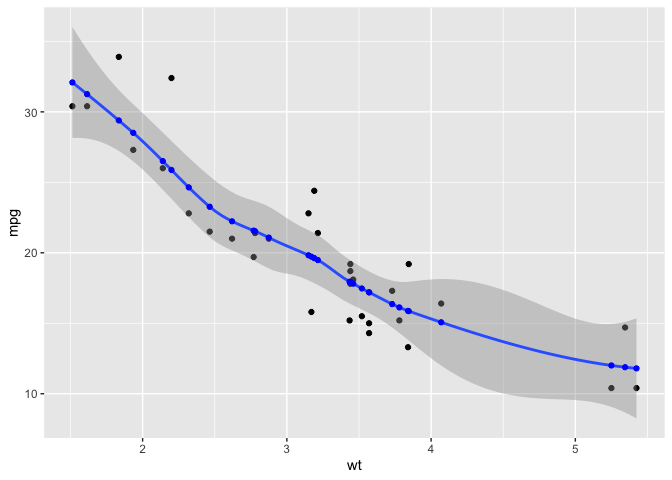<!-- --> \### Step 1. compute

``` r
compute_group_smooth_fit <- function(data, scales, method = NULL, formula = NULL,
                           se = TRUE, n = 80, span = 0.75, fullrange = FALSE,
                           level = 0.95, method.args = list(),
                           na.rm = FALSE, flipped_aes = NA){
  
  
  out <- ggplot2::StatSmooth$compute_group(data = data, scales = scales, 
                       method = method, formula = formula, 
                       se = FALSE, n= n, span = span, fullrange = fullrange,
                       xseq = data$x, 
                       level = .95, method.args = method.args, 
                       na.rm = na.rm, flipped_aes = flipped_aes) 
  

  out$x_obs <-  data$x
  out$y_obs <- data$y
  
  out$xend <- out$x_obs
  out$yend <- out$y_obs
  
  out
  
}
```

### Step 2

### Step 3

``` r
geom_smooth_predict <- function(xseq,  mapping = NULL, data = NULL, ..., method = NULL, formula = NULL, se = TRUE, method.args = list(), na.rm = FALSE, orientation = NA, show.legend = NA, inherit.aes = TRUE, color = "blue"){
  
  stat_smooth( mapping = mapping, data = data, geom = "point", position = "identity", xseq = xseq,  ..., method = method, formula = formula, se = se, method.args = list(), na.rm = na.rm, orientation = orientation, show.legend = show.legend, inherit.aes = inherit.aes, color = color
)
  
}
```

## add default aesthetics

## geom_barlab: Adding defaults to existing stats via ggproto editing

# facet_sample

# theme_chalkboard()

``` r

theme_chalkboard <- function(board_color = "darkseagreen4",
                             chalk_color = "lightyellow", ...){

  ggplot2::theme_gray(...) %+replace%   ##<< we'll piggy back on an existing theme
    ggplot2::theme(
      rect = ggplot2::element_rect(fill = board_color,
                                   color = board_color),
      text = ggplot2::element_text(color = chalk_color,
                                   face = "italic",
                                   size = 18),
      panel.background = ggplot2::element_rect(fill = board_color,
                                               color = board_color),
      axis.text = ggplot2::element_text(color = chalk_color),
      axis.ticks = ggplot2::element_line(color = chalk_color),
      panel.grid = ggplot2::element_blank(),
      complete = TRUE   ##<< important, see 20.1.2 Complete themes in ggplot2 book
      )

}

theme_chalkboard_slate <- function(){

  theme_chalkboard("lightskyblue4", "honeydew")

}
```

``` r
ggplot(data = cars) +
  aes(x = speed, dist) +
  geom_point() +
  theme_chalkboard()
```

<!-- -->

``` r

last_plot() +
  theme_chalkboard_slate()
```

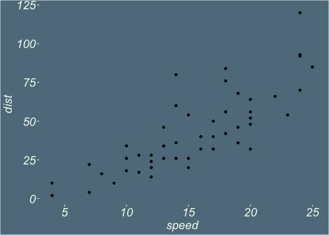<!-- -->

See ggchalkboard for geoms_chalk_on() and geoms_chalk_off().

# Coords

## coord_page()

One easily created new coord function is the coord_page(). Here we just
wrap the coord_trans function and setting y to be reversed. Therefore,
our coordinate system will be set up more like a note page where we
count lines from top to bottom instead of a Cartesian coordinate system
which counts from bottom to top.

``` r
coord_page <- function(...){
  
  coord_trans(y = "reverse", ...)
  
}
```

# coord_poster()

Similar to the properties of coord_page(), our aim with creating
coord_poster() is to have vertical positioning go from top to bottom,
but also to have the aspect ratio to be 1 (horizontal 1 unit is equal to
one vertical move). It’s between coord_equal() X coord_page()

``` r
coord_equal
#> function (ratio = 1, xlim = NULL, ylim = NULL, expand = TRUE, 
#>     clip = "on") 
#> {
#>     check_coord_limits(xlim)
#>     check_coord_limits(ylim)
#>     ggproto(NULL, CoordFixed, limits = list(x = xlim, y = ylim), 
#>         ratio = ratio, expand = expand, clip = clip)
#> }
#> <bytecode: 0x7f8b5acca7c0>
#> <environment: namespace:ggplot2>
```

``` r
CoordCartesian$transform
#> <ggproto method>
#>   <Wrapper function>
#>     function (...) 
#> transform(...)
#> 
#>   <Inner function (f)>
#>     function (data, panel_params) 
#> {
#>     data <- transform_position(data, panel_params$x$rescale, 
#>         panel_params$y$rescale)
#>     transform_position(data, squish_infinite, squish_infinite)
#> }
```

``` r
CoordCartesian$aspect
#> <ggproto method>
#>   <Wrapper function>
#>     function (...) 
#> aspect(...)
#> 
#>   <Inner function (f)>
#>     function (ranges) 
#> NULL
```

``` r
CoordCartesian$range
#> <ggproto method>
#>   <Wrapper function>
#>     function (...) 
#> range(...)
#> 
#>   <Inner function (f)>
#>     function (panel_params) 
#> {
#>     list(x = panel_params$x$dimension(), y = panel_params$y$dimension())
#> }
```

``` r
CoordFixed$is_free
#> <ggproto method>
#>   <Wrapper function>
#>     function (...) 
#> is_free(...)
#> 
#>   <Inner function (f)>
#>     function () 
#> FALSE
```

# modified start points; ggverbatim(),

## ggverbatim()

``` r
ggverbatim <- function(data, cat_cols = 1,  row_var_name = NULL, cols_var_name = "x", value_var_name = NULL){

  message("Variables that represented visually are ; e.g.  aesthetic mappying are 'x', and " |> paste(row_var_name))

  row_var_name <- names(data)[1]
  names(data)[1] <- "row_var"

  col_headers <- names(data)
  col_headers <- col_headers[2:length(col_headers)]

  data %>%
    mutate(row_var = fct_inorder(row_var)) %>%
    pivot_longer(cols = -cat_cols) %>%
    mutate(name = factor(name, levels = col_headers)) %>%
    rename(x = name) ->
  pivoted

  pivoted %>%
    ggplot() +
    aes(x = x) +
    labs(x = cols_var_name) +
    aes(y = row_var) +
    labs(y = row_var_name) +
    aes(label = value) +
    aes(fill = value) +
    scale_x_discrete(position = "top") +
    scale_y_discrete(limits=rev)

}
```

# ggedgelist()

``` r
# get into ggplot2 plot space from edge list data frame 
ggedgelist <- function(edgelist, nodelist = NULL, ...)(
  
  # message("'name' a variable created in the 'nodes' dataframe")
  
    if(is.null(nodelist)){
    edgelist %>% 
    tidygraph::as_tbl_graph() %>% 
    ggraph::ggraph(...) 
    
  }else{ # join on nodes attributes if they are available
    
    names(nodelist)[1] <- "name"
    
    edgelist %>% 
    tidygraph::as_tbl_graph() %>%
    dplyr::full_join(nodelist) %>% 
    ggraph::ggraph(...) 
    
  }
  
)

# get a fill viz w edgelist dataframe only
ggedgelist_quick <- function(edgelist, nodelist = NULL, include_names = F,  ...){
  

  p <- ggedgelist(edgelist = edgelist,
                  nodelist = nodelist, ...) +
  ggraph::geom_edge_link(color = "orange") +
  ggraph::geom_node_point(size = 9,
                  color = "steelblue",
                  alpha = .8) 
  
  if(include_names){p + ggraph::geom_node_label(aes(label = name))}else{p}
  
}

geom_node_label_auto <- function(...){ 
  
  ggraph::geom_node_label(aes(label = name), ...)
  
}

geom_node_text_auto <- function(...){ 
  
  ggraph::geom_node_text(aes(label = name), ...)
  
}
```

## ggscatterplot(), rearrangement

# wrapping fiddly functions (annotate and theme)

<https://github.com/EvaMaeRey/ggstamp>

<https://github.com/EvaMaeRey/more_theme_easing_ideas>

# make it a package: ggtedious *formal testing*

This is a placeholder for the ggtedious workshop, yet to be completed.

<https://github.com/EvaMaeRey/ggtedious>

``` r
#library(ggtedius)
```
